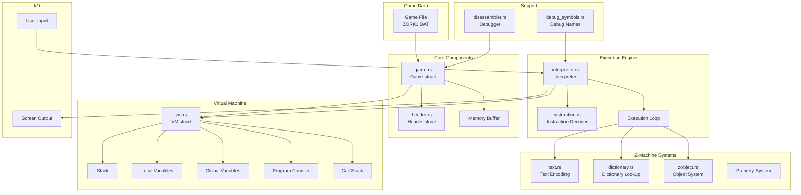

# Gruesome Z-Machine Interpreter Architecture

## Overview

Gruesome is a Z-Machine interpreter written in Rust that can run classic Infocom text adventure games like Zork I. The Z-Machine is a virtual machine designed by Infocom in the 1980s to run their text adventure games portably across different computer systems.

## Architecture Diagram



## Project Structure

```
gruesome/
├── src/
│   ├── main.rs           # Entry point, command-line handling
│   ├── lib.rs            # Library exports
│   │
│   ├── game.rs           # Game file loading and memory management
│   ├── header.rs         # Z-Machine file header parsing
│   ├── vm.rs             # Virtual machine state
│   ├── interpreter.rs    # Main execution engine
│   ├── instruction.rs    # Instruction decoding
│   │
│   ├── text.rs           # Z-string encoding/decoding
│   ├── dictionary.rs     # Dictionary lookups and parsing
│   ├── zobject.rs        # Object tree and properties
│   │
│   ├── disassembler.rs   # Debugging disassembler
│   ├── debug_symbols.rs  # Known routine/variable names
│   └── bin/              # Utility programs for debugging
│
├── resources/test/       # Test game files
└── tests/                # Integration tests
```

## Core Components

### 1. Game Loading (`game.rs`)

The `Game` struct loads and validates Z-Machine game files:

```rust
pub struct Game {
    pub memory: Vec<u8>,      // Complete game memory
    pub header: Header,       // Parsed header information
    pub static_memory_base: usize,  // Where dynamic memory ends
}
```

Key responsibilities:
- Load game file into memory
- Parse and validate header
- Determine memory boundaries (dynamic vs static)
- Create object table and dictionary interfaces

### 2. Virtual Machine State (`vm.rs`)

The `VM` struct maintains the complete state of the Z-Machine:

```rust
pub struct VM {
    pub game: Game,
    pub pc: u32,                    // Program counter
    pub stack: Vec<u16>,            // Evaluation stack
    pub call_stack: Vec<CallFrame>, // Routine call frames
    // ... internal state
}
```

Key features:
- 16-bit word-based architecture
- Stack for expression evaluation
- Call stack with local variables (up to 16 per routine)
- Global variables (240 in V3)
- Memory read/write operations

### 3. Interpreter (`interpreter.rs`)

The heart of the execution engine:

```rust
pub struct Interpreter {
    pub vm: VM,
    pub debug: bool,
    instruction_count: u64,
    routine_names: RoutineNames,
}
```

Main responsibilities:
- Fetch-decode-execute loop
- Instruction execution (130+ opcodes)
- Branching and routine calls
- I/O operations (print, read)
- Timer support (simplified)

### 4. Instruction Decoding (`instruction.rs`)

Z-Machine instructions have variable formats:

```rust
pub struct Instruction {
    pub opcode: u8,
    pub form: InstructionForm,      // Long, Short, Variable, Extended
    pub operand_count: OperandCount, // OP0, OP1, OP2, VAR
    pub operands: Vec<u16>,
    pub store_var: Option<u8>,      // Variable to store result
    pub branch: Option<BranchInfo>, // Conditional branch info
    pub text: Option<String>,       // For print instructions
    pub size: usize,                // Total instruction size
}
```

Instruction forms:
- **Long**: 2OP with small constants/variables
- **Short**: 0OP or 1OP instructions
- **Variable**: 2OP or VAR with flexible operands
- **Extended**: Extended opcodes (V5+)

## Z-Machine Systems

### 1. Text System (`text.rs`)

Z-strings use 5-bit character encoding with special escapes:

```rust
pub fn decode_string(memory: &[u8], addr: usize, abbrev_table: usize) 
    -> Result<(String, usize), String>
```

Features:
- 3 alphabets (A0: lowercase, A1: uppercase, A2: punctuation)
- Abbreviations to save space
- Unicode support via escape sequences
- High bit indicates end of string

### 2. Dictionary (`dictionary.rs`)

Fast word lookup for parsing:

```rust
impl VM {
    pub fn lookup_dictionary(&self, word: &str) -> u16
    pub fn parse_text(&mut self, text_buffer: u32, parse_buffer: u32) 
        -> Result<(), String>
}
```

Dictionary format:
- Sorted list of word entries
- Binary search for O(log n) lookup
- Each entry: encoded word + metadata
- Parse buffer stores: dictionary address, word length, text position

### 3. Object System (`zobject.rs`)

Hierarchical object tree with properties:

```rust
pub struct ObjectTable {
    base_addr: usize,
    property_defaults: [u16; 31],
    // ... object tree navigation
}
```

Object features:
- Parent-child-sibling relationships
- 32 boolean attributes per object
- Variable-length properties (1-8 bytes)
- Property inheritance from defaults

## Key Algorithms

### 1. Main Execution Loop

```rust
// Simplified execution flow
loop {
    let inst = decode_instruction(memory, pc)?;
    pc += inst.size;
    
    match execute_instruction(&inst)? {
        ExecutionResult::Continue => continue,
        ExecutionResult::Quit => break,
        // ... handle other results
    }
}
```

### 2. Routine Calls

Z-Machine uses activation frames:

```rust
// Call routine
1. Save current PC and locals
2. Read routine header (local count)
3. Initialize locals (V3: from header, V5+: to zero)
4. Overwrite with provided arguments
5. Jump to routine code

// Return from routine
1. Pop call frame
2. Restore PC
3. Store return value if requested
4. Continue execution
```

### 3. Text Buffer Parsing

The parser tokenizes input into the parse buffer:

```
Text Buffer: [max_len][actual_len][text characters...]
Parse Buffer: [max_words][word_count][word_entries...]
Word Entry: [dict_addr:2][word_len:1][text_pos:1]
```

### 4. Property Access

Properties are stored in a compact format:

```
Property Header: [size/number byte][data bytes...]
- Bits 7-5: size-1 (0-7 means 1-8 bytes)
- Bits 4-0: property number (1-31)
```

## Important Implementation Details

### 1. Memory Layout

```
0x00000 - 0x00040: Header (64 bytes)
0x00040 - STATIC:  Dynamic memory (modifiable)
STATIC  - HIGH:    Static memory (read-only)
HIGH    - END:     High memory (optional)
```

### 2. Addressing Modes

- **Byte addresses**: Direct memory addresses
- **Word addresses**: Address / 2 (for 16-bit values)
- **Packed addresses**: Special encoding for routines/strings
  - V3: `addr * 2`
  - V4-5: `addr * 4`
  - V6-7: Complex with offsets

### 3. Variable Storage

Variables are numbered 0x00-0xFF:
- 0x00: Stack (pop/push)
- 0x01-0x0F: Local variables (L01-L15)
- 0x10-0xFF: Global variables (G00-G239)

### 4. Known Issues Fixed

1. **Text printing bug**: Parse buffer positions were off by one due to not accounting for text buffer header
2. **Timer support**: Simplified implementation that simulates timer firing after blocking input

## Debugging Support

### 1. Disassembler

Full disassembly with symbolic names:

```
0x5fda (WORD-PRINT):
    dec_chk L01, #0000 [TRUE RTRUE]
    loadb V7d, V02 -> V00
    print_char V00
    inc L02
    jump -14
```

### 2. Debug Binaries

The `src/bin/` directory contains numerous debugging tools:
- `trace_*`: Execution tracers for specific scenarios
- `analyze_*`: Static analysis tools
- `test_*`: Component testers
- `find_*`: Search utilities

### 3. Known Routines

Major routines documented in `ROUTINE_ADDRESSES.md`:
- MAIN (0x4f05): Entry point
- PARSER (0x5880): Command parser
- PERFORM (0x577c): Action handler
- V-WALK (0x6f76): Movement handler
- NOT-HERE-OBJECT-F (0x4fd9): Error messages

## Building and Running

```bash
# Build the interpreter
cargo build --release

# Run Zork I
cargo run --bin gruesome resources/test/zork1/DATA/ZORK1.DAT

# Run with debugging
RUST_LOG=debug cargo run --bin gruesome game.dat

# Run test suite
cargo test
```

## Contributing

When adding new features:

1. **Follow existing patterns**: Look at similar code for style
2. **Add tests**: Unit tests for components, integration tests for features
3. **Update documentation**: Keep CLAUDE.md and comments current
4. **Use debug logging**: `log::debug!()` instead of `println!()`
5. **Handle errors properly**: Use `Result<T, String>` for fallible operations

## Future Improvements

- [ ] Full async timer support
- [ ] Save/restore game state
- [ ] Sound support (V3+)
- [ ] Graphics support (V6)
- [ ] More Z-Machine versions (V4-V8)
- [ ] Debugger interface
- [ ] Performance optimizations