# Gruesome Z-Machine Interpreter Architecture

## Overview

Gruesome is a complete, production-ready Z-Machine interpreter written in Rust that supports both classic v3 games (like Zork I) and advanced v4+ games (like A Mind Forever Voyaging). The interpreter features clean version separation, comprehensive Z-Machine specification compliance, and robust cross-platform operation.

## High-Level Architecture


## Entity Relationship Diagram


## Version-Specific Architecture Details

### Input System Architecture

```mermaid
graph LR
    subgraph "Input Selection"
        VERSION_CHECK{Game Version}
    end
    
    subgraph "v3 Input (Simple)"
        V3_STDIN[Standard Input<br/>io::stdin()]
        V3_ECHO[Automatic Echo<br/>Terminal Handles]
        V3_TIMER[Timer After Input<br/>Turn-based Only]
    end
    
    subgraph "v4+ Input (Advanced)"
        V4_RAW[Raw Terminal Mode<br/>crossterm]
        V4_CHAR[Character Input<br/>read_char support]
        V4_ECHO[Manual Echo<br/>Real-time Display]
        V4_TIMER[Real-time Timers<br/>Event-driven]
    end
    
    VERSION_CHECK -->|"version <= 3"| V3_STDIN
    VERSION_CHECK -->|"version >= 4"| V4_RAW
    
    V3_STDIN --> V3_ECHO
    V3_ECHO --> V3_TIMER
    
    V4_RAW --> V4_CHAR
    V4_CHAR --> V4_ECHO
    V4_ECHO --> V4_TIMER
```

### Display System Architecture


### Object System Architecture


## Modular Opcode Architecture

### Overview

The Z-Machine interpreter uses a modular opcode system that separates operations by functional domain. This architecture provides clean separation of concerns, improved maintainability, and better testability.


### Opcode Module Responsibilities

| Module | Operations | Key Features |
|--------|------------|--------------|
| **Stack** | push, pull, call_*, ret | Call frame management, stack manipulation |
| **Math** | add, sub, mul, div, mod, and, or, not | Arithmetic and bitwise logic |
| **Memory** | load, store, loadw, storew, loadb, storeb | Memory access and manipulation |
| **Object** | get_prop, put_prop, get_parent, insert_obj | Z-Machine object system |
| **Display** | print, print_*, new_line, set_cursor | Text output and screen control |
| **I/O** | sread, read_char, output_stream | Input/output and stream management |
| **Flow Control** | je, jz, jump, rtrue, rfalse, branches | Embedded in execution methods |

### Routing Logic

The interpreter uses a form-aware routing system that checks for specialized operations before falling back to default handlers:

```rust
// Example routing logic for Variable form instructions
match inst.operand_count {
    OperandCount::OP2 => {
        if Interpreter::is_math_opcode(inst.opcode, &inst.operand_count) {
            self.execute_math_op(inst, &operands)
        } else if Interpreter::is_memory_opcode(inst.opcode, &inst.operand_count) {
            self.execute_memory_op(inst, &operands)
        } else if Interpreter::is_object_opcode(inst.opcode, &inst.operand_count) 
                  || Interpreter::is_var_13_object_opcode(inst) {
            self.execute_object_op(inst, &operands)
        } else if Interpreter::is_display_opcode(inst.opcode, &inst.operand_count) {
            self.execute_display_op(inst, &operands)
        } else {
            self.execute_2op_variable(inst, &operands)
        }
    }
    // ... other operand counts
}
```

### Special Cases

#### VAR:0x13 Disambiguation
The interpreter handles the critical VAR:0x13 opcode disambiguation between `get_next_prop` (object operations) and `output_stream` (I/O operations):

```rust
// Object operations when store_var is present
pub fn is_var_13_object_opcode(inst: &Instruction) -> bool {
    inst.opcode == 0x13 
        && inst.operand_count == OperandCount::VAR
        && inst.store_var.is_some()
}

// I/O operations when store_var is absent  
pub fn is_var_13_io_opcode(inst: &Instruction) -> bool {
    inst.opcode == 0x13 
        && inst.operand_count == OperandCount::VAR
        && inst.store_var.is_none()
}
```

#### Flow Control Integration
Flow control operations (branches, jumps, returns) remain embedded in the main execution methods (`execute_0op`, `execute_1op`, `execute_2op`, `execute_var`) because they are fundamental to the execution flow and benefit from direct integration rather than extraction.

### Module Integration Patterns

Each opcode module follows a consistent pattern:

1. **Method Definition**: `execute_[module]_op(&mut self, inst: &Instruction, operands: &[u16])`
2. **Opcode Matching**: Pattern matching on `(opcode, operand_count)` tuples
3. **Operation Execution**: Direct VM state manipulation
4. **Result Return**: `ExecutionResult` enum (Continue, Branch, Call, Return, etc.)
5. **Detection Function**: `is_[module]_opcode(opcode, operand_count)` for routing

### Benefits of Modular Architecture

1. **Separation of Concerns**: Each module handles a specific functional domain
2. **Improved Maintainability**: Changes to math operations don't affect object operations
3. **Better Testability**: Individual modules can be tested in isolation
4. **Code Organization**: Related operations are grouped together logically
5. **Performance**: Direct method calls with minimal routing overhead

## Core Components Deep Dive

### 1. Game Loading and Version Detection

```rust
// Automatic version detection and system initialization
pub struct Game {
    pub memory: Vec<u8>,
    pub header: Header,
    // Version-specific object table selected at runtime
    object_table: Box<dyn ZObjectInterface>,
}

impl Game {
    pub fn from_memory(data: Vec<u8>) -> Result<Self, String> {
        let header = Header::parse(&data)?;
        
        // Select appropriate object system based on version
        let object_table: Box<dyn ZObjectInterface> = if header.version <= 3 {
            Box::new(ZObjectV3::new(&data, header.object_table_addr))
        } else {
            Box::new(ZObjectV4::new(&data, header.object_table_addr))
        };
        
        Ok(Game { memory: data, header, object_table })
    }
}
```

### 2. Interpreter with Version-Aware Systems

```rust
pub struct Interpreter {
    pub vm: VM,
    
    // Version-specific input handlers
    v3_input: Option<V3Input>,    // Simple stdin for v3
    v4_input: Option<V4Input>,    // Raw terminal for v4+
    
    // Version-aware display system
    display: Option<Box<dyn ZMachineDisplay>>,
    
    // Debugging and state
    pub debug: bool,
    instruction_count: u64,
    routine_names: RoutineNames,
}
```

### 3. Smart Display Management

```rust
pub fn create_display(version: u8, mode: DisplayMode) 
    -> Result<Box<dyn ZMachineDisplay>, String> {
    
    match mode {
        DisplayMode::Auto => {
            // Smart selection based on version and environment
            if version <= 3 {
                // v3 games use simple display
                if can_create_terminal_display() {
                    Ok(Box::new(DisplayV3::new()?))
                } else {
                    Ok(Box::new(DisplayHeadless::new()))
                }
            } else {
                // v4+ games need advanced display
                if can_create_ratatui_display() {
                    Ok(Box::new(RatatuiDisplay::new()?))
                } else {
                    // Graceful fallback
                    Ok(Box::new(DisplayHeadless::new()))
                }
            }
        }
        // ... explicit mode handling
    }
}
```

## Key Architectural Principles

### 1. Runtime Version Detection
- Single codebase supports all Z-Machine versions
- Version detected from game header at load time
- Appropriate systems selected automatically
- No compile-time version locking

### 2. Trait-Based Abstraction
- Common interfaces hide version differences
- `ZMachineDisplay` trait for all display systems
- `ZObjectInterface` trait for object systems
- Enables clean separation without code duplication

### 3. Smart Fallback Systems
- Display: Ratatui → Terminal → Headless
- Input: Raw terminal → Piped input seamlessly
- Cross-platform compatibility through graceful degradation

### 4. Clean Separation of Concerns
- Input system handles only input logic
- Display system handles only output logic
- Object system handles only game data structures
- Interpreter orchestrates but doesn't implement details

## Memory Management

### Game Memory Layout
```
┌─────────────────┬──────────────────┬─────────────────┬──────────────────┐
│   Header        │   Dynamic        │    Static       │   High Memory    │
│   (64 bytes)    │   (modifiable)   │  (read-only)    │   (optional)     │
├─────────────────┼──────────────────┼─────────────────┼──────────────────┤
│ 0x0000-0x003F   │ 0x0040-STATIC    │ STATIC-HIGH     │ HIGH-END         │
└─────────────────┴──────────────────┴─────────────────┴──────────────────┘
```

### Stack Architecture
```rust
pub struct VM {
    // Main evaluation stack (shared across all routines)
    pub stack: Vec<u16>,
    
    // Call stack with activation frames
    pub call_stack: Vec<CallFrame>,
}

pub struct CallFrame {
    pub return_pc: u32,              // Where to return
    pub locals: [u16; 16],           // Local variables L01-L15
    pub num_locals: u8,              // How many locals this routine has
    pub store_var: Option<u8>,       // Where to store return value
    pub catch_value: Option<u16>,    // For catch/throw (v5+)
}
```

## Instruction Processing Pipeline

```mermaid
graph LR
    subgraph "Instruction Pipeline"
        FETCH[Fetch<br/>PC → Memory]
        DECODE[Decode<br/>instruction.rs]
        OPERANDS[Resolve Operands<br/>Variables/Constants]
        ROUTE[Route to Module<br/>Form-aware Dispatch]
        EXECUTE[Execute in Module<br/>Specialized Handler]
        STORE[Store Result<br/>If Required]
        BRANCH[Handle Branch<br/>If Conditional]
    end
    
    subgraph "Module Routing"
        STACK_R[Stack Module]
        MATH_R[Math Module]
        MEMORY_R[Memory Module]
        OBJECT_R[Object Module]
        DISPLAY_R[Display Module]
        IO_R[I/O Module]
        FLOW_R[Flow Control<br/>Embedded]
    end
    
    FETCH --> DECODE
    DECODE --> OPERANDS
    OPERANDS --> ROUTE
    ROUTE --> STACK_R
    ROUTE --> MATH_R
    ROUTE --> MEMORY_R
    ROUTE --> OBJECT_R
    ROUTE --> DISPLAY_R
    ROUTE --> IO_R
    ROUTE --> FLOW_R
    STACK_R --> EXECUTE
    MATH_R --> EXECUTE
    MEMORY_R --> EXECUTE
    OBJECT_R --> EXECUTE
    DISPLAY_R --> EXECUTE
    IO_R --> EXECUTE
    FLOW_R --> EXECUTE
    EXECUTE --> STORE
    STORE --> BRANCH
    BRANCH -->|Continue| FETCH
```



### Instruction Format Support

| Form | Versions | Operand Count | Usage |
|------|----------|---------------|-------|
| Long | All | 2OP | Basic arithmetic, comparison |
| Short | All | 0OP, 1OP | Stack ops, jumps, calls |
| Variable | All | 2OP, VAR | Flexible argument count |
| Extended | v5+ | VAR | Extended opcode space |

## Z-Machine Specification Compliance

### Text System
- **v3**: 6 Z-characters encoded in 4 bytes (2 words)
- **v4+**: 9 Z-characters encoded in 6 bytes (3 words)
- Full alphabet support (A0: lowercase, A1: uppercase, A2: punctuation)
- Abbreviation table support for compression
- Unicode escape sequences for extended characters

### Dictionary Encoding - CRITICAL COMPATIBILITY NOTE

**⚠️ NEVER CHANGE SPACE ENCODING FROM 5 TO 0** - This breaks all commercial Infocom games!

The interpreter uses **Infocom convention** (space = Z-character 5) rather than strict Z-Machine specification (space = Z-character 0) for dictionary encoding. This is required for compatibility with commercial games.

#### Encoding Implementation (`src/dictionary.rs`)

```rust
// CORRECT encoding (Infocom convention):
fn encode_word_v3(word: &str) -> (u16, u16) {
    let code = match ch {
        'a'..='z' => ch as u8 - b'a' + 6,
        ' ' => 5,        // Space is Z-character 5 (Infocom convention)
        _ => 5,          // Default to space
    };
    // Pad with 5s (spaces)
    while chars.len() < 6 { chars.push(5); }
}

// WRONG encoding (breaks commercial games):
' ' => 0,        // Z-Machine spec says 0, but commercial games use 5
```

#### Why This Matters

**Commercial Game Compatibility**:
- All Infocom games (Zork I, AMFV, etc.) were compiled with space=5 encoding
- Dictionary lookups compare encoded search words against game dictionaries
- Mismatch causes ALL words to fail: "I don't know the word 'look'"

**Historical Context**:
- Commit 90495e8 (Sep 28, 2025) changed space encoding from 5 to 0 for spec compliance
- Change enabled 'quit' in compiled mini_zork.grue but broke ALL commercial games
- Reverted in commit ae4468b to restore commercial game compatibility

#### Trade-offs

**Decision**: Prioritize commercial game compatibility over Z-Machine spec compliance

**Implications**:
- ✅ All commercial Infocom games work correctly
- ✅ Integration tests pass (Zork I, AMFV gameplay)
- ⚠️ Compiled games from grue-compiler must use matching encoding
- 🔮 Future: Consider version-aware encoding (space=5 for v3, investigate v4+ spec)

### Input Echo Compliance
- **Section 7.1.1.1**: Input echoed to output streams as typed
- **Section 7.2**: Buffer mode controls word-wrapping, not display timing
- **Section 15.4**: Carriage return printed when input terminates normally

### Timer System
- **v3**: Simplified turn-based timers (post-input execution)
- **v4+**: Real-time timer interrupts with callback support
- Event-driven architecture using crossterm for non-blocking input
- Proper interrupt routine handling per specification

## Testing Architecture

### Test Categories
1. **Unit Tests**: Individual component testing
2. **Integration Tests**: Full game execution scenarios
3. **Compatibility Tests**: Multi-version game support
4. **Display Tests**: Cross-platform display verification

### Test Game Coverage
- **v3**: Zork I, Seastalker, The Lurking Horror
- **v4+**: A Mind Forever Voyaging, Bureaucracy, Border Zone
- **Edge Cases**: Save/restore, timer interrupts, complex text

## Performance Characteristics

### Execution Speed
- **Instruction Decode**: ~1μs per instruction
- **Memory Access**: Direct Vec<u8> indexing
- **Display Updates**: 60fps for real-time input echo
- **Save/Restore**: Quetzal format, <100ms typical

### Memory Usage
- **Base Interpreter**: ~2MB compiled
- **Game Memory**: Variable (typically 64KB-256KB)
- **Display Buffers**: Minimal overhead with smart buffering
- **Call Stack**: Dynamic growth, typical depth <20 frames

## Future Architecture Considerations

### Extensibility Points
1. **Display System**: New display backends via trait
2. **Input System**: Additional input methods (network, scripted)
3. **Save System**: Alternative save formats
4. **Debug System**: Enhanced debugging interfaces

### Version Support Roadmap
- **v5**: Extended opcodes (scan_table, etc.) ✅ Complete
- **v6**: Graphics support (planned)
- **v7-v8**: Modern IF features (planned)

## Build and Deployment

### Build Targets
```bash
# Development build with debug symbols
cargo build

# Release build (optimized)
cargo build --release

# Cross-platform builds
cargo build --target x86_64-pc-windows-gnu
cargo build --target x86_64-apple-darwin
cargo build --target x86_64-unknown-linux-gnu
```

### Feature Configuration
- No feature flags required - version detection is runtime
- Automatic fallback systems handle missing dependencies
- Single binary supports all platforms and game versions

## Modular File Organization

### Core Files
- `interpreter.rs` - Main execution orchestrator and routing logic
- `vm.rs` - Virtual machine state and memory management
- `instruction.rs` - Instruction decoding and format handling

### Opcode Modules
- `opcodes_stack.rs` - Stack manipulation (push, pull, call_*, ret)
- `opcodes_math.rs` - Arithmetic and logic (add, sub, mul, div, and, or, not)
- `opcodes_memory.rs` - Memory operations (load, store, loadw, storew, loadb, storeb)
- `opcodes_object.rs` - Object system (get_prop, put_prop, get_parent, insert_obj, etc.)
- `opcodes_display.rs` - Text and display (print, print_*, new_line, set_cursor, etc.)
- `opcodes_io.rs` - Input/output (sread, read_char, output_stream, input_stream)

### Version-Specific Systems
- `input_v3.rs` / `input_v4.rs` - Version-specific input handling
- `display_v3.rs` / `display_ratatui.rs` - Version-specific display systems
- `zobject_v3.rs` / `zobject_v4.rs` - Version-specific object formats

### Support Systems
- `display_manager.rs` - Smart display selection and fallback
- `dictionary.rs` - Version-aware text encoding
- `quetzal/` - Save/restore functionality
- `text.rs` - Z-string decoding

## Grue Compiler Grammar System Architecture

The Grue compiler implements a complete natural language grammar system for Z-Machine games, enabling verb+noun pattern matching with dynamic object resolution. This system translates high-level grammar declarations into optimized Z-Machine bytecode.

### Grammar System Overview

```mermaid
graph TB
    subgraph "Main Loop Structure"
        LOOP_START[Main Loop Entry<br/>ID 9000]
        PROMPT[Print Prompt '>']
        SREAD[Read User Input<br/>SREAD instruction]
        COMMAND[Command Processing]
        JUMP_BACK[Jump to Loop Start<br/>Infinite Loop]
    end

    subgraph "Command Processing Pipeline"
        GRAMMAR[Grammar Pattern Matching]
        UNKNOWN[Unknown Command Message]
    end

    subgraph "Grammar Pattern Matching"
        VERB1[Verb Handler 1]
        VERB2[Verb Handler 2]
        VERBN[Verb Handler N]
    end

    subgraph "Verb Matching Logic"
        PARSE_BUF[Parse Buffer Access<br/>Globals 109, 110]
        DICT_CMP[Dictionary Comparison]
        WORD_COUNT[Word Count Check]
        BRANCH_PATTERN{Pattern Type}
    end

    subgraph "Pattern Handlers"
        OBJ_LOOKUP[Object Lookup<br/>Dictionary→Object ID]
        HANDLER_NOUN[Handler with Object]
        HANDLER_VERB[Handler No Object]
    end

    LOOP_START --> PROMPT
    PROMPT --> SREAD
    SREAD --> COMMAND
    COMMAND --> GRAMMAR
    GRAMMAR --> VERB1
    GRAMMAR --> VERB2
    GRAMMAR --> VERBN
    GRAMMAR --> UNKNOWN
    UNKNOWN --> JUMP_BACK

    VERB1 --> PARSE_BUF
    PARSE_BUF --> DICT_CMP
    DICT_CMP --> WORD_COUNT
    WORD_COUNT --> BRANCH_PATTERN

    BRANCH_PATTERN -->|Verb+Noun| OBJ_LOOKUP
    BRANCH_PATTERN -->|Verb-Only| HANDLER_VERB
    OBJ_LOOKUP --> HANDLER_NOUN

    HANDLER_NOUN --> JUMP_BACK
    HANDLER_VERB --> JUMP_BACK
    JUMP_BACK --> LOOP_START
```



### Main Loop Architecture

**Location**: `src/grue_compiler/codegen.rs` lines 5048-5188

The main loop (ID 9000) is a self-contained Z-Machine routine with 5 local variables:

```rust
// Main loop routine structure
Routine Header: 0x05 (5 locals)
Variable 1: Word count from parse buffer
Variable 2: Word 1 dictionary address (verb)
Variable 3: Resolved object ID (noun → object mapping)
Variable 4: Loop counter (object lookup iteration)
Variable 5: Property value (object name comparison)
```

**Execution Flow**:
1. Print prompt "> " via `print_paddr` (string reference)
2. Store buffer addresses in Globals 109 (text) and 110 (parse)
3. Execute SREAD instruction with global variables
4. Call command processing (falls through to grammar system)
5. Print unknown command message if no match
6. Jump back to step 1 (infinite loop)

**Global Variables**:
- `TEXT_BUFFER_GLOBAL` (109 / G6d): Text input buffer address
- `PARSE_BUFFER_GLOBAL` (110 / G6e): Parse buffer address (tokenized words)

### Parse Buffer Layout

After SREAD execution, the parse buffer contains tokenized user input:

```
Parse Buffer Structure (byte offsets):
[0]     = max words capacity
[1]     = actual word count
[2-3]   = word 1 dictionary address (16-bit big-endian)
[4]     = word 1 text position in input buffer
[5]     = word 1 character length
[6-7]   = word 2 dictionary address (16-bit big-endian)
[8]     = word 2 text position
[9]     = word 2 character length
... (pattern continues for additional words)
```

### Grammar Pattern Matching Engine

**Location**: `src/grue_compiler/codegen.rs` lines 5241-5260

The grammar system processes all defined verb handlers sequentially:

```rust
fn generate_grammar_pattern_matching(
    grammar_rules: &[IrGrammar]
) -> Result<(), CompilerError> {
    // For each grammar verb, generate pattern matching logic
    for grammar in grammar_rules {
        self.generate_verb_matching(&grammar.verb, &grammar.patterns)?;
    }

    // Fall through to unknown command message if no match
}
```

**Key Characteristics**:
- Sequential verb matching (first match wins)
- No fallthrough between verbs (each verb has explicit branches)
- Unknown command message only reached if ALL verbs fail

### Verb Matching Logic

**Location**: `src/grue_compiler/codegen.rs` lines 5263-5673

Each verb handler implements a multi-phase matching algorithm:

#### Phase 1: Parse Buffer Access
```
Load Global 110 → parse buffer address
Load buffer[1] → word count (Variable 1)
Load buffer[2-3] → word 1 dictionary address (Variable 2)
```

#### Phase 2: Verb Dictionary Comparison
```
Call lookup_word_in_dictionary(verb_name) → expected_address
Compare Variable 2 (parsed verb) with expected_address
Branch if not equal → try next verb
```

**Dictionary Lookup Algorithm** (lines 5675-5716):
- Dictionary base address from layout phase
- Header: 4 bytes (separator count, entry length, entry count)
- Entry size: 6 bytes for v3
- Position: Binary search in sorted dictionary_words list
- Address calculation: `base + header + (position × entry_size)`

#### Phase 3: Pattern Selection

**Word Count Branch** (lines 5423-5449):
```
Compare Variable 1 (word_count) with 2
Branch if less than 2 → verb_only_label
Continue to verb+noun pattern
```

**Label Generation** (lines 5275-5281):
```rust
// Unique labels via verb name hashing
let mut hasher = DefaultHasher::new();
verb.hash(&mut hasher);
let end_function_label = 90000 + (hasher.finish() % 9999) as u32;
```

### Verb+Noun Pattern (Phase 3.1)

**Location**: Lines 5454-5583

**Execution Steps**:
1. Load word 2 dictionary address from buffer[6-7] → Variable 2
2. Call `generate_object_lookup_from_noun()` → Variable 3 = object ID
3. Call handler function with object parameter: `call_vs(handler, Variable 3)`
4. Jump to end_function_label (skip verb-only case)

**UnresolvedReference Pattern**:
```rust
// Function call with packed address
UnresolvedReference {
    reference_type: LegacyReferenceType::FunctionCall,
    location: layout.operand_location, // From emit_instruction
    target_id: func_id,
    is_packed_address: true,
    offset_size: 2,
    location_space: MemorySpace::Code,
}
```

### Verb-Only Pattern (Phase 3.2)

**Location**: Lines 5586-5667

**Execution Steps**:
1. Register `verb_only_label` at current code address
2. Check for default pattern (verb-only handler)
3. If found: `call_vs(handler)` with no arguments
4. If not found: `call_vs(noun_handler, 0)` with object ID 0
5. Fall through to end_function_label

**Critical Label Registration** (lines 5588-5594):
```rust
self.label_addresses.insert(verb_only_label, self.code_address);
self.record_final_address(verb_only_label, self.code_address);
```

### Dynamic Object Lookup System

**Location**: `src/grue_compiler/codegen.rs` lines 5721-5887

**Algorithm Overview**: Loop-based dictionary address → object ID mapping

**Critical Architectural Fix (Sept 30, 2025)**:
- Replaced hardcoded 2-object limitation with dynamic loop
- Supports all 68 objects in mini_zork (configurable maximum)
- Uses proper UnresolvedReference system for all branches

**Implementation Details**:

```
1. Initialize Variables:
   Variable 3 = 0 (result, not found)
   Variable 4 = 1 (loop counter, first object)

2. Loop Start (dynamically allocated label):
   Register loop_start_label at current address

3. Bounds Check:
   If Variable 4 > 68 → branch to end_label

4. Property Access:
   get_prop(Variable 4, 7) → Variable 5
   (Property 7 = object name dictionary address)

5. Dictionary Comparison:
   If Variable 5 == Variable 2 → branch to found_match_label

6. Loop Increment:
   inc Variable 4 (next object)
   jump to loop_start_label

7. Match Found:
   store Variable 4 → Variable 3 (object ID as result)
   fall through to end_label

8. End Label:
   Variable 3 contains object ID (or 0 if not found)
```

**Key Features**:
- **Dynamic Label Allocation**: Uses `next_string_id` counter to avoid conflicts
- **Comprehensive Coverage**: Checks all objects (1-68 configurable)
- **Zero on Failure**: Variable 3 = 0 indicates object not found
- **Proper Placeholder Resolution**: All branches use layout-tracked locations

### UnresolvedReference System Integration

All grammar system jumps, branches, and calls use the UnresolvedReference pattern:

**Branch Instructions** (conditional jumps):
```rust
let layout = self.emit_instruction(0x01, operands, None, Some(0x7FFF))?;
self.reference_context.unresolved_refs.push(UnresolvedReference {
    reference_type: LegacyReferenceType::Branch,
    location: layout.branch_location.expect("branch instruction needs location"),
    target_id: target_label,
    is_packed_address: false,
    offset_size: 2,
    location_space: MemorySpace::Code,
});
```

**Jump Instructions** (unconditional jumps):
```rust
let layout = self.emit_instruction(0x0C, &[Operand::LargeConstant(placeholder_word())], None, None)?;
self.reference_context.unresolved_refs.push(UnresolvedReference {
    reference_type: LegacyReferenceType::Jump,
    location: layout.operand_location.expect("jump instruction needs operand"),
    target_id: target_label,
    is_packed_address: false,
    offset_size: 2,
    location_space: MemorySpace::Code,
});
```

**Function Calls** (handler invocation):
```rust
let layout = self.emit_instruction(0x00, &[Operand::LargeConstant(placeholder_word()), ...], Some(0), None)?;
self.reference_context.unresolved_refs.push(UnresolvedReference {
    reference_type: LegacyReferenceType::FunctionCall,
    location: layout.operand_location.expect("call instruction needs operand"),
    target_id: function_id,
    is_packed_address: true, // Function addresses are packed
    offset_size: 2,
    location_space: MemorySpace::Code,
});
```

### Critical Implementation Patterns

**1. Layout-Based Location Tracking** (NOT hardcoded offsets):
```rust
// CORRECT: Use layout.operand_location from emit_instruction
if let Some(operand_location) = layout.operand_location {
    // Use operand_location for reference
} else {
    panic!("BUG: emit_instruction didn't return operand_location");
}

// WRONG: Never calculate locations manually
// self.code_address - 2  // NEVER DO THIS
```

**2. Label Registration Order**:
```rust
// Labels registered BEFORE jumping to them (forward references)
let label_id = allocate_unique_label();
emit_jump_to(label_id); // Creates UnresolvedReference
// ... other code ...
self.label_addresses.insert(label_id, self.code_address); // Resolves reference
```

**3. Placeholder Values**:
- Branch placeholders: `0x7FFF`
- Jump/call placeholders: `placeholder_word()` returns `0xFFFF`
- String references: `placeholder_word()` for packed addresses

### Control Flow Summary

```
Main Loop (ID 9000)
  ↓
[Print Prompt]
  ↓
[SREAD User Input]
  ↓
[Command Processing]
  ↓
[Grammar Pattern Matching] ← Sequential verb handlers
  ↓
[Verb 1 Matching]
  ├─ Parse buffer access
  ├─ Dictionary comparison
  ├─ Word count check
  ├─ Branch: No match → try Verb 2
  ├─ Branch: Verb-only → call handler() → return
  └─ Verb+Noun:
      ├─ Object lookup loop (dictionary → object ID)
      ├─ Call handler(object_id) → return
      └─ Jump to end label
  ↓
[Verb 2 Matching] ← Similar structure
  ↓
[Verb N Matching]
  ↓
[Unknown Command Message] ← Only if ALL verbs fail
  ↓
[Jump to Main Loop Start] ← Infinite loop
```

### Performance Characteristics

- **Dictionary Lookup**: O(log n) binary search in sorted word list
- **Object Lookup**: O(n) linear scan through objects (worst case 68 iterations for mini_zork)
- **Verb Matching**: O(v) where v = number of defined verbs (sequential)
- **Memory Usage**: 5 local variables + parse buffer (typically 128 bytes)

### Integration with IR Pipeline

**AST → IR → Codegen Flow**:
1. **AST**: `GrammarDecl` with `VerbDecl` and `PatternElement` enums
2. **IR**: `IrGrammar` with `IrPattern` and `IrHandler` structures
3. **Codegen**: Z-Machine bytecode generation with placeholder resolution

**Pattern Element Types** (`src/grue_compiler/ast.rs` lines 160-204):
- `Literal(String)` - Exact word match
- `Noun` - Object reference (requires lookup)
- `Default` - Verb-only pattern (no noun)
- `Adjective`, `MultiWordNoun`, `Preposition` - Advanced patterns (future)

This modular architecture provides a robust, maintainable foundation for a complete Z-Machine interpreter with excellent game compatibility, clean code organization, and clear separation of concerns across functional domains.

## CRITICAL: Z-Machine Opcode Form Instability

### The Problem

**Z-Machine opcodes are not stable across instruction forms** - the same opcode number means different instructions depending on the form (Long/Short/Variable/Extended). The grue-compiler's `emit_instruction` function treats opcode numbers as stable, which causes it to emit incorrect instructions when operand constraints force form changes.

### Why This Occurs

The `emit_instruction` function in `src/grue_compiler/codegen_instructions.rs` (line 1225) automatically selects instruction form based on operand types:

```rust
// Lines 1570-1583: Form determination logic
match operands.len() {
    2 => {
        // Check if Long form can handle all operands
        let can_use_long_form = operands.iter().all(|op| {
            match op {
                Operand::LargeConstant(value) => *value <= 255,
                _ => true,
            }
        });

        if opcode < 0x80 && can_use_long_form {
            InstructionForm::Long    // 2OP: opcodes as expected
        } else {
            InstructionForm::Variable  // ⚠️ BUG: Same opcode, different meaning!
        }
    }
    _ => InstructionForm::Variable,
}
```

**The Bug**: When `LargeConstant > 255`, the form switches from Long (2OP) to Variable (VAR), but the opcode number remains unchanged even though it now refers to a different instruction.

### Examples of Form-Sensitive Opcodes

| Opcode | Long Form (2OP) | Variable Form (VAR) | Conflict |
|--------|-----------------|---------------------|----------|
| 0x01 | `je` (jump if equal) | `storew` (store word) | ✅ |
| 0x0D | `store` (store value) | `output_stream` (select stream) | ✅ |
| 0x03 | `jl` (jump if less) | `put_prop` (set property) | ✅ |
| 0x13 | `get_next_prop` (object) | `get_next_prop` OR `output_stream` (disambiguated by store_var) | ⚠️ |

### Historical Context

**First Discovery (Commit 45b7b37)**:
- Problem: `je` instruction with `LargeConstant > 255` became `storew` (VAR:0x01)
- Solution: Load large constant into variable first, then use `je` with variable reference
- Date: September 30, 2025

**Current Discovery (October 3, 2025)**:
- Problem: `store` instruction with `LargeConstant > 255` became `output_stream` (VAR:0x0D)
- Issue: Cannot use "load first" workaround because `store` itself is the loading mechanism
- Location: `src/grue_compiler/codegen.rs` lines 5406-5414 (grammar verb matching)

**The Circular Dependency**:
```rust
// We wanted to emit:
// 2OP:0x0D store Variable(6), LargeConstant(0xFFFF)

// But it generated:
// VAR:0x0D output_stream Variable(6), LargeConstant(0xFFFF)

// We can't fix it with:
// store temp_var, LargeConstant(0xFFFF)   ← This IS the broken instruction!
// store Variable(6), temp_var              ← Would work, but first line fails
```

### The Three Solution Approaches

#### Option 1: Compile-Time Validation (RECOMMENDED)

Add validation to detect when opcode meaning would change across forms:

```rust
// In determine_instruction_form_with_operands (lines 1570-1583)
const FORM_SENSITIVE_OPCODES: &[(u8, &str, &str)] = &[
    (0x01, "je (2OP)", "storew (VAR)"),
    (0x0D, "store (2OP)", "output_stream (VAR)"),
    (0x03, "jl (2OP)", "put_prop (VAR)"),
    // ... add all form-sensitive opcodes
];

match operands.len() {
    2 => {
        let can_use_long_form = /* ... check as before ... */;

        if opcode < 0x80 && can_use_long_form {
            InstructionForm::Long
        } else {
            // Check if switching to VAR form would change instruction meaning
            if let Some((_, long_name, var_name)) =
                FORM_SENSITIVE_OPCODES.iter().find(|(op, _, _)| *op == opcode) {
                return Err(CompilerError::OpcodeFormConflict {
                    opcode,
                    long_form_name: long_name.to_string(),
                    var_form_name: var_name.to_string(),
                    operands: operands.to_vec(),
                });
            }
            InstructionForm::Variable
        }
    }
    _ => InstructionForm::Variable,
}
```

**Pros**:
- Catches all instances at compile time
- Clear error messages guide developers to correct solutions
- No runtime overhead
- Prevents future bugs

**Cons**:
- Requires maintaining opcode conflict table
- Errors force developers to rewrite code

#### Option 2: Automatic Opcode Mapping (REJECTED)

Map 2OP opcodes to equivalent VAR opcodes when form changes:

```rust
const OPCODE_2OP_TO_VAR: &[(u8, u8)] = &[
    (0x01, 0x??),  // je → ??? (no VAR equivalent)
    (0x0D, 0x??),  // store → ??? (no VAR equivalent)
];
```

**Rejected Because**: Most 2OP instructions don't have semantic VAR equivalents. This would only work for a small subset of opcodes.

#### Option 3: Instruction Sequence Rewriting (CURRENT SOLUTION)

Rewrite problematic instruction patterns into equivalent sequences:

```rust
// For store with LargeConstant:
// ORIGINAL (doesn't work):
emit_instruction(0x0D, [Variable(dest), LargeConstant(value)])

// SOLUTION 1: Use stack as intermediate
emit_instruction(push, [LargeConstant(value)])  // Push to stack
emit_instruction(pull, [Variable(dest)])         // Pull from stack

// SOLUTION 2: Manual Long form emission (if guaranteed ≤ 255)
if value <= 255 {
    self.emit_byte(long_form_header);
    self.emit_byte(dest);
    self.emit_byte(value as u8);
}
```

**Pros**:
- Works around immediate problems
- No need to maintain conflict tables
- Keeps existing `emit_instruction` API

**Cons**:
- Bug-prone (easy to forget when to use workaround)
- Larger code size (multiple instructions vs single)
- Performance overhead (extra stack operations)
- Doesn't prevent future bugs

### Implementation Plan

**Phase 1: Documentation** ✅
- Add this section to ARCHITECTURE.md
- Document all known form-sensitive opcodes
- Explain root cause and solutions

**Phase 2: Validation (Option 1)**
- Create comprehensive opcode conflict table
- Add validation to `determine_instruction_form_with_operands`
- Define `CompilerError::OpcodeFormConflict` variant
- Write tests to verify detection

**Phase 3: Fix Immediate Bugs (Option 3)**
- Fix grammar system `store` instruction (lines 5406-5414)
- Use push+pull sequence for large constants
- Verify all tests pass with workaround

**Phase 4: Systematic Audit**
- Search codebase for all `emit_instruction` calls with `LargeConstant`
- Check each against opcode conflict table
- Apply Option 3 workarounds where needed
- Add regression tests

### Integration Points

**Key Files**:
- `src/grue_compiler/codegen_instructions.rs:1225` - `emit_instruction` entry point
- `src/grue_compiler/codegen_instructions.rs:1570-1583` - Form determination logic
- `src/grue_compiler/codegen.rs:5406-5414` - Grammar system `store` bug location

**Testing Strategy**:
1. Unit test: Verify validation detects all conflicts
2. Integration test: Compile programs with large constants
3. Runtime test: Execute compiled bytecode in interpreter
4. Regression test: Ensure commit 45b7b37 pattern doesn't recur

### Detection Commands

Find potential conflicts in existing code:

```bash
# Find all emit_instruction calls with LargeConstant
grep -n "emit_instruction.*LargeConstant" src/grue_compiler/*.rs

# Check specific form-sensitive opcodes
grep -n "emit_instruction(0x01" src/grue_compiler/*.rs  # je
grep -n "emit_instruction(0x0D" src/grue_compiler/*.rs  # store
grep -n "emit_instruction(0x03" src/grue_compiler/*.rs  # jl
```

### Lessons Learned

1. **Z-Machine Spec Complexity**: Opcode semantics depend on context (form, operand count, store_var presence)
2. **Abstraction Leakage**: High-level API (`emit_instruction`) cannot fully hide low-level constraints
3. **Validation is Critical**: Silent bugs (wrong instruction, valid bytecode) are hardest to debug
4. **Test Coverage**: Need tests that verify semantic correctness, not just syntactic validity

### References

- **Z-Machine Standards Document v1.1**: Section 4 (Instruction Formats), Section 15 (Opcode Tables)
- **Commit 45b7b37**: First instance of form instability bug (`je` → `storew` conflict)
- **Current Bug Report**: October 3, 2025 (grammar system `store` → `output_stream` conflict)
- **File Locations**: See "Integration Points" above

## Complex Expression Control Flow Patterns

### Overview

The Grue compiler's IR generation creates complex control flow patterns for expressions that require conditional evaluation. Some of these patterns generate redundant jumps when branches contain only `LoadImmediate` instructions (which don't emit Z-code).

### Pattern 1: MethodCall with LoadImmediate Fallback

**Location**: `src/grue_compiler/ir.rs:2393-2445`

**Structure**:
```
Branch { condition, true_label: valid_method, false_label: else_label }
Label { valid_method }
  [Method-specific code - varies]
  - Call instruction (emits Z-code) OR
  - GetPropertyByNumber (emits Z-code) OR
  - LoadImmediate (no Z-code) ← Creates offset-2 jump
Jump { end_label }
Label { else_label }
  LoadImmediate { target, value: Integer(1) }  ← No Z-code
Label { end_label }
```

**Why Offset-2 Occurs**:
When the true branch ends with `LoadImmediate` (default case for unknown methods), both branches contain only `LoadImmediate`. Since neither emits Z-code, the jump lands at offset-2 (itself + 2 bytes).

**Instances**: Approximately 6-8 in mini_zork.grue

**Why Not Eliminated**:
The true branch has multiple code paths (switch on method name):
- Some paths emit `Call` instructions (Z-code)
- Some paths emit `GetPropertyByNumber` (Z-code)
- Default path emits `LoadImmediate` (no Z-code)

Eliminating the jump would require tracking which code path was taken - sophisticated control-flow analysis beyond current IR capabilities.

### Pattern 2: PropertyAccess with Null-Check

**Location**: `src/grue_compiler/ir.rs:2530-2664`

**Structure**:
```
BinaryOp { target: condition, op: NotEqual, left: object, right: 0 }
Branch { condition, true_label: valid_label, false_label: null_check_label }
Label { null_check_label }
  LoadImmediate { target, value: Integer(0) }  ← No Z-code
Jump { end_label }
Label { valid_label }
  [Property access code - emits Z-code]
Label { end_label }
```

**Why Offset-2 Occurs**:
The null-check branch contains only `LoadImmediate` (no Z-code), so the jump lands at offset-2.

**Instances**: Approximately 3-5 in mini_zork.grue

**Why Not Eliminated**:
The valid branch always emits Z-code (property access operations), but the null branch must still execute. The jump is semantically necessary - it's only redundant in the generated bytecode because `LoadImmediate` doesn't emit instructions.

### Pattern 3: Ternary Operator (Currently Optimized)

**Location**: `src/grue_compiler/ir.rs:2630-2674`

**Structure**:
```
Branch { condition, true_label, false_label }
Label { true_label }
  [true expression]
  StoreVar { var_id: result_temp, source: true_temp }  ← Emits Z-code
Jump { end_label }
Label { false_label }
  [false expression]
  StoreVar { var_id: result_temp, source: false_temp }  ← Emits Z-code
Label { end_label }
LoadVar { target: final_temp, var_id: result_temp }
```

**Why No Offset-2**:
Both branches emit `StoreVar` instructions (Z-code), so jumps resolve correctly.

### Optimization History

**October 4, 2025 - Commit 458282c**:
- **Eliminated**: If-statements without else branches (21 jumps removed)
- **Mechanism**: Skip `Jump { end_label }` when `else_branch.is_none()`
- **Impact**: Reduced offset-2 jumps from 32 to 11 (66% improvement)

**Remaining 11 Jumps**:
- **Status**: Converted to NOP instructions during reference resolution
- **Impact**: Harmless - NOPs are valid Z-code instructions
- **Future Work**: Would require control-flow analysis to track code emission

### Technical Details

**LoadImmediate Behavior**:
- **IR Instruction**: `LoadImmediate { target, value }`
- **Z-Code Emission**: **NONE** - value stored in IR tracking structures only
- **Codegen**: Deferred until value is actually used
- **Label Behavior**: Labels after `LoadImmediate` defer to next code-emitting instruction

**Jump Offset Calculation**:
```rust
// In reference resolution (codegen.rs:1488-1494)
let offset = (resolved_address as i32) - (instruction_pc as i32) - 2;
// offset=2 means: jump to (self + 2), which is the next instruction
// When no code emitted between jump and target, this creates infinite loop
```

**NOP Conversion Workaround** (`codegen.rs:1496-1511`):
```rust
if offset == 2 {
    // Replace 3-byte jump instruction with 3 NOP instructions
    self.write_byte_at(instruction_pc, 0xB4)?;      // NOP
    self.write_byte_at(final_location, 0xB4)?;      // NOP
    self.write_byte_at(final_location + 1, 0xB4)?;  // NOP
    return Ok(());
}
```

### Future Optimization Strategies

**Option 1: Control-Flow Analysis**
- Track which instructions emit Z-code vs IR-only
- Eliminate jumps when both branches are IR-only
- **Complexity**: High - requires full control-flow graph
- **Benefit**: Eliminate all 11 remaining jumps

**Option 2: LoadImmediate Code Emission**
- Make `LoadImmediate` emit `store` instruction when label exists
- **Complexity**: Medium - changes codegen semantics
- **Benefit**: Eliminates offset-2 pattern entirely
- **Risk**: May increase code size unnecessarily

**Option 3: Accept Current State**
- NOPs are harmless and rare (11 in 68-object game)
- Focus optimization efforts elsewhere
- **Complexity**: Zero - documentation only
- **Benefit**: Development velocity

**Recommendation**: Option 3 - Current state is acceptable. The 66% improvement addressed the systematic issue. Remaining jumps are edge cases with negligible performance impact.

### Detection Commands

Find LoadImmediate followed by Jump patterns:
```bash
# Search IR generation for problematic patterns
grep -A10 "LoadImmediate" src/grue_compiler/ir.rs | grep -B10 "Jump.*end_label"

# Count offset-2 jumps in compiled output
RUST_LOG=debug cargo run --bin grue-compiler -- examples/mini_zork.grue -o /tmp/test.z3 2>&1 | grep "FALL_THROUGH" | wc -l
```

### References

- **Commit 458282c**: IR optimization (if-statement jump elimination)
- **File**: `src/grue_compiler/ir.rs` (IR generation)
- **File**: `src/grue_compiler/codegen.rs:1496-1511` (NOP conversion)
- **CLAUDE.md**: Bug 2b documentation

## Object Tree Iteration Implementation (October 5, 2025)

### The Problem: For-Loop Collection Type Detection

**Issue**: The compiler cannot distinguish between array iteration and object tree iteration at compile time when the collection is stored in a variable.

**Example**:
```grue
// Direct method call - DETECTABLE
for item in player.contents() { ... }

// Variable indirection - NOT DETECTABLE
let items = player.contents();
for item in items { ... }
```

**Root Cause**: IR generation processes expressions before statements. By the time the for-loop is generated, `items` is just a variable - the compiler has lost the information that it came from `contents()`.

### Current (Incomplete) Implementation

**What Works**:
- Direct `for item in obj.contents()` syntax (lines 2119-2128 in `ir.rs`)
- GetObjectChild and GetObjectSibling IR instructions (lines 641-651)
- Z-Machine opcode generation for object tree traversal (codegen_instructions.rs:914-944)

**What Doesn't Work**:
- Indirect iteration via variable: `let items = obj.contents(); for item in items`
- Detection relies on AST pattern matching, which fails with variable indirection

### Technical Details

**IR Instructions Added**:
```rust
GetObjectChild { target, object }  // get_child opcode
GetObjectSibling { target, object } // get_sibling opcode
```

**Codegen Implementation** (codegen_instructions.rs:914-944):
- Uses Z-Machine `get_child` (Op1::GetChild) and `get_sibling` (Op1::GetSibling)
- Results stored to stack (proper SSA semantics)
- Both opcodes have branch conditions (true if child/sibling exists)

**Object Tree Iteration Pattern** (ir.rs:1821-1929):
```rust
// Get first child
GetObjectChild { target, object: container }
StoreVar { var_id: current_obj, source: target }

// Loop while current != 0
Label { loop_start }
LoadVar { target, var_id: current_obj }
Branch { condition: target, true_label: body, false_label: end }

// Loop body
Label { body }
LoadVar { target, var_id: current_obj }
StoreVar { var_id: loop_var, source: target }
[execute loop body statements]

// Get next sibling
LoadVar { target, var_id: current_obj }
GetObjectSibling { target, object: current_obj }
StoreVar { var_id: current_obj, source: target }
Jump { loop_start }

Label { end }
```

### Why This Is Inadequate

**Problem 1: Variable Type Tracking**
- IR doesn't track "this variable holds object tree results"
- No distinction between arrays, object lists, and scalar values
- Type information lost after expression generation

**Problem 2: Runtime Type Ambiguity**
- At runtime, `contents()` returns first child object ID (e.g., 5)
- Arrays also contain object IDs as elements
- No way to distinguish "object ID for iteration" vs "array address"

**Problem 3: Multiple Collection Types**
- `contents()` - object tree (should use get_sibling iteration)
- Array literals `[1, 2, 3]` - array (should use GetArrayElement iteration)
- No unified collection interface

### Proper Solutions (Not Yet Implemented)

**Option A: Variable Source Tracking** ⭐ RECOMMENDED
- Track in IR: "variable X assigned from builtin Y"
- HashMap: `var_id → VariableSource` enum
- VariableSource::ObjectTreeRoot, VariableSource::Array, VariableSource::Scalar
- For-loop checks source, selects iteration strategy

**Implementation**:
```rust
enum VariableSource {
    ObjectTreeRoot(IrId),  // From contents() call
    Array(IrId),           // From array literal or CreateArray
    Scalar(IrId),          // From other expressions
}

// In IR generator
struct IrGenerator {
    variable_sources: HashMap<IrId, VariableSource>,
    // ...
}

// When generating contents() call
let result_temp = self.next_id();
self.generate_contents_call(result_temp, object);
self.variable_sources.insert(result_temp, VariableSource::ObjectTreeRoot(object));

// In for-loop generation
match self.variable_sources.get(&iterable_id) {
    Some(VariableSource::ObjectTreeRoot(_)) => self.generate_object_tree_iteration(...),
    Some(VariableSource::Array(_)) => self.generate_array_iteration(...),
    _ => return Err("Cannot iterate over scalar value"),
}
```

**Benefits**:
- Handles variable indirection correctly
- Type-safe iteration strategy selection
- Clear error messages for non-iterable types

**Complexity**: Medium - requires threading variable_sources through IR generation

**Option B: Runtime Type Tagging** ⚠️ NOT RECOMMENDED
- Tag values at runtime: high bit = "object tree root"
- Check tag in for-loop prologue, branch to appropriate iteration code
- Emit both iteration strategies, select at runtime

**Problems**:
- Wastes Z-Machine's limited 16-bit value space
- Complex runtime branching
- Doesn't help with compile-time validation

**Option C: Explicit Iteration Methods** 🔮 FUTURE
- Add language syntax: `for item in obj.children() { ... }`
- Separate `contents()` → array vs `children()` → iterator
- Requires language design changes

### Current Workaround Impact

**What Fails**:
- Mini_zork inventory command (`for item in player.contents()`)
- Any for-loop over `contents()` stored in variable
- Results in: "Invalid object number: 1000" (GetArrayElement on object ID)

**Why It Fails**:
1. `contents()` returns object ID (e.g., 5) via GetChild
2. For-loop uses array iteration (GetArrayElement)
3. GetArrayElement tries to read memory at address 5 + offset
4. Returns garbage value (1000 = 0x03E8)
5. Code tries to use 1000 as object number → validation error

**Error Location**: PC 0x140c, trying to call `get_prop` on object 1000

### Files Modified

**Added**:
- `ir.rs:641-651` - GetObjectChild/GetObjectSibling IR instructions
- `ir.rs:1821-1929` - generate_object_tree_iteration() method
- `ir.rs:2119-2128` - Direct contents() call detection
- `codegen_instructions.rs:914-944` - Object tree opcode generation

**Limitations**:
- Detection only works for direct `for item in obj.contents()`
- Does not work with variable indirection
- Requires Option A implementation for production use

### Next Steps (REQUIRED FOR PRODUCTION)

**Phase 1: Implement Variable Source Tracking**
1. Add `VariableSource` enum to IR module
2. Add `variable_sources: HashMap<IrId, VariableSource>` to IrGenerator
3. Track sources during expression generation
4. Use sources in for-loop generation

**Phase 2: Comprehensive Testing**
1. Test direct `for item in obj.contents()`
2. Test indirect `let items = obj.contents(); for item in items`
3. Test array literals `for item in [1, 2, 3]`
4. Test error cases (iterating over scalars)

**Phase 3: Error Handling**
1. Clear error messages for non-iterable types
2. Helpful suggestions ("Did you mean .contents()?")
3. Compile-time validation where possible

**Phase 4: Documentation**
1. Update language reference with iteration semantics
2. Document collection type system
3. Add examples to tutorial

### References

- **Issue Discovery**: October 5, 2025
- **Partial Implementation**: Commits 081637d (SSA fixes), current session
- **Mini_zork Test Case**: `examples/mini_zork.grue` lines 292-298 (show_inventory)
- **Error Manifestation**: "Invalid object number: 1000" at PC 0x140c
- **Related**: CLAUDE.md Bug 5 (Placeholder Array Issue)

### Lessons Learned

1. **Early Type Information Is Critical**: Expression evaluation loses type context
2. **Variable Indirection Breaks Pattern Matching**: AST patterns insufficient for complex analysis
3. **Pragmatic Workarounds Have Limits**: Partial solutions create maintenance burden
4. **Need Proper Type System**: Collection types, iteration protocols require formal design

⚠️ **TECHNICAL DEBT**: Current implementation is incomplete and will fail on most real-world code. Option A (Variable Source Tracking) must be implemented before compiler is production-ready.