# Gruesome Z-Machine Interpreter Architecture

## Overview

Gruesome is a complete, production-ready Z-Machine interpreter written in Rust that supports both classic v3 games (like Zork I) and advanced v4+ games (like A Mind Forever Voyaging). The interpreter features clean version separation, comprehensive Z-Machine specification compliance, and robust cross-platform operation.

## High-Level Architecture


## Entity Relationship Diagram


## Version-Specific Architecture Details

### Input System Architecture

```mermaid
graph LR
    subgraph "Input Selection"
        VERSION_CHECK{Game Version}
    end
    
    subgraph "v3 Input (Simple)"
        V3_STDIN[Standard Input<br/>io::stdin()]
        V3_ECHO[Automatic Echo<br/>Terminal Handles]
        V3_TIMER[Timer After Input<br/>Turn-based Only]
    end
    
    subgraph "v4+ Input (Advanced)"
        V4_RAW[Raw Terminal Mode<br/>crossterm]
        V4_CHAR[Character Input<br/>read_char support]
        V4_ECHO[Manual Echo<br/>Real-time Display]
        V4_TIMER[Real-time Timers<br/>Event-driven]
    end
    
    VERSION_CHECK -->|"version <= 3"| V3_STDIN
    VERSION_CHECK -->|"version >= 4"| V4_RAW
    
    V3_STDIN --> V3_ECHO
    V3_ECHO --> V3_TIMER
    
    V4_RAW --> V4_CHAR
    V4_CHAR --> V4_ECHO
    V4_ECHO --> V4_TIMER
```

### Display System Architecture


### Object System Architecture


### CRITICAL: Rooms vs Objects - What's in the Object Table?

**Architecture Fundamental**: In the Z-Machine object table, **rooms are NOT objects**. Only actual game objects (items, scenery, etc.) are stored in the object table.

#### What This Means

**Rooms**:
- Referenced by identifiers in Grue source code (e.g., `west_of_house`, `forest_path`)
- Used in navigation code and initial object placement
- **NOT stored in the object table**
- **NOT assigned object IDs**
- Cannot be examined, taken, or manipulated as objects
- Exist only as conceptual locations in game logic

**Objects**:
- Stored in the object table with sequential IDs starting from 1
- **Player is always object ID 1** (special requirement)
- Can have properties, attributes, and parent/child/sibling relationships
- Can be examined, taken, dropped, opened, etc.
- Names must be in dictionary for parser recognition
- Examples: mailbox, leaflet, tree, nest, egg

#### Example from mini_zork.grue

**Objects** (in object table):
1. `player` - Object ID 1 (always)
2. `mailbox` - Object ID 2
3. `leaflet` - Object ID 3 (inside mailbox)
4. `window` - Object ID 4
5. `tree` - Object ID 5 (scenery object in forest_path)
6. `nest` - Object ID 6 (in up_a_tree room)
7. `egg` - Object ID 7 (inside nest)

**Rooms** (NOT in object table):
- `west_of_house` - Starting location
- `north_of_house`
- `south_of_house`
- `behind_house`
- `forest_path` - Where the tree object is located
- `up_a_tree` - Room representing being in the tree
- `forest`
- `clearing`

#### Why This Matters

**1. Object ID Calculations During Debugging**
- When debugging "Invalid object number X" errors, remember rooms are NOT in the object table
- If you see object ID 7, count through actual game objects (player, mailbox, leaflet, etc.), not rooms

**2. Property Lookups**
- Rooms don't have properties in the object table
- Room descriptions are stored in separate room handler code
- Object descriptions are in object property tables

**3. Object Tree Navigation**
- Parent/child/sibling relationships only apply to objects
- Room names used for navigation are purely in game logic, not object tree
- Example: `player.location = west_of_house` uses `insert_obj` to put player in west_of_house, but west_of_house itself has no object ID

**4. Dictionary Word Resolution**
- Object names (from `names:` property) must be in dictionary for parser
- Room names don't need to be in dictionary (used only in source code)
- Example: "tree" and "large tree" are in dictionary (object names), but "up_a_tree" is not (room identifier)

**5. Naming Conflicts**
- Object identifiers and room identifiers share the same namespace during compilation
- Cannot have both `object tree` and `room tree` in the same game
- Solution: Use descriptive names like `room up_a_tree` vs `object tree`

#### Common Debugging Pitfall

When examining compiled Z-Machine files:
- Object table starts at address specified in header
- Each object entry is 9 bytes (v3) or 14 bytes (v4+)
- Calculating "number of objects" from remaining space is **WRONG**
- Property table data follows object entries, but is NOT part of object count
- Always count actual object definitions in source code, not bytes in memory

**See Also**: `docs/MINI_ZORK_OBJECT_ANALYSIS.md` for detailed mini_zork object structure.

### CRITICAL CLARIFICATION: Navigation vs Containment (October 15, 2025)

**Key Insight**: The distinction between "room as location" vs "object as thing" is NOT about whether rooms are in the object table. Both rooms AND objects are in the object table with sequential IDs. The distinction is about **HOW they're used in game logic**.

#### The Confusion: Tree Object vs Up_a_Tree Room

**Example from mini_zork that clarifies everything**:

```grue
room forest_path "Forest Path" {
    object tree {              // ← tree is an OBJECT (scenery, examinable)
        names: ["tree", "large tree"]
        desc: "The tree has low branches that look climbable."
        takeable: false
    }

    exits: {
        up: up_a_tree          // ← Going "up" navigates to a different location
    }
}

room up_a_tree "Up a Tree" {   // ← up_a_tree is a ROOM (location player can be in)
    object nest {              // ← nest is an OBJECT (container, takeable)
        container: true
        contains {
            object egg { ... } // ← egg is inside nest
        }
    }
}
```

**Both are in the object table**:
- `tree` = Object ID 10, parent = forest_path (Object ID 9)
- `up_a_tree` = Object ID 11 (it's a room, but also an object!)
- `nest` = Object ID 12, parent = up_a_tree (Object ID 11)
- `egg` = Object ID 13, parent = nest (Object ID 12)

#### The Real Distinction

**Navigation** (moving between locations):
- Uses room exits: `exits: { up: up_a_tree }`
- When player types "up" or "climb tree", game executes: `move(player, up_a_tree)`
- This uses Z-Machine `insert_obj` to update player's parent pointer
- `player.location` (a `get_parent` call) now returns up_a_tree's object number

**Containment** (objects inside other objects):
- Uses object tree parent/child pointers
- `nest.parent = up_a_tree` (nest is IN the up_a_tree room)
- `egg.parent = nest` (egg is IN the nest container)
- Both use the SAME object tree mechanism (parent pointers)

#### Why "tree" Doesn't Contain "nest"

**In the game world narrative**: You climb the tree to reach the nest.

**In the Z-Machine structure**:
1. `tree` (obj#10) is scenery in `forest_path` (obj#9) - a thing you can examine
2. Typing "climb tree" or "up" navigates to `up_a_tree` (obj#11) - a different location
3. `nest` (obj#12) is in `up_a_tree` room, not in `tree` object
4. These are connected by **room exits**, not **object containment**

**The object tree shows**:
```
forest_path (obj#9)
  └─ tree (obj#10)           ← tree is IN forest_path room (containment)

up_a_tree (obj#11)           ← Different location (navigation)
  └─ nest (obj#12)           ← nest is IN up_a_tree room (containment)
      └─ egg (obj#13)        ← egg is IN nest object (containment)
```

**Room exits handle navigation**:
```
forest_path.exits.up → up_a_tree   ← This is NOT parent/child!
up_a_tree.exits.down → forest_path
```

#### Key Architectural Points

1. **Rooms ARE objects in the object table** - They have object IDs and can have parent/child relationships
2. **Room exits are NOT object containment** - They're a separate navigation system in game logic
3. **Scenery objects vs location objects** - Both in object table, used differently:
   - Scenery (tree): Can examine, maybe climb, but it's just a "thing" in a location
   - Location (up_a_tree): Player can BE here, has its own description and objects
4. **Object containment is universal** - Same parent/child mechanism for:
   - Objects in rooms (nest in up_a_tree)
   - Objects in containers (egg in nest)
   - Player in rooms (player in west_of_house)

#### Design Pattern: Separating Object Identity from Location

**Why this matters for game design**:
- `tree` object gives players something to examine/interact with at ground level
- `up_a_tree` room is a separate location with its own description and contents
- Climbing doesn't move you "inside" the tree object - it navigates you to a different location
- This separation allows flexible world design (rooms can represent physical locations OR conceptual states)

**Infocom convention**:
- Physical object: Examinable, potentially takeable, has attributes
- Location/Room: Where player can be, has exits to other locations, contains objects
- Both stored in object table, distinguished by usage in game logic

### Location as Containment Only (October 12, 2025)

**Architecture Decision**: Object location is ONLY represented by object tree parent pointers, never as a property.

#### Design Rationale

Previously, the compiler had `StandardProperty::Location` which attempted to maintain location as both:
1. A property in the property table (property 10/13)
2. Parent pointer in the object tree

This dual representation caused **synchronization bugs** where property and tree could become desynchronized, leading to navigation failures (e.g., "Invalid object number: 768").

**The Fix**: Remove Location from property system entirely. Location is now purely object tree containment.

#### Implementation

**Read Access** (`.location`):
- IR: `GetObjectParent` instruction
- Z-Machine: `get_parent` opcode (1OP:3 / 0x03)
- Returns: Parent object number from object tree

**Write Access** (`.location =`):
- IR: `InsertObj` instruction
- Z-Machine: `insert_obj` opcode (2OP:14 / 0x0E)
- Effect: Removes object from current parent, inserts as first child of destination

**Initial Location** (e.g., `player.location = west_of_house` in init block):
- Executes `insert_obj` at game startup
- One instruction with zero performance impact
- Works correctly because player is loaded via Variable(0) from global 16

#### Why Runtime Instead of Compile-Time?

Originally planned a "Phase 2" to set parent pointers at compile time during object table generation. This was **rejected as over-engineering** because:

1. **Variable Operands**: Player is stored in global 16, loaded via Variable(0) - not a compile-time constant
2. **Complexity**: Tracking logic would need to distinguish Variable vs Constant operands
3. **No Benefit**: One `insert_obj` at startup has zero performance impact
4. **Simplicity**: Runtime approach works with any operand type

**User's insight**: "why the fuck didn't we just start with Option 1?"

#### Code Locations

**IR Generation**:
- src/grue_compiler/ir.rs:664-669 - InsertObj IR instruction definition
- src/grue_compiler/ir.rs:2192-2199 - Special handling for `.location =` assignment

**Code Generation**:
- src/grue_compiler/codegen_instructions.rs:1087-1102 - InsertObj → insert_obj opcode

**Removed**:
- StandardProperty::Location enum variant (was ir.rs:457)
- Property registration and name mapping
- location_prop references in codegen_objects.rs

#### Benefits

1. **Single Source of Truth**: Object tree is the only location representation
2. **No Synchronization Bugs**: Impossible for property and tree to diverge
3. **Native Z-Machine Operations**: Uses built-in get_parent and insert_obj opcodes
4. **Zero Runtime Overhead**: Tree operations are native, no property table access
5. **Architectural Guarantee**: Location is always correct and consistent

#### Testing

- ✅ All 174 tests pass
- ✅ Mini_zork navigation works correctly
- ✅ Player starts in correct location
- ✅ `.location` reads return correct room
- ✅ `.location =` writes update object tree correctly

### CRITICAL: Object Name Property Disambiguation (October 16, 2025)

**Issue**: Objects defining only `names: ["leaflet", "paper"]` produce garbled text when code accesses `item.name`, displaying garbage like "s   amFym xw cwm   glpgg rwjjj" instead of "leaflet".

#### Executive Summary

**Problem**: Property number mismatch between `names` array (property 16, plural, for parser) and `name` accessor (property 1, singular, for display). Objects set property 16 but never property 1, causing reads of uninitialized memory.

**Solution**: Auto-derive property 1 from names[0] at compile time. If short_name not explicitly set AND names array exists, compiler automatically sets `short_name = names[0]`.

**Impact**: Zero developer friction (define names once, works everywhere), zero runtime cost (happens at compile time), backwards compatible (explicit name: definitions still work).

**Future Work**: If dynamic runtime name changes needed, would require property 16 → string conversion. Current approach optimizes for static definitions (99% use case).

#### Root Cause

**Property Number Mismatch**:
- Z-Machine property 1 = `short_name` (singular, used for display)
- Z-Machine property 16 = `names` (plural array, used for dictionary lookup)
- Objects define `names` array (property 16), but never set property 1
- Code accesses `.name` which compiles to property 1 lookup
- Property 1 contains uninitialized memory → garbled text

**Example from mini_zork.grue**:
```grue
object leaflet {
    parent: mailbox,
    names: ["leaflet", "paper"],  // Sets property 16 with dictionary addresses
    description: "A small leaflet",
}

// Later in code:
print(item.name);  // Compiles to: get property 1 from item → garbage!
```

#### Property System Background

**IR PropertyManager** (`ir.rs:306-423`):
- Assigns property numbers dynamically as properties are encountered
- property 1 = `short_name` (first property registered)
- property 16 = `names` (registered later during object processing)
- Both compiler and runtime must use identical property numbers

**Object Table Generation** (`codegen_objects.rs:464-524`):
- Only populates properties explicitly set in object definitions
- `names` property gets dictionary addresses (2 bytes per name)
- `short_name` property NEVER set unless explicitly defined
- No automatic conversion from names → short_name

**Property Access Compilation** (`ir.rs:3135-3311`):
```rust
Expr::PropertyAccess { object, property } => {
    // property "name" → PropertyManager.get_property_number("name") → 1
    // Generates: IrInstruction::GetPropertyByNumber with property_num = 1
}
```

#### Three Solution Options

**Option A: Auto-derive short_name from names[0]** ✅ IMPLEMENTED
- **How**: If property 1 unset AND names array exists, set property 1 = names[0]
- **Where**: `codegen_objects.rs:509-522, 374-387` (after setting names property)
- **Pros**:
  - Backwards compatible (existing code works)
  - Minimal invasive changes
  - Natural developer experience (define names once, works everywhere)
- **Cons**:
  - Implicit magic (not obvious from source)
  - Names property still has duplicate data
- **Trade-off**: Convenience over explicitness

**Option B: Make .name access property 16**
- **How**: Change PropertyManager to map "name" → property 16 instead of property 1
- **Pros**: Direct semantic match (name → names[0])
- **Cons**:
  - Property 16 stores dictionary addresses, not strings
  - Would require runtime dictionary lookup for every .name access
  - Performance penalty
  - Complex runtime conversion
- **Rejected**: Performance and complexity issues

**Option C: Require explicit name: in object definitions**
- **How**: Force developers to set both `name:` and `names:` explicitly
- **Pros**: Explicit is better than implicit
- **Cons**:
  - Repetitive code (`name: "leaflet", names: ["leaflet", "paper"]`)
  - Developer friction
  - Higher chance of bugs (forgetting to set name)
- **Rejected**: Poor developer experience

#### Implementation Details

**Fix Location**: `src/grue_compiler/codegen_objects.rs`

**Player Object** (lines 374-387):
```rust
// After setting names property...
let short_name_prop = *self.property_numbers.get("short_name").unwrap_or(&1);
if !player_properties.properties.contains_key(&short_name_prop) && !player.names.is_empty() {
    player_properties.set_string(short_name_prop, player.names[0].clone());
    log::debug!("🔍 SHORT_NAME_AUTO: Player '{}' short_name auto-derived from names[0]", player.name);
}
```

**Regular Objects** (lines 509-522):
```rust
// After setting names property...
let short_name_prop = *self.property_numbers.get("short_name").unwrap_or(&1);
if !object_properties.properties.contains_key(&short_name_prop) && !object.names.is_empty() {
    object_properties.set_string(short_name_prop, object.names[0].clone());
    log::debug!("🔍 SHORT_NAME_AUTO: Object '{}' short_name auto-derived from names[0]", object.name);
}
```

**Key Implementation Points**:
1. Check runs AFTER names property is set (ensures names[0] exists)
2. Only auto-derives if short_name NOT explicitly set (respects explicit values)
3. Only runs if names array not empty (safe check)
4. Uses clone() to avoid lifetime issues
5. Logging tracks when auto-derivation happens

#### Why This Fix

**Design Philosophy**: Prioritize developer experience over architectural purity.

**Rationale**:
1. **Common Case Optimization**: 90% of objects define only names array
2. **Fail-Safe**: Explicit `name:` definitions still work (override auto-derivation)
3. **Zero Runtime Cost**: Derivation happens at compile time
4. **Natural Semantics**: "First name is primary name" is intuitive
5. **Backwards Compatible**: Existing objects with explicit name: unchanged

**Future Considerations**:
- If runtime dynamic names needed (e.g., changing object.name at runtime), Option B would be required
- Current approach optimizes for static object definitions (99% use case)
- Can revisit if dynamic name changes become a requirement

**Testing**:
- ✅ Garbled text bug fixed (inventory displays correct names)
- ✅ Explicit name: definitions still work
- ✅ Objects with empty names array unaffected
- ✅ All existing tests pass

## Modular Opcode Architecture

### Overview

The Z-Machine interpreter uses a modular opcode system that separates operations by functional domain. This architecture provides clean separation of concerns, improved maintainability, and better testability.


### Opcode Module Responsibilities

| Module | Operations | Key Features |
|--------|------------|--------------|
| **Stack** | push, pull, call_*, ret | Call frame management, stack manipulation |
| **Math** | add, sub, mul, div, mod, and, or, not | Arithmetic and bitwise logic |
| **Memory** | load, store, loadw, storew, loadb, storeb | Memory access and manipulation |
| **Object** | get_prop, put_prop, get_parent, insert_obj | Z-Machine object system |
| **Display** | print, print_*, new_line, set_cursor | Text output and screen control |
| **I/O** | sread, read_char, output_stream | Input/output and stream management |
| **Flow Control** | je, jz, jump, rtrue, rfalse, branches | Embedded in execution methods |

### Routing Logic

The interpreter uses a form-aware routing system that checks for specialized operations before falling back to default handlers:

```rust
// Example routing logic for Variable form instructions
match inst.operand_count {
    OperandCount::OP2 => {
        if Interpreter::is_math_opcode(inst.opcode, &inst.operand_count) {
            self.execute_math_op(inst, &operands)
        } else if Interpreter::is_memory_opcode(inst.opcode, &inst.operand_count) {
            self.execute_memory_op(inst, &operands)
        } else if Interpreter::is_object_opcode(inst.opcode, &inst.operand_count) 
                  || Interpreter::is_var_13_object_opcode(inst) {
            self.execute_object_op(inst, &operands)
        } else if Interpreter::is_display_opcode(inst.opcode, &inst.operand_count) {
            self.execute_display_op(inst, &operands)
        } else {
            self.execute_2op_variable(inst, &operands)
        }
    }
    // ... other operand counts
}
```

### Special Cases

#### VAR:0x13 Disambiguation
The interpreter handles the critical VAR:0x13 opcode disambiguation between `get_next_prop` (object operations) and `output_stream` (I/O operations):

```rust
// Object operations when store_var is present
pub fn is_var_13_object_opcode(inst: &Instruction) -> bool {
    inst.opcode == 0x13 
        && inst.operand_count == OperandCount::VAR
        && inst.store_var.is_some()
}

// I/O operations when store_var is absent  
pub fn is_var_13_io_opcode(inst: &Instruction) -> bool {
    inst.opcode == 0x13 
        && inst.operand_count == OperandCount::VAR
        && inst.store_var.is_none()
}
```

#### Flow Control Integration
Flow control operations (branches, jumps, returns) remain embedded in the main execution methods (`execute_0op`, `execute_1op`, `execute_2op`, `execute_var`) because they are fundamental to the execution flow and benefit from direct integration rather than extraction.

### Module Integration Patterns

Each opcode module follows a consistent pattern:

1. **Method Definition**: `execute_[module]_op(&mut self, inst: &Instruction, operands: &[u16])`
2. **Opcode Matching**: Pattern matching on `(opcode, operand_count)` tuples
3. **Operation Execution**: Direct VM state manipulation
4. **Result Return**: `ExecutionResult` enum (Continue, Branch, Call, Return, etc.)
5. **Detection Function**: `is_[module]_opcode(opcode, operand_count)` for routing

### Benefits of Modular Architecture

1. **Separation of Concerns**: Each module handles a specific functional domain
2. **Improved Maintainability**: Changes to math operations don't affect object operations
3. **Better Testability**: Individual modules can be tested in isolation
4. **Code Organization**: Related operations are grouped together logically
5. **Performance**: Direct method calls with minimal routing overhead

## Core Components Deep Dive

### 1. Game Loading and Version Detection

```rust
// Automatic version detection and system initialization
pub struct Game {
    pub memory: Vec<u8>,
    pub header: Header,
    // Version-specific object table selected at runtime
    object_table: Box<dyn ZObjectInterface>,
}

impl Game {
    pub fn from_memory(data: Vec<u8>) -> Result<Self, String> {
        let header = Header::parse(&data)?;
        
        // Select appropriate object system based on version
        let object_table: Box<dyn ZObjectInterface> = if header.version <= 3 {
            Box::new(ZObjectV3::new(&data, header.object_table_addr))
        } else {
            Box::new(ZObjectV4::new(&data, header.object_table_addr))
        };
        
        Ok(Game { memory: data, header, object_table })
    }
}
```

### 2. Interpreter with Version-Aware Systems

```rust
pub struct Interpreter {
    pub vm: VM,
    
    // Version-specific input handlers
    v3_input: Option<V3Input>,    // Simple stdin for v3
    v4_input: Option<V4Input>,    // Raw terminal for v4+
    
    // Version-aware display system
    display: Option<Box<dyn ZMachineDisplay>>,
    
    // Debugging and state
    pub debug: bool,
    instruction_count: u64,
    routine_names: RoutineNames,
}
```

### 3. Smart Display Management

```rust
pub fn create_display(version: u8, mode: DisplayMode) 
    -> Result<Box<dyn ZMachineDisplay>, String> {
    
    match mode {
        DisplayMode::Auto => {
            // Smart selection based on version and environment
            if version <= 3 {
                // v3 games use simple display
                if can_create_terminal_display() {
                    Ok(Box::new(DisplayV3::new()?))
                } else {
                    Ok(Box::new(DisplayHeadless::new()))
                }
            } else {
                // v4+ games need advanced display
                if can_create_ratatui_display() {
                    Ok(Box::new(RatatuiDisplay::new()?))
                } else {
                    // Graceful fallback
                    Ok(Box::new(DisplayHeadless::new()))
                }
            }
        }
        // ... explicit mode handling
    }
}
```

## Key Architectural Principles

### 1. Runtime Version Detection
- Single codebase supports all Z-Machine versions
- Version detected from game header at load time
- Appropriate systems selected automatically
- No compile-time version locking

### 2. Trait-Based Abstraction
- Common interfaces hide version differences
- `ZMachineDisplay` trait for all display systems
- `ZObjectInterface` trait for object systems
- Enables clean separation without code duplication

### 3. Smart Fallback Systems
- Display: Ratatui → Terminal → Headless
- Input: Raw terminal → Piped input seamlessly
- Cross-platform compatibility through graceful degradation

### 4. Clean Separation of Concerns
- Input system handles only input logic
- Display system handles only output logic
- Object system handles only game data structures
- Interpreter orchestrates but doesn't implement details

## Memory Management

### Game Memory Layout
```
┌─────────────────┬──────────────────┬─────────────────┬──────────────────┐
│   Header        │   Dynamic        │    Static       │   High Memory    │
│   (64 bytes)    │   (modifiable)   │  (read-only)    │   (optional)     │
├─────────────────┼──────────────────┼─────────────────┼──────────────────┤
│ 0x0000-0x003F   │ 0x0040-STATIC    │ STATIC-HIGH     │ HIGH-END         │
└─────────────────┴──────────────────┴─────────────────┴──────────────────┘
```

### Stack Architecture
```rust
pub struct VM {
    // Main evaluation stack (shared across all routines)
    pub stack: Vec<u16>,
    
    // Call stack with activation frames
    pub call_stack: Vec<CallFrame>,
}

pub struct CallFrame {
    pub return_pc: u32,              // Where to return
    pub locals: [u16; 16],           // Local variables L01-L15
    pub num_locals: u8,              // How many locals this routine has
    pub store_var: Option<u8>,       // Where to store return value
    pub catch_value: Option<u16>,    // For catch/throw (v5+)
}
```

## Instruction Processing Pipeline

```mermaid
graph LR
    subgraph "Instruction Pipeline"
        FETCH[Fetch<br/>PC → Memory]
        DECODE[Decode<br/>instruction.rs]
        OPERANDS[Resolve Operands<br/>Variables/Constants]
        ROUTE[Route to Module<br/>Form-aware Dispatch]
        EXECUTE[Execute in Module<br/>Specialized Handler]
        STORE[Store Result<br/>If Required]
        BRANCH[Handle Branch<br/>If Conditional]
    end
    
    subgraph "Module Routing"
        STACK_R[Stack Module]
        MATH_R[Math Module]
        MEMORY_R[Memory Module]
        OBJECT_R[Object Module]
        DISPLAY_R[Display Module]
        IO_R[I/O Module]
        FLOW_R[Flow Control<br/>Embedded]
    end
    
    FETCH --> DECODE
    DECODE --> OPERANDS
    OPERANDS --> ROUTE
    ROUTE --> STACK_R
    ROUTE --> MATH_R
    ROUTE --> MEMORY_R
    ROUTE --> OBJECT_R
    ROUTE --> DISPLAY_R
    ROUTE --> IO_R
    ROUTE --> FLOW_R
    STACK_R --> EXECUTE
    MATH_R --> EXECUTE
    MEMORY_R --> EXECUTE
    OBJECT_R --> EXECUTE
    DISPLAY_R --> EXECUTE
    IO_R --> EXECUTE
    FLOW_R --> EXECUTE
    EXECUTE --> STORE
    STORE --> BRANCH
    BRANCH -->|Continue| FETCH
```



### Instruction Format Support

| Form | Versions | Operand Count | Usage |
|------|----------|---------------|-------|
| Long | All | 2OP | Basic arithmetic, comparison |
| Short | All | 0OP, 1OP | Stack ops, jumps, calls |
| Variable | All | 2OP, VAR | Flexible argument count |
| Extended | v5+ | VAR | Extended opcode space |

## Z-Machine Specification Compliance

### Text System
- **v3**: 6 Z-characters encoded in 4 bytes (2 words)
- **v4+**: 9 Z-characters encoded in 6 bytes (3 words)
- Full alphabet support (A0: lowercase, A1: uppercase, A2: punctuation)
- Abbreviation table support for compression
- Unicode escape sequences for extended characters

### Dictionary Encoding - CRITICAL COMPATIBILITY NOTE

**⚠️ NEVER CHANGE SPACE ENCODING FROM 5 TO 0** - This breaks all commercial Infocom games!

The interpreter uses **Infocom convention** (space = Z-character 5) rather than strict Z-Machine specification (space = Z-character 0) for dictionary encoding. This is required for compatibility with commercial games.

#### Encoding Implementation (`src/dictionary.rs`)

```rust
// CORRECT encoding (Infocom convention):
fn encode_word_v3(word: &str) -> (u16, u16) {
    let code = match ch {
        'a'..='z' => ch as u8 - b'a' + 6,
        ' ' => 5,        // Space is Z-character 5 (Infocom convention)
        _ => 5,          // Default to space
    };
    // Pad with 5s (spaces)
    while chars.len() < 6 { chars.push(5); }
}

// WRONG encoding (breaks commercial games):
' ' => 0,        // Z-Machine spec says 0, but commercial games use 5
```

#### Why This Matters

**Commercial Game Compatibility**:
- All Infocom games (Zork I, AMFV, etc.) were compiled with space=5 encoding
- Dictionary lookups compare encoded search words against game dictionaries
- Mismatch causes ALL words to fail: "I don't know the word 'look'"

**Historical Context**:
- Commit 90495e8 (Sep 28, 2025) changed space encoding from 5 to 0 for spec compliance
- Change enabled 'quit' in compiled mini_zork.grue but broke ALL commercial games
- Reverted in commit ae4468b to restore commercial game compatibility

#### Trade-offs

**Decision**: Prioritize commercial game compatibility over Z-Machine spec compliance

**Implications**:
- ✅ All commercial Infocom games work correctly
- ✅ Integration tests pass (Zork I, AMFV gameplay)
- ⚠️ Compiled games from grue-compiler must use matching encoding
- 🔮 Future: Consider version-aware encoding (space=5 for v3, investigate v4+ spec)

### Input Echo Compliance
- **Section 7.1.1.1**: Input echoed to output streams as typed
- **Section 7.2**: Buffer mode controls word-wrapping, not display timing
- **Section 15.4**: Carriage return printed when input terminates normally

### Timer System
- **v3**: Simplified turn-based timers (post-input execution)
- **v4+**: Real-time timer interrupts with callback support
- Event-driven architecture using crossterm for non-blocking input
- Proper interrupt routine handling per specification

## Testing Architecture

### Test Categories
1. **Unit Tests**: Individual component testing
2. **Integration Tests**: Full game execution scenarios
3. **Compatibility Tests**: Multi-version game support
4. **Display Tests**: Cross-platform display verification

### Test Game Coverage
- **v3**: Zork I, Seastalker, The Lurking Horror
- **v4+**: A Mind Forever Voyaging, Bureaucracy, Border Zone
- **Edge Cases**: Save/restore, timer interrupts, complex text

## Performance Characteristics

### Execution Speed
- **Instruction Decode**: ~1μs per instruction
- **Memory Access**: Direct Vec<u8> indexing
- **Display Updates**: 60fps for real-time input echo
- **Save/Restore**: Quetzal format, <100ms typical

### Memory Usage
- **Base Interpreter**: ~2MB compiled
- **Game Memory**: Variable (typically 64KB-256KB)
- **Display Buffers**: Minimal overhead with smart buffering
- **Call Stack**: Dynamic growth, typical depth <20 frames

## Future Architecture Considerations

### Extensibility Points
1. **Display System**: New display backends via trait
2. **Input System**: Additional input methods (network, scripted)
3. **Save System**: Alternative save formats
4. **Debug System**: Enhanced debugging interfaces

### Version Support Roadmap
- **v5**: Extended opcodes (scan_table, etc.) ✅ Complete
- **v6**: Graphics support (planned)
- **v7-v8**: Modern IF features (planned)

## Build and Deployment

### Build Targets
```bash
# Development build with debug symbols
cargo build

# Release build (optimized)
cargo build --release

# Cross-platform builds
cargo build --target x86_64-pc-windows-gnu
cargo build --target x86_64-apple-darwin
cargo build --target x86_64-unknown-linux-gnu
```

### Feature Configuration
- No feature flags required - version detection is runtime
- Automatic fallback systems handle missing dependencies
- Single binary supports all platforms and game versions

## Modular File Organization

### Core Files
- `interpreter.rs` - Main execution orchestrator and routing logic
- `vm.rs` - Virtual machine state and memory management
- `instruction.rs` - Instruction decoding and format handling

### Opcode Modules
- `opcodes_stack.rs` - Stack manipulation (push, pull, call_*, ret)
- `opcodes_math.rs` - Arithmetic and logic (add, sub, mul, div, and, or, not)
- `opcodes_memory.rs` - Memory operations (load, store, loadw, storew, loadb, storeb)
- `opcodes_object.rs` - Object system (get_prop, put_prop, get_parent, insert_obj, etc.)
- `opcodes_display.rs` - Text and display (print, print_*, new_line, set_cursor, etc.)
- `opcodes_io.rs` - Input/output (sread, read_char, output_stream, input_stream)

### Version-Specific Systems
- `input_v3.rs` / `input_v4.rs` - Version-specific input handling
- `display_v3.rs` / `display_ratatui.rs` - Version-specific display systems
- `zobject_v3.rs` / `zobject_v4.rs` - Version-specific object formats

### Support Systems
- `display_manager.rs` - Smart display selection and fallback
- `dictionary.rs` - Version-aware text encoding
- `quetzal/` - Save/restore functionality
- `text.rs` - Z-string decoding

## Grue Compiler Grammar System Architecture

The Grue compiler implements a complete natural language grammar system for Z-Machine games, enabling verb+noun pattern matching with dynamic object resolution. This system translates high-level grammar declarations into optimized Z-Machine bytecode.

### Grammar System Overview

```mermaid
graph TB
    subgraph "Main Loop Structure"
        LOOP_START[Main Loop Entry<br/>ID 9000]
        PROMPT[Print Prompt '>']
        SREAD[Read User Input<br/>SREAD instruction]
        COMMAND[Command Processing]
        JUMP_BACK[Jump to Loop Start<br/>Infinite Loop]
    end

    subgraph "Command Processing Pipeline"
        GRAMMAR[Grammar Pattern Matching]
        UNKNOWN[Unknown Command Message]
    end

    subgraph "Grammar Pattern Matching"
        VERB1[Verb Handler 1]
        VERB2[Verb Handler 2]
        VERBN[Verb Handler N]
    end

    subgraph "Verb Matching Logic"
        PARSE_BUF[Parse Buffer Access<br/>Globals 109, 110]
        DICT_CMP[Dictionary Comparison]
        WORD_COUNT[Word Count Check]
        BRANCH_PATTERN{Pattern Type}
    end

    subgraph "Pattern Handlers"
        OBJ_LOOKUP[Object Lookup<br/>Dictionary→Object ID]
        HANDLER_NOUN[Handler with Object]
        HANDLER_VERB[Handler No Object]
    end

    LOOP_START --> PROMPT
    PROMPT --> SREAD
    SREAD --> COMMAND
    COMMAND --> GRAMMAR
    GRAMMAR --> VERB1
    GRAMMAR --> VERB2
    GRAMMAR --> VERBN
    GRAMMAR --> UNKNOWN
    UNKNOWN --> JUMP_BACK

    VERB1 --> PARSE_BUF
    PARSE_BUF --> DICT_CMP
    DICT_CMP --> WORD_COUNT
    WORD_COUNT --> BRANCH_PATTERN

    BRANCH_PATTERN -->|Verb+Noun| OBJ_LOOKUP
    BRANCH_PATTERN -->|Verb-Only| HANDLER_VERB
    OBJ_LOOKUP --> HANDLER_NOUN

    HANDLER_NOUN --> JUMP_BACK
    HANDLER_VERB --> JUMP_BACK
    JUMP_BACK --> LOOP_START
```



### Main Loop Architecture

**Location**: `src/grue_compiler/codegen.rs` lines 5048-5188

The main loop (ID 9000) is a self-contained Z-Machine routine with 5 local variables:

```rust
// Main loop routine structure
Routine Header: 0x05 (5 locals)
Variable 1: Word count from parse buffer
Variable 2: Word 1 dictionary address (verb)
Variable 3: Resolved object ID (noun → object mapping)
Variable 4: Loop counter (object lookup iteration)
Variable 5: Property value (object name comparison)
```

**Execution Flow**:
1. Print prompt "> " via `print_paddr` (string reference)
2. Store buffer addresses in Globals 109 (text) and 110 (parse)
3. Execute SREAD instruction with global variables
4. Call command processing (falls through to grammar system)
5. Print unknown command message if no match
6. Jump back to step 1 (infinite loop)

**Global Variables**:
- `TEXT_BUFFER_GLOBAL` (109 / G6d): Text input buffer address
- `PARSE_BUFFER_GLOBAL` (110 / G6e): Parse buffer address (tokenized words)

### Parse Buffer Layout

After SREAD execution, the parse buffer contains tokenized user input:

```
Parse Buffer Structure (byte offsets):
[0]     = max words capacity
[1]     = actual word count
[2-3]   = word 1 dictionary address (16-bit big-endian)
[4]     = word 1 text position in input buffer
[5]     = word 1 character length
[6-7]   = word 2 dictionary address (16-bit big-endian)
[8]     = word 2 text position
[9]     = word 2 character length
... (pattern continues for additional words)
```

### Grammar Pattern Matching Engine

**Location**: `src/grue_compiler/codegen.rs` lines 5241-5260

The grammar system processes all defined verb handlers sequentially:

```rust
fn generate_grammar_pattern_matching(
    grammar_rules: &[IrGrammar]
) -> Result<(), CompilerError> {
    // For each grammar verb, generate pattern matching logic
    for grammar in grammar_rules {
        self.generate_verb_matching(&grammar.verb, &grammar.patterns)?;
    }

    // Fall through to unknown command message if no match
}
```

**Key Characteristics**:
- Sequential verb matching (first match wins)
- No fallthrough between verbs (each verb has explicit branches)
- Unknown command message only reached if ALL verbs fail

### Verb Matching Logic

**Location**: `src/grue_compiler/codegen.rs` lines 5263-5673

#### Grammar Dispatch Control Flow: Linked List Pattern

**CRITICAL DESIGN DECISION**: Grammar dispatch uses a **linked list (chain) pattern**, NOT an array loop.

**The Pattern**:
```
main_loop:
    Parse user input → extract verb dictionary address
    ↓
verb_handler_1: ("look")
    Compare Variable(2) with "look" dictionary address
    ✓ Match → execute patterns
    ✗ No match → JUMP to verb_handler_2
    ↓
verb_handler_2: ("examine")
    Compare Variable(2) with "examine" dictionary address
    ✓ Match → execute patterns
    ✗ No match → JUMP to verb_handler_3
    ↓
verb_handler_3: ("take")
    Compare Variable(2) with "take" dictionary address
    ✓ Match → execute patterns
    ✗ No match → JUMP to verb_handler_4
    ↓
    ... (chain continues for all verbs)
    ↓
verb_handler_N: (last verb)
    Compare Variable(2) with last verb dictionary address
    ✓ Match → execute patterns
    ✗ No match → JUMP to main_loop (no verb matched)
```

**Why Not Array Loop?**
Alternative design would be iterating over grammar array:
```
for i = 0 to verb_count:
    if parse_buffer[verb] == verbs[i]:
        execute patterns[i]
        break
```

**Reasons for Linked List Pattern**:
1. **Z-Machine Efficiency**: No loop counter variable needed, no array bounds checking
2. **Code Size**: Each verb handler is self-contained, no shared loop infrastructure
3. **Memory Constraints**: No need to store verb array in memory (verbs are compile-time constants)
4. **Infocom Precedent**: Commercial Infocom games use this pattern
5. **Early Exit**: First matching verb exits immediately without checking remaining verbs

**Implementation Details** (`codegen.rs` lines 5913-5922, 6147-6166):
- Each verb handler ends with unconditional `jump` instruction
- Jump target is **next verb handler's start label** (on mismatch)
- Last verb handler jumps to `main_loop_jump_id` (no verb matched)
- Each verb gets unique labels via hashing: `end_function_label = 90000 + hash(verb)`

**Bug #20 - Broken Chain** (FIXED Oct 12, 2025):
- Line 6161 originally jumped to `end_function_label` (end of ALL grammar)
- This broke the chain - only first verb could ever match!
- Fix: Change `target_id` from `end_function_label` to `next_handler_label`
- Result: Verbs now correctly chain to next handler on mismatch

**Why First Verb Works But Others Fail**:
- "look" (first verb): Checked first, matches before any jumps
- "examine" (second verb): Never reached if "look" jumps to end instead of chaining
- Infinite loop: Main loop re-parses same input, tries "look" again, jumps to end, repeat

---

Each verb handler implements a multi-phase matching algorithm:

#### Phase 1: Parse Buffer Access
```
Load Global 110 → parse buffer address
Load buffer[1] → word count (Variable 1)
Load buffer[2-3] → word 1 dictionary address (Variable 2)
```

#### Phase 2: Verb Dictionary Comparison
```
Call lookup_word_in_dictionary(verb_name) → expected_address
Compare Variable 2 (parsed verb) with expected_address
Branch if not equal → try next verb
```

**Dictionary Lookup Algorithm** (lines 5675-5716):
- Dictionary base address from layout phase
- Header: 4 bytes (separator count, entry length, entry count)
- Entry size: 6 bytes for v3
- Position: Binary search in sorted dictionary_words list
- Address calculation: `base + header + (position × entry_size)`

#### Phase 3: Pattern Selection

**Word Count Branch** (lines 5423-5449):
```
Compare Variable 1 (word_count) with 2
Branch if less than 2 → verb_only_label
Continue to verb+noun pattern
```

**Label Generation** (lines 5275-5281):
```rust
// Unique labels via verb name hashing
let mut hasher = DefaultHasher::new();
verb.hash(&mut hasher);
let end_function_label = 90000 + (hasher.finish() % 9999) as u32;
```

### Verb+Noun Pattern (Phase 3.1)

**Location**: Lines 5454-5583

**Execution Steps**:
1. Load word 2 dictionary address from buffer[6-7] → Variable 2
2. Call `generate_object_lookup_from_noun()` → Variable 3 = object ID
3. Call handler function with object parameter: `call_vs(handler, Variable 3)`
4. Jump to end_function_label (skip verb-only case)

**UnresolvedReference Pattern**:
```rust
// Function call with packed address
UnresolvedReference {
    reference_type: LegacyReferenceType::FunctionCall,
    location: layout.operand_location, // From emit_instruction
    target_id: func_id,
    is_packed_address: true,
    offset_size: 2,
    location_space: MemorySpace::Code,
}
```

### Verb-Only Pattern (Phase 3.2)

**Location**: Lines 5586-5667

**Execution Steps**:
1. Register `verb_only_label` at current code address
2. Check for default pattern (verb-only handler)
3. If found: `call_vs(handler)` with no arguments
4. If not found: `call_vs(noun_handler, 0)` with object ID 0
5. Fall through to end_function_label

**Critical Label Registration** (lines 5588-5594):
```rust
self.label_addresses.insert(verb_only_label, self.code_address);
self.record_final_address(verb_only_label, self.code_address);
```

### Dynamic Object Lookup System

**Location**: `src/grue_compiler/codegen.rs` lines 5721-5887

**Algorithm Overview**: Loop-based dictionary address → object ID mapping

**Critical Architectural Fix (Sept 30, 2025)**:
- Replaced hardcoded 2-object limitation with dynamic loop
- Supports all 68 objects in mini_zork (configurable maximum)
- Uses proper UnresolvedReference system for all branches

**Implementation Details**:

```
1. Initialize Variables:
   Variable 3 = 0 (result, not found)
   Variable 4 = 1 (loop counter, first object)

2. Loop Start (dynamically allocated label):
   Register loop_start_label at current address

3. Bounds Check:
   If Variable 4 > 68 → branch to end_label

4. Property Access:
   get_prop(Variable 4, 7) → Variable 5
   (Property 7 = object name dictionary address)

5. Dictionary Comparison:
   If Variable 5 == Variable 2 → branch to found_match_label

6. Loop Increment:
   inc Variable 4 (next object)
   jump to loop_start_label

7. Match Found:
   store Variable 4 → Variable 3 (object ID as result)
   fall through to end_label

8. End Label:
   Variable 3 contains object ID (or 0 if not found)
```

**Key Features**:
- **Dynamic Label Allocation**: Uses `next_string_id` counter to avoid conflicts
- **Comprehensive Coverage**: Checks all objects (1-68 configurable)
- **Zero on Failure**: Variable 3 = 0 indicates object not found
- **Proper Placeholder Resolution**: All branches use layout-tracked locations

### UnresolvedReference System Integration

All grammar system jumps, branches, and calls use the UnresolvedReference pattern:

**Branch Instructions** (conditional jumps):
```rust
let layout = self.emit_instruction(0x01, operands, None, Some(0x7FFF))?;
self.reference_context.unresolved_refs.push(UnresolvedReference {
    reference_type: LegacyReferenceType::Branch,
    location: layout.branch_location.expect("branch instruction needs location"),
    target_id: target_label,
    is_packed_address: false,
    offset_size: 2,
    location_space: MemorySpace::Code,
});
```

**Jump Instructions** (unconditional jumps):
```rust
let layout = self.emit_instruction(0x0C, &[Operand::LargeConstant(placeholder_word())], None, None)?;
self.reference_context.unresolved_refs.push(UnresolvedReference {
    reference_type: LegacyReferenceType::Jump,
    location: layout.operand_location.expect("jump instruction needs operand"),
    target_id: target_label,
    is_packed_address: false,
    offset_size: 2,
    location_space: MemorySpace::Code,
});
```

**Function Calls** (handler invocation):
```rust
let layout = self.emit_instruction(0x00, &[Operand::LargeConstant(placeholder_word()), ...], Some(0), None)?;
self.reference_context.unresolved_refs.push(UnresolvedReference {
    reference_type: LegacyReferenceType::FunctionCall,
    location: layout.operand_location.expect("call instruction needs operand"),
    target_id: function_id,
    is_packed_address: true, // Function addresses are packed
    offset_size: 2,
    location_space: MemorySpace::Code,
});
```

### Critical Implementation Patterns

**1. Layout-Based Location Tracking** (NOT hardcoded offsets):
```rust
// CORRECT: Use layout.operand_location from emit_instruction
if let Some(operand_location) = layout.operand_location {
    // Use operand_location for reference
} else {
    panic!("BUG: emit_instruction didn't return operand_location");
}

// WRONG: Never calculate locations manually
// self.code_address - 2  // NEVER DO THIS
```

**2. Label Registration Order**:
```rust
// Labels registered BEFORE jumping to them (forward references)
let label_id = allocate_unique_label();
emit_jump_to(label_id); // Creates UnresolvedReference
// ... other code ...
self.label_addresses.insert(label_id, self.code_address); // Resolves reference
```

**3. Placeholder Values**:
- Branch placeholders: `0x7FFF`
- Jump/call placeholders: `placeholder_word()` returns `0xFFFF`
- String references: `placeholder_word()` for packed addresses

### Control Flow Summary

```
Main Loop (ID 9000)
  ↓
[Print Prompt]
  ↓
[SREAD User Input]
  ↓
[Command Processing]
  ↓
[Grammar Pattern Matching] ← Sequential verb handlers
  ↓
[Verb 1 Matching]
  ├─ Parse buffer access
  ├─ Dictionary comparison
  ├─ Word count check
  ├─ Branch: No match → try Verb 2
  ├─ Branch: Verb-only → call handler() → return
  └─ Verb+Noun:
      ├─ Object lookup loop (dictionary → object ID)
      ├─ Call handler(object_id) → return
      └─ Jump to end label
  ↓
[Verb 2 Matching] ← Similar structure
  ↓
[Verb N Matching]
  ↓
[Unknown Command Message] ← Only if ALL verbs fail
  ↓
[Jump to Main Loop Start] ← Infinite loop
```

### Performance Characteristics

- **Dictionary Lookup**: O(log n) binary search in sorted word list
- **Object Lookup**: O(n) linear scan through objects (worst case 68 iterations for mini_zork)
- **Verb Matching**: O(v) where v = number of defined verbs (sequential)
- **Memory Usage**: 5 local variables + parse buffer (typically 128 bytes)

### Integration with IR Pipeline

**AST → IR → Codegen Flow**:
1. **AST**: `GrammarDecl` with `VerbDecl` and `PatternElement` enums
2. **IR**: `IrGrammar` with `IrPattern` and `IrHandler` structures
3. **Codegen**: Z-Machine bytecode generation with placeholder resolution

**Pattern Element Types** (`src/grue_compiler/ast.rs` lines 160-204):
- `Literal(String)` - Exact word match
- `Noun` - Object reference (requires lookup)
- `Default` - Verb-only pattern (no noun)
- `Adjective`, `MultiWordNoun`, `Preposition` - Advanced patterns (future)

This modular architecture provides a robust, maintainable foundation for a complete Z-Machine interpreter with excellent game compatibility, clean code organization, and clear separation of concerns across functional domains.

## IR Generation for Builtin Pseudo-Methods (October 9, 2025)

### The Problem

**Method calls with property checks created incorrect IR when methods were builtins** - The IR generator created a conditional branch to check if a method property exists on an object. For builtin pseudo-methods like `get_exit()`, `empty()`, and `none()`, this property check always failed (property = 0), causing the actual method call to be skipped.

### Example Bug Pattern

**Grue Source**:
```grue
let exit = player.location.get_exit(direction);
```

**Incorrect IR Generation** (lines 2662-2666, 2689-2703 in ir.rs):
```
1. Generate property lookup: get_property(location, "get_exit")
2. Branch: if property != 0 then valid_method else else_label
3. Label: valid_method
4.   Call: get_exit(location, direction)  ← NEVER EXECUTED!
5. Label: else_label
6.   LoadImmediate: result = 0
```

**Why it failed**:
- Property lookup for "get_exit" always returned 0 (not a real property)
- Branch took `else` path, skipped the Call instruction
- Function called with NO arguments instead of correct arguments

### The Fix

**Detection**: Check if method name is a known builtin pseudo-method before generating property check

**Implementation** (ir.rs:2645-2717):
```rust
// Check if this is a known built-in pseudo-method that doesn't require property lookup
let is_builtin_pseudo_method = matches!(
    method.as_str(),
    "get_exit" | "empty" | "none"
);

if is_builtin_pseudo_method {
    // For built-in pseudo-methods, generate direct call without property check
    let result_temp = self.next_id();

    match method.as_str() {
        "get_exit" => {
            let builtin_id = self.next_id();
            self.builtin_functions.insert(builtin_id, "get_exit".to_string());

            let mut call_args = vec![object_temp];
            call_args.extend(arg_temps);

            block.add_instruction(IrInstruction::Call {
                target: Some(result_temp),
                function: builtin_id,
                args: call_args,
            });
        }
        // Similar for "empty" and "none"
    }

    return Ok(result_temp);
}

// For regular property-based methods, use conditional branch pattern
```

**Correct IR Generation**:
```
1. Detect "get_exit" is builtin
2. Call: get_exit(location, direction)  ← EXECUTES IMMEDIATELY
3. Return result_temp
```

### Why This Pattern Exists

**Property-Based Methods**: Infocom games can attach action routines to objects as properties. Example:
```
object door {
    property "open" = routine_address  // Custom open behavior
}
```

The conditional branch pattern checks if the object has a custom implementation before calling the default handler.

**Builtin Pseudo-Methods**: These are compiler-provided functions that don't exist as properties:
- `get_exit()` - Runtime exit lookup in room property tables
- `empty()` - Check if object has no children
- `none()` - Check if value is zero

These should generate direct calls, not property lookups.

### Detection Strategy

**AST Pattern Matching Limitation**: Using `is_builtin_pseudo_method` matches on method name strings. This works but requires maintaining the list of builtin methods.

**Alternative**: Track builtin methods in semantic analysis, annotate method calls with type information. Higher complexity but more robust.

### Impact

**Before Fix**: Navigation commands failed with "I don't understand that" because `get_exit()` was never called (property check failed, fell through to else branch with no arguments).

**After Fix**: Navigation commands work correctly, `get_exit()` receives both room and direction arguments as expected.

### Related Bugs

This bug pattern contributed to Bug 3 (Grammar Argument Passing). The root cause was twofold:
1. Grammar handler discarded arguments (underscore pattern)
2. IR generator skipped method call due to property check

Both issues needed fixing for navigation to work.

### Files Modified

- `src/grue_compiler/ir.rs:2645-2717` - Builtin pseudo-method detection and direct call generation
- `src/grue_compiler/ir.rs:2764-2822` - Removed duplicate conditional branch handling

### Prevention Rules

**DO**:
- ✅ Check for builtin methods before generating property lookups
- ✅ Generate direct calls for compiler-provided functions
- ✅ Test method calls with arguments to verify they execute

**DON'T**:
- ❌ Assume all method calls go through property lookup
- ❌ Use property checks for methods that don't exist as properties
- ❌ Discard function arguments with underscore patterns

### Debugging Lesson

**Key Insight**: When debugging execution failures, instrument the actual execution path FIRST, not reverse engineering with binary dumps (xxd).

**What worked**:
1. Add logging to instruction decode (what instructions are decoded)
2. Add logging to instruction execute (what instructions actually run)
3. Compare decoded vs executed to find missing execution
4. Trace control flow to find skipped code path

**What didn't work**:
- Examining binary with xxd and guessing at intent
- Assuming interpreter bugs when compiler is at fault
- Trying to fix symptoms without understanding root cause

## CRITICAL: Z-Machine Opcode Form Instability

### The Problem

**Z-Machine opcodes are not stable across instruction forms** - the same opcode number means different instructions depending on the form (Long/Short/Variable/Extended). The grue-compiler's `emit_instruction` function treats opcode numbers as stable, which causes it to emit incorrect instructions when operand constraints force form changes.

### Why This Occurs

The `emit_instruction` function in `src/grue_compiler/codegen_instructions.rs` (line 1225) automatically selects instruction form based on operand types:

```rust
// Lines 1570-1583: Form determination logic
match operands.len() {
    2 => {
        // Check if Long form can handle all operands
        let can_use_long_form = operands.iter().all(|op| {
            match op {
                Operand::LargeConstant(value) => *value <= 255,
                _ => true,
            }
        });

        if opcode < 0x80 && can_use_long_form {
            InstructionForm::Long    // 2OP: opcodes as expected
        } else {
            InstructionForm::Variable  // ⚠️ BUG: Same opcode, different meaning!
        }
    }
    _ => InstructionForm::Variable,
}
```

**The Bug**: When `LargeConstant > 255`, the form switches from Long (2OP) to Variable (VAR), but the opcode number remains unchanged even though it now refers to a different instruction.

### Examples of Form-Sensitive Opcodes

| Opcode | Long Form (2OP) | Variable Form (VAR) | Conflict |
|--------|-----------------|---------------------|----------|
| 0x01 | `je` (jump if equal) | `storew` (store word) | ✅ |
| 0x0D | `store` (store value) | `output_stream` (select stream) | ✅ |
| 0x03 | `jl` (jump if less) | `put_prop` (set property) | ✅ |
| 0x13 | `get_next_prop` (object) | `get_next_prop` OR `output_stream` (disambiguated by store_var) | ⚠️ |

### Historical Context

**First Discovery (Commit 45b7b37)**:
- Problem: `je` instruction with `LargeConstant > 255` became `storew` (VAR:0x01)
- Solution: Load large constant into variable first, then use `je` with variable reference
- Date: September 30, 2025

**Second Discovery (October 3, 2025)**:
- Problem: `store` instruction with `LargeConstant > 255` became `output_stream` (VAR:0x0D)
- Issue: Cannot use "load first" workaround because `store` itself is the loading mechanism
- Location: `src/grue_compiler/codegen.rs` lines 5406-5414 (grammar verb matching)

**Third Discovery (October 10, 2025) - Bug #16**: ✅ FIXED
- Problem: `store` instruction with 1 operand + store_var became SHORT form (1OP:13 = PrintPaddr) instead of LONG form (2OP:13 = Store)
- Root Cause: Form determination logic counted operands only, didn't recognize Store needs 2 operands (variable + value)
  - get_exit builtin called: `emit_instruction(0x0D, [SmallConstant(0)], Some(239), None)`
  - Passed 1 operand (value) + store_var field (destination)
  - Form logic: 1 operand → SHORT form (1OP)
  - SHORT form 0x0D = PrintPaddr (1OP:13), NOT Store (2OP:13)!
- Impact: Emitted wrong instruction, caused PC corruption in navigation system
- Fix Part 1: Added explicit handling for opcode 0x0D in form determination (`codegen_instructions.rs:2084-2090`)
  ```rust
  (0x0D, 1 | 2) => Ok(InstructionForm::Long),  // store is 2OP
  (0x0D, _) => Ok(InstructionForm::Variable),  // output_stream (3+ operands)
  ```
- Fix Part 2: Changed Store calls to pass 2 operands correctly (`codegen_builtins.rs:1347-1355`)
  ```rust
  self.emit_instruction_typed(
      Opcode::Op2(Op2::Store),
      &[Operand::Variable(index_var), Operand::SmallConstant(0)],
      None,  // Store does NOT use store_var field
      None,
  )
  ```
- Location: `src/grue_compiler/codegen_builtins.rs` line 1348 (get_exit loop initialization)
- Date: October 10, 2025

**The Circular Dependency**:
```rust
// We wanted to emit:
// 2OP:0x0D store Variable(6), LargeConstant(0xFFFF)

// But it generated:
// VAR:0x0D output_stream Variable(6), LargeConstant(0xFFFF)

// We can't fix it with:
// store temp_var, LargeConstant(0xFFFF)   ← This IS the broken instruction!
// store Variable(6), temp_var              ← Would work, but first line fails
```

### The Three Solution Approaches

#### Option 1: Compile-Time Validation (RECOMMENDED)

Add validation to detect when opcode meaning would change across forms:

```rust
// In determine_instruction_form_with_operands (lines 1570-1583)
const FORM_SENSITIVE_OPCODES: &[(u8, &str, &str)] = &[
    (0x01, "je (2OP)", "storew (VAR)"),
    (0x0D, "store (2OP)", "output_stream (VAR)"),
    (0x03, "jl (2OP)", "put_prop (VAR)"),
    // ... add all form-sensitive opcodes
];

match operands.len() {
    2 => {
        let can_use_long_form = /* ... check as before ... */;

        if opcode < 0x80 && can_use_long_form {
            InstructionForm::Long
        } else {
            // Check if switching to VAR form would change instruction meaning
            if let Some((_, long_name, var_name)) =
                FORM_SENSITIVE_OPCODES.iter().find(|(op, _, _)| *op == opcode) {
                return Err(CompilerError::OpcodeFormConflict {
                    opcode,
                    long_form_name: long_name.to_string(),
                    var_form_name: var_name.to_string(),
                    operands: operands.to_vec(),
                });
            }
            InstructionForm::Variable
        }
    }
    _ => InstructionForm::Variable,
}
```

**Pros**:
- Catches all instances at compile time
- Clear error messages guide developers to correct solutions
- No runtime overhead
- Prevents future bugs

**Cons**:
- Requires maintaining opcode conflict table
- Errors force developers to rewrite code

#### Option 2: Automatic Opcode Mapping (REJECTED)

Map 2OP opcodes to equivalent VAR opcodes when form changes:

```rust
const OPCODE_2OP_TO_VAR: &[(u8, u8)] = &[
    (0x01, 0x??),  // je → ??? (no VAR equivalent)
    (0x0D, 0x??),  // store → ??? (no VAR equivalent)
];
```

**Rejected Because**: Most 2OP instructions don't have semantic VAR equivalents. This would only work for a small subset of opcodes.

#### Option 3: Instruction Sequence Rewriting (CURRENT SOLUTION)

Rewrite problematic instruction patterns into equivalent sequences:

```rust
// For store with LargeConstant:
// ORIGINAL (doesn't work):
emit_instruction(0x0D, [Variable(dest), LargeConstant(value)])

// SOLUTION 1: Use stack as intermediate
emit_instruction(push, [LargeConstant(value)])  // Push to stack
emit_instruction(pull, [Variable(dest)])         // Pull from stack

// SOLUTION 2: Manual Long form emission (if guaranteed ≤ 255)
if value <= 255 {
    self.emit_byte(long_form_header);
    self.emit_byte(dest);
    self.emit_byte(value as u8);
}
```

**Pros**:
- Works around immediate problems
- No need to maintain conflict tables
- Keeps existing `emit_instruction` API

**Cons**:
- Bug-prone (easy to forget when to use workaround)
- Larger code size (multiple instructions vs single)
- Performance overhead (extra stack operations)
- Doesn't prevent future bugs

### Implementation Plan

**Phase 1: Documentation** ✅
- Add this section to ARCHITECTURE.md
- Document all known form-sensitive opcodes
- Explain root cause and solutions

**Phase 2: Validation (Option 1)**
- Create comprehensive opcode conflict table
- Add validation to `determine_instruction_form_with_operands`
- Define `CompilerError::OpcodeFormConflict` variant
- Write tests to verify detection

**Phase 3: Fix Immediate Bugs (Option 3)**
- Fix grammar system `store` instruction (lines 5406-5414)
- Use push+pull sequence for large constants
- Verify all tests pass with workaround

**Phase 4: Systematic Audit**
- Search codebase for all `emit_instruction` calls with `LargeConstant`
- Check each against opcode conflict table
- Apply Option 3 workarounds where needed
- Add regression tests

### Integration Points

**Key Files**:
- `src/grue_compiler/codegen_instructions.rs:1225` - `emit_instruction` entry point
- `src/grue_compiler/codegen_instructions.rs:1570-1583` - Form determination logic
- `src/grue_compiler/codegen.rs:5406-5414` - Grammar system `store` bug location

**Testing Strategy**:
1. Unit test: Verify validation detects all conflicts
2. Integration test: Compile programs with large constants
3. Runtime test: Execute compiled bytecode in interpreter
4. Regression test: Ensure commit 45b7b37 pattern doesn't recur

### Detection Commands

Find potential conflicts in existing code:

```bash
# Find all emit_instruction calls with LargeConstant
grep -n "emit_instruction.*LargeConstant" src/grue_compiler/*.rs

# Check specific form-sensitive opcodes
grep -n "emit_instruction(0x01" src/grue_compiler/*.rs  # je
grep -n "emit_instruction(0x0D" src/grue_compiler/*.rs  # store
grep -n "emit_instruction(0x03" src/grue_compiler/*.rs  # jl
```

### Lessons Learned

1. **Z-Machine Spec Complexity**: Opcode semantics depend on context (form, operand count, store_var presence)
2. **Abstraction Leakage**: High-level API (`emit_instruction`) cannot fully hide low-level constraints
3. **Validation is Critical**: Silent bugs (wrong instruction, valid bytecode) are hardest to debug
4. **Test Coverage**: Need tests that verify semantic correctness, not just syntactic validity

### References

- **Z-Machine Standards Document v1.1**: Section 4 (Instruction Formats), Section 15 (Opcode Tables)
- **Commit 45b7b37**: First instance of form instability bug (`je` → `storew` conflict)
- **Current Bug Report**: October 3, 2025 (grammar system `store` → `output_stream` conflict)
- **File Locations**: See "Integration Points" above

## Complex Expression Control Flow Patterns

### Overview

The Grue compiler's IR generation creates complex control flow patterns for expressions that require conditional evaluation. Some of these patterns generate redundant jumps when branches contain only `LoadImmediate` instructions (which don't emit Z-code).

### Pattern 1: MethodCall with LoadImmediate Fallback

**Location**: `src/grue_compiler/ir.rs:2393-2445`

**Structure**:
```
Branch { condition, true_label: valid_method, false_label: else_label }
Label { valid_method }
  [Method-specific code - varies]
  - Call instruction (emits Z-code) OR
  - GetPropertyByNumber (emits Z-code) OR
  - LoadImmediate (no Z-code) ← Creates offset-2 jump
Jump { end_label }
Label { else_label }
  LoadImmediate { target, value: Integer(1) }  ← No Z-code
Label { end_label }
```

**Why Offset-2 Occurs**:
When the true branch ends with `LoadImmediate` (default case for unknown methods), both branches contain only `LoadImmediate`. Since neither emits Z-code, the jump lands at offset-2 (itself + 2 bytes).

**Instances**: Approximately 6-8 in mini_zork.grue

**Why Not Eliminated**:
The true branch has multiple code paths (switch on method name):
- Some paths emit `Call` instructions (Z-code)
- Some paths emit `GetPropertyByNumber` (Z-code)
- Default path emits `LoadImmediate` (no Z-code)

Eliminating the jump would require tracking which code path was taken - sophisticated control-flow analysis beyond current IR capabilities.

### Pattern 2: PropertyAccess with Null-Check

**Location**: `src/grue_compiler/ir.rs:2530-2664`

**Structure**:
```
BinaryOp { target: condition, op: NotEqual, left: object, right: 0 }
Branch { condition, true_label: valid_label, false_label: null_check_label }
Label { null_check_label }
  LoadImmediate { target, value: Integer(0) }  ← No Z-code
Jump { end_label }
Label { valid_label }
  [Property access code - emits Z-code]
Label { end_label }
```

**Why Offset-2 Occurs**:
The null-check branch contains only `LoadImmediate` (no Z-code), so the jump lands at offset-2.

**Instances**: Approximately 3-5 in mini_zork.grue

**Why Not Eliminated**:
The valid branch always emits Z-code (property access operations), but the null branch must still execute. The jump is semantically necessary - it's only redundant in the generated bytecode because `LoadImmediate` doesn't emit instructions.

### Pattern 3: Ternary Operator (Currently Optimized)

**Location**: `src/grue_compiler/ir.rs:2630-2674`

**Structure**:
```
Branch { condition, true_label, false_label }
Label { true_label }
  [true expression]
  StoreVar { var_id: result_temp, source: true_temp }  ← Emits Z-code
Jump { end_label }
Label { false_label }
  [false expression]
  StoreVar { var_id: result_temp, source: false_temp }  ← Emits Z-code
Label { end_label }
LoadVar { target: final_temp, var_id: result_temp }
```

**Why No Offset-2**:
Both branches emit `StoreVar` instructions (Z-code), so jumps resolve correctly.

### Optimization History

**October 4, 2025 - Commit 458282c**:
- **Eliminated**: If-statements without else branches (21 jumps removed)
- **Mechanism**: Skip `Jump { end_label }` when `else_branch.is_none()`
- **Impact**: Reduced offset-2 jumps from 32 to 11 (66% improvement)

**Remaining 11 Jumps**:
- **Status**: Converted to NOP instructions during reference resolution
- **Impact**: Harmless - NOPs are valid Z-code instructions
- **Future Work**: Would require control-flow analysis to track code emission

### Technical Details

**LoadImmediate Behavior**:
- **IR Instruction**: `LoadImmediate { target, value }`
- **Z-Code Emission**: **NONE** - value stored in IR tracking structures only
- **Codegen**: Deferred until value is actually used
- **Label Behavior**: Labels after `LoadImmediate` defer to next code-emitting instruction

**Jump Offset Calculation**:
```rust
// In reference resolution (codegen.rs:1488-1494)
let offset = (resolved_address as i32) - (instruction_pc as i32) - 2;
// offset=2 means: jump to (self + 2), which is the next instruction
// When no code emitted between jump and target, this creates infinite loop
```

**NOP Conversion Workaround** (`codegen.rs:1496-1511`):
```rust
if offset == 2 {
    // Replace 3-byte jump instruction with 3 NOP instructions
    self.write_byte_at(instruction_pc, 0xB4)?;      // NOP
    self.write_byte_at(final_location, 0xB4)?;      // NOP
    self.write_byte_at(final_location + 1, 0xB4)?;  // NOP
    return Ok(());
}
```

### Future Optimization Strategies

**Option 1: Control-Flow Analysis**
- Track which instructions emit Z-code vs IR-only
- Eliminate jumps when both branches are IR-only
- **Complexity**: High - requires full control-flow graph
- **Benefit**: Eliminate all 11 remaining jumps

**Option 2: LoadImmediate Code Emission**
- Make `LoadImmediate` emit `store` instruction when label exists
- **Complexity**: Medium - changes codegen semantics
- **Benefit**: Eliminates offset-2 pattern entirely
- **Risk**: May increase code size unnecessarily

**Option 3: Accept Current State**
- NOPs are harmless and rare (11 in 68-object game)
- Focus optimization efforts elsewhere
- **Complexity**: Zero - documentation only
- **Benefit**: Development velocity

**Recommendation**: Option 3 - Current state is acceptable. The 66% improvement addressed the systematic issue. Remaining jumps are edge cases with negligible performance impact.

### Detection Commands

Find LoadImmediate followed by Jump patterns:
```bash
# Search IR generation for problematic patterns
grep -A10 "LoadImmediate" src/grue_compiler/ir.rs | grep -B10 "Jump.*end_label"

# Count offset-2 jumps in compiled output
RUST_LOG=debug cargo run --bin grue-compiler -- examples/mini_zork.grue -o /tmp/test.z3 2>&1 | grep "FALL_THROUGH" | wc -l
```

### References

- **Commit 458282c**: IR optimization (if-statement jump elimination)
- **File**: `src/grue_compiler/ir.rs` (IR generation)
- **File**: `src/grue_compiler/codegen.rs:1496-1511` (NOP conversion)
- **CLAUDE.md**: Bug 2b documentation

## Object Tree Iteration Implementation (October 5, 2025)

### The Problem: For-Loop Collection Type Detection

**Issue**: The compiler cannot distinguish between array iteration and object tree iteration at compile time when the collection is stored in a variable.

**Example**:
```grue
// Direct method call - DETECTABLE
for item in player.contents() { ... }

// Variable indirection - NOT DETECTABLE
let items = player.contents();
for item in items { ... }
```

**Root Cause**: IR generation processes expressions before statements. By the time the for-loop is generated, `items` is just a variable - the compiler has lost the information that it came from `contents()`.

### Current (Incomplete) Implementation

**What Works**:
- Direct `for item in obj.contents()` syntax (lines 2119-2128 in `ir.rs`)
- GetObjectChild and GetObjectSibling IR instructions (lines 641-651)
- Z-Machine opcode generation for object tree traversal (codegen_instructions.rs:914-944)

**What Doesn't Work**:
- Indirect iteration via variable: `let items = obj.contents(); for item in items`
- Detection relies on AST pattern matching, which fails with variable indirection

### Technical Details

**IR Instructions Added**:
```rust
GetObjectChild { target, object }  // get_child opcode
GetObjectSibling { target, object } // get_sibling opcode
```

**Codegen Implementation** (codegen_instructions.rs:914-944):
- Uses Z-Machine `get_child` (Op1::GetChild) and `get_sibling` (Op1::GetSibling)
- Results stored to stack (proper SSA semantics)
- Both opcodes have branch conditions (true if child/sibling exists)

**Object Tree Iteration Pattern** (ir.rs:1821-1929):
```rust
// Get first child
GetObjectChild { target, object: container }
StoreVar { var_id: current_obj, source: target }

// Loop while current != 0
Label { loop_start }
LoadVar { target, var_id: current_obj }
Branch { condition: target, true_label: body, false_label: end }

// Loop body
Label { body }
LoadVar { target, var_id: current_obj }
StoreVar { var_id: loop_var, source: target }
[execute loop body statements]

// Get next sibling
LoadVar { target, var_id: current_obj }
GetObjectSibling { target, object: current_obj }
StoreVar { var_id: current_obj, source: target }
Jump { loop_start }

Label { end }
```

### Why This Is Inadequate

**Problem 1: Variable Type Tracking**
- IR doesn't track "this variable holds object tree results"
- No distinction between arrays, object lists, and scalar values
- Type information lost after expression generation

**Problem 2: Runtime Type Ambiguity**
- At runtime, `contents()` returns first child object ID (e.g., 5)
- Arrays also contain object IDs as elements
- No way to distinguish "object ID for iteration" vs "array address"

**Problem 3: Multiple Collection Types**
- `contents()` - object tree (should use get_sibling iteration)
- Array literals `[1, 2, 3]` - array (should use GetArrayElement iteration)
- No unified collection interface

### Proper Solutions (Not Yet Implemented)

**Option A: Variable Source Tracking** ⭐ RECOMMENDED
- Track in IR: "variable X assigned from builtin Y"
- HashMap: `var_id → VariableSource` enum
- VariableSource::ObjectTreeRoot, VariableSource::Array, VariableSource::Scalar
- For-loop checks source, selects iteration strategy

**Implementation**:
```rust
enum VariableSource {
    ObjectTreeRoot(IrId),  // From contents() call
    Array(IrId),           // From array literal or CreateArray
    Scalar(IrId),          // From other expressions
}

// In IR generator
struct IrGenerator {
    variable_sources: HashMap<IrId, VariableSource>,
    // ...
}

// When generating contents() call
let result_temp = self.next_id();
self.generate_contents_call(result_temp, object);
self.variable_sources.insert(result_temp, VariableSource::ObjectTreeRoot(object));

// In for-loop generation
match self.variable_sources.get(&iterable_id) {
    Some(VariableSource::ObjectTreeRoot(_)) => self.generate_object_tree_iteration(...),
    Some(VariableSource::Array(_)) => self.generate_array_iteration(...),
    _ => return Err("Cannot iterate over scalar value"),
}
```

**Benefits**:
- Handles variable indirection correctly
- Type-safe iteration strategy selection
- Clear error messages for non-iterable types

**Complexity**: Medium - requires threading variable_sources through IR generation

**Option B: Runtime Type Tagging** ⚠️ NOT RECOMMENDED
- Tag values at runtime: high bit = "object tree root"
- Check tag in for-loop prologue, branch to appropriate iteration code
- Emit both iteration strategies, select at runtime

**Problems**:
- Wastes Z-Machine's limited 16-bit value space
- Complex runtime branching
- Doesn't help with compile-time validation

**Option C: Explicit Iteration Methods** 🔮 FUTURE
- Add language syntax: `for item in obj.children() { ... }`
- Separate `contents()` → array vs `children()` → iterator
- Requires language design changes

### Current Workaround Impact

**What Fails**:
- Mini_zork inventory command (`for item in player.contents()`)
- Any for-loop over `contents()` stored in variable
- Results in: "Invalid object number: 1000" (GetArrayElement on object ID)

**Why It Fails**:
1. `contents()` returns object ID (e.g., 5) via GetChild
2. For-loop uses array iteration (GetArrayElement)
3. GetArrayElement tries to read memory at address 5 + offset
4. Returns garbage value (1000 = 0x03E8)
5. Code tries to use 1000 as object number → validation error

**Error Location**: PC 0x140c, trying to call `get_prop` on object 1000

### Files Modified

**Added**:
- `ir.rs:641-651` - GetObjectChild/GetObjectSibling IR instructions
- `ir.rs:1821-1929` - generate_object_tree_iteration() method
- `ir.rs:2119-2128` - Direct contents() call detection
- `codegen_instructions.rs:914-944` - Object tree opcode generation

**Limitations**:
- Detection only works for direct `for item in obj.contents()`
- Does not work with variable indirection
- Requires Option A implementation for production use

### Next Steps (REQUIRED FOR PRODUCTION)

**Phase 1: Implement Variable Source Tracking**
1. Add `VariableSource` enum to IR module
2. Add `variable_sources: HashMap<IrId, VariableSource>` to IrGenerator
3. Track sources during expression generation
4. Use sources in for-loop generation

**Phase 2: Comprehensive Testing**
1. Test direct `for item in obj.contents()`
2. Test indirect `let items = obj.contents(); for item in items`
3. Test array literals `for item in [1, 2, 3]`
4. Test error cases (iterating over scalars)

**Phase 3: Error Handling**
1. Clear error messages for non-iterable types
2. Helpful suggestions ("Did you mean .contents()?")
3. Compile-time validation where possible

**Phase 4: Documentation**
1. Update language reference with iteration semantics
2. Document collection type system
3. Add examples to tutorial

### References

- **Issue Discovery**: October 5, 2025

## Standard Property Number Mappings

The Grue compiler uses a standardized property numbering scheme for Z-Machine object properties. These mappings are consistent across the codebase to avoid confusion and property number collisions.

### Core Property Mappings

| Property Number | Property Name | Source Field | Description | Access Pattern |
|----------------|---------------|--------------|-------------|----------------|
| 1 | ShortName | `obj.identifier` | Object identifier (e.g., "mailbox") | Read-only, used internally |
| 2 | LongName | Not used | Reserved for future use | - |
| 7 | Description | `obj.description` (from `desc:` in Grue source) | Object description text for examine commands | Accessed via `obj.desc` |
| 27 | Names | `obj.names` array | Dictionary addresses for parser recognition | Grammar system lookup (property 27) |

### Property Assignment Architecture

**Parser** (`parser.rs`):
- Parses `desc:` field in object declarations (line 173-176)
- Calls `parse_expression_as_string()` to extract string literal
- Stores in AST `ObjectDecl.description` field

**IR Generator** (`ir.rs`):
- Line 1635-1641: Assigns description to property 7
- `properties.set_string(StandardProperty::Description as u8, obj.description.clone())`
- Property 7 is the **only** property used for descriptions

**Code Generator** (`codegen.rs`):
- Line 369: `property_numbers.insert("description".to_string(), 7)`
- Line 373: `property_numbers.insert("names".to_string(), 27)`
- Grammar system reads property 27 for object name lookup (line 6890-6905)

### Critical Consistency Rules

**ALWAYS use "description" (not "desc")** in property mappings:
- ✅ `property_numbers.get("description")` - CORRECT
- ❌ `property_numbers.get("desc")` - WRONG (causes key mismatch)

**Property 7 is ONLY for descriptions**:
- User-visible via `obj.desc` property access in Grue code
- Printed by examine commands
- Never used for dictionary addresses or other data

**Property 27 is ONLY for grammar names**:
- Contains array of dictionary word addresses
- Used by grammar system for noun matching
- Never printed directly to user

### Historical Context

**The "desc" vs "description" Confusion**:
- Originally attempted to support both spellings to ease source authoring
- Led to key mismatch bugs when codegen used one name and parser used another
- **Resolution**: Use "description" everywhere in code, "desc:" in Grue source syntax only

**Property Number Collision (Bug #21)**:
- Property 7 was being used for BOTH descriptions AND dictionary addresses
- Caused examine commands to print garbage or crash
- Fixed by moving dictionary addresses to property 27
- Separated concerns: property 7 = user-visible text, property 27 = parser data

### Verification Commands

Check property number consistency:
```bash
# Find all property_numbers.get() calls
grep -n 'property_numbers\.get' src/grue_compiler/*.rs

# Verify property 7 usage (should be description only)
grep -n 'StandardProperty::Description' src/grue_compiler/*.rs

# Verify property 27 usage (should be names only)
grep -n 'names_prop' src/grue_compiler/*.rs
```

### Future Property Additions

When adding new standard properties:
1. Add to `StandardProperty` enum in `ir.rs`
2. Register in `PropertyManager::new()` (ir.rs:306-370)
3. Add to `property_numbers` in codegen.rs initialization
4. Document in this table with property number, name, and purpose
5. **NEVER reuse existing property numbers**

### References

- Bug #21 Part 2: Property number collision fix (October 15, 2025)
- `src/grue_compiler/ir.rs:306-370` - PropertyManager and StandardProperty enum
- `src/grue_compiler/codegen.rs:362-375` - Property number initialization
- `src/grue_compiler/parser.rs:173-176` - Object description parsing
- **Partial Implementation**: Commits 081637d (SSA fixes), current session
- **Mini_zork Test Case**: `examples/mini_zork.grue` lines 292-298 (show_inventory)
- **Error Manifestation**: "Invalid object number: 1000" at PC 0x140c
- **Related**: CLAUDE.md Bug 5 (Placeholder Array Issue)

### Lessons Learned

1. **Early Type Information Is Critical**: Expression evaluation loses type context
2. **Variable Indirection Breaks Pattern Matching**: AST patterns insufficient for complex analysis
3. **Pragmatic Workarounds Have Limits**: Partial solutions create maintenance burden
4. **Need Proper Type System**: Collection types, iteration protocols require formal design

⚠️ **TECHNICAL DEBT**: Current implementation is incomplete and will fail on most real-world code. Option A (Variable Source Tracking) must be implemented before compiler is production-ready.

---

## Exit System Architecture (Room Navigation)

### Overview

The exit system enables runtime lookup of room exits by direction string (e.g., "north", "south") while storing all exit data at compile time in Z-Machine property tables. This architecture respects Z-Machine constraints (no dynamic allocation, no hash maps) while providing flexible navigation including blocked exits with custom messages.

### Design Constraints

1. **Z-Machine Limitations**:
   - No dynamic memory allocation
   - No hash maps or associative arrays
   - Properties limited to byte/word/byte-array values
   - Must work with standard Z-Machine property system

2. **Language Requirements**:
   - Support `player.location.get_exit(direction)` where direction is runtime string
   - Return value must support `.none()`, `.blocked`, `.destination` accessors
   - Handle both room destinations and blocked exits with messages

### Storage Architecture

For each room object, store three parallel-array properties:

#### Property: `exit_directions` (Bytes)
Packed array of dictionary word addresses (2 bytes each) for direction strings.

**Example**: For room with north/south exits:
```
[north_word_hi, north_word_lo, south_word_hi, south_word_lo]
```

#### Property: `exit_types` (Bytes)
Array of type codes (1 byte each):
- `0` = Room destination (normal exit)
- `1` = Blocked exit (with message)

**Example**: For north=room, south=blocked:
```
[0, 1]
```

#### Property: `exit_data` (Bytes)
Packed array of data values (2 bytes each):
- For type=0: Room object ID
- For type=1: String address of block message

**Example**: For north→room_5, south→blocked("locked door"):
```
[0x00, 0x05, msg_hi, msg_lo]
```

### Runtime Lookup Algorithm

`get_exit(direction)` implementation:

1. **Encode Direction**: Convert direction string to dictionary word address
2. **Search Directions**: Linear search through `exit_directions` property for match
3. **Extract Exit Data**: Read corresponding entries from `exit_types` and `exit_data`
4. **Pack Result**: Return encoded value: `(type << 14) | data`

**Return Value Encoding**:
- `0x0000` = No exit found (`.none()` returns true)
- `0x0000-0x3FFF` = Room destination (type=0, data=room_id)
- `0x4000-0x7FFF` = Blocked exit (type=1, data=message_addr)

### Accessor Methods

The returned packed integer supports method calls:

- **`.none()`**: Returns `result == 0`
- **`.blocked`**: Returns `(result >> 14) == 1`
- **`.destination`**: Returns `result & 0x3FFF` (room ID)
- **`.message`**: Returns string at address `result & 0x3FFF`

### Implementation Phases

#### Phase 1: Property Generation (codegen_objects.rs)
**STATUS**: ✅ COMPLETE

For each room during object table generation:
1. Allocate property numbers for exit properties (20, 21, 22)
2. Build parallel arrays from `room.exits` data
3. Encode direction strings to dictionary words
4. Write properties to room object

**Implementation**: `src/grue_compiler/codegen_objects.rs:508-634`

#### Phase 2: Builtin Implementation (codegen.rs)
**STATUS**: ✅ COMPLETE (October 12, 2025)

Implemented `create_builtin_get_exit()` as a real Z-Machine function:
1. Function with 9 local variables (arguments in locals 1-2)
2. Property address lookups for exit_directions, exit_types, exit_data
3. Loop-based linear search through directions array
4. On match: load type/data from parallel arrays and pack result
5. On no match: return 0
6. Return via `ret` instruction with proper Z-Machine calling conventions

**Implementation**: `src/grue_compiler/codegen.rs:11100-11347` (get_exit function)

**Calling**: `src/grue_compiler/codegen.rs:10979-11040` (call_builtin_function)

**Size**: ~220 bytes (generated once, called via call_vs at each call site)

#### Phase 3: Accessor Methods (codegen.rs)
**STATUS**: ✅ COMPLETE

Method handlers for exit result values implemented as real Z-Machine functions:
1. `.none()` → implemented as builtin `value_is_none()` (codegen.rs:10769-10827)
2. `.blocked` → implemented as builtin `exit_is_blocked()` (codegen.rs:10829-10897)
3. `.destination` → implemented as builtin `exit_get_data()` (codegen.rs:10899-10935)
4. `.message` → implemented as builtin `exit_get_message()` (codegen.rs:10937-10973)

All four accessor builtins are real Z-Machine functions with proper calling conventions.

### Example Compilation

**Grue Source**:
```grue
room west_of_house {
    exits: {
        north: north_of_house,
        east: blocked("The door is boarded")
    }
}
```

**Generated Properties**:
```
exit_directions: [dict_word("north"), dict_word("east")]
exit_types: [0, 1]
exit_data: [north_of_house_obj_id, string_addr("The door is boarded")]
```

**Runtime Behavior**:
```grue
let exit = west_of_house.get_exit("north");
// Returns: 0x0000 | north_of_house_obj_id (e.g., 0x0002)

let exit = west_of_house.get_exit("east");
// Returns: 0x4000 | string_address (e.g., 0x4567)

let exit = west_of_house.get_exit("south");
// Returns: 0x0000 (no exit)
```

### Memory Efficiency

For a typical room with 3-4 exits:
- exit_directions: 6-8 bytes (3-4 words)
- exit_types: 3-4 bytes
- exit_data: 6-8 bytes (3-4 words)
- **Total**: ~15-20 bytes per room

For a 50-room game: ~750-1000 bytes total, well within Z-Machine limits.

### Future Enhancements

1. **Conditional Exits**: Support exits that appear/disappear based on game state
2. **Exit Descriptions**: Add optional "look direction" text
3. **One-Way Connections**: Support exits that don't have reverse connections
4. **Door Objects**: Link exits to door objects for open/close state

### References

- **Design Date**: October 6, 2025
- **Completion Date**: October 12, 2025
- **Implementation Files**:
  - `src/grue_compiler/codegen_objects.rs:508-634` - Property generation
  - `src/grue_compiler/codegen.rs:10769-11347` - All exit system builtins (real Z-Machine functions)
  - `src/grue_compiler/codegen.rs:10979-11040` - Builtin function calling infrastructure
- **Test Case**: `examples/mini_zork.grue` - handle_go() function
- **Documentation**: `docs/BUILTIN_FUNCTION_CONVERSION_PLAN.md` - Implementation plan and status

---

## Room Handler System Architecture

### Overview

The room handler system enables rooms to execute custom code when specific events occur: entering the room (`on_enter`), exiting the room (`on_exit`), and looking around (`on_look`). This provides dynamic behavior beyond static room descriptions and enables interactive elements like locked doors, special effects, and conditional messages.

### Design Goals

1. **Event-Driven Architecture**: Rooms respond to player actions with custom code
2. **Property-Based Dispatch**: Handler functions stored as properties, called indirectly
3. **Optional Handlers**: Rooms without handlers have minimal overhead
4. **Type Safety**: Compile-time verification of handler signatures
5. **Z-Machine Integration**: Uses standard property system and call instructions

### Implementation Phases

The room handler system was implemented in three phases, each building on the previous:

#### Phase 1: Handlers to Functions (COMPLETE ✅)
**Goal**: Convert handler blocks to standalone Z-Machine functions

**Grue Source**:
```grue
room west_of_house {
    on_enter {
        print("You are standing in an open field.");
    }
    on_look {
        print("The house is a beautiful colonial structure.");
    }
}
```

**IR Transformation**:
1. During room processing, detect handler blocks (on_enter, on_exit, on_look)
2. Extract block of IR instructions from each handler
3. Create standalone function with naming convention: `room_name__handler_name`
4. Replace handler block with function ID in IrRoom structure
5. Register function in function registry

**Example Function Names**:
- `west_of_house__on_enter` → function ID 123
- `west_of_house__on_look` → function ID 124
- `behind_house__on_look` → function ID 125

**Implementation Details**:
- **Helper Method**: `create_function_from_block(room_name, handler_name, block)` in `ir.rs:2928-3003`
  - Takes room name, handler name, and IR block
  - Creates IrFunction with proper name, empty parameters, instructions from block
  - Returns function ID for tracking
  - Registers function in function_decls for later codegen

- **IrRoom Structure Change**: Handler fields changed from `Option<IrBlock>` to `Option<IrId>`
  ```rust
  pub struct IrRoom {
      pub name: String,
      pub description: Option<IrId>,    // String ID
      pub on_enter: Option<IrId>,       // Function ID (was Option<IrBlock>)
      pub on_exit: Option<IrId>,        // Function ID (was Option<IrBlock>)
      pub on_look: Option<IrId>,        // Function ID (was Option<IrBlock>)
      pub exits: Vec<Exit>,
  }
  ```

- **Code Location**: `src/grue_compiler/ir.rs:2928-3003, 3159-3207`

**Benefits**:
- Handlers are real Z-Machine functions with proper calling conventions
- Can be debugged like any other function
- Code reuse if multiple rooms share handler logic
- Proper stack frame management

**Testing**: `tests/room_handler_phase1_test.rs` - 3 validation tests passing

---

#### Phase 2: Function Addresses in Properties (COMPLETE ✅)
**Goal**: Store handler function addresses in room object properties

**Property Allocation**:
- `on_look` → Property 18
- `on_exit` → Property 20
- `on_enter` → Property 21

**Property Values**:
- **Handler exists**: Packed function address (placeholder 0xFFFF until resolved)
- **No handler**: Value 0 (indicates no handler present)

**Implementation Details**:

1. **Handler Tracking** (`codegen_objects.rs:403-409`):
   ```rust
   // During room object processing, track which rooms have handlers
   if room.on_enter.is_some() || room.on_exit.is_some() || room.on_look.is_some() {
       self.room_handlers.insert(
           room.name.clone(),
           (room.on_enter, room.on_exit, room.on_look),
       );
   }
   ```

2. **Placeholder Writing** (during property serialization):
   - Handler exists: Write 0xFFFF (placeholder for function address)
   - No handler: Write 0x0000 (indicates no handler)

3. **UnresolvedReference Creation** (`codegen.rs:5224-5274`):
   ```rust
   // During property serialization, create references for handler properties
   if (prop_num == on_look_prop || prop_num == on_enter_prop || prop_num == on_exit_prop)
       && i == 0
       && prop_data.len() >= 2
   {
       if let Some((on_enter_id, on_exit_id, on_look_id)) =
           self.room_handlers.get(&object.name)
       {
           let handler_id = if prop_num == on_look_prop {
               *on_look_id
           } else if prop_num == on_enter_prop {
               *on_enter_id
           } else {
               *on_exit_id
           };

           if let Some(func_id) = handler_id {
               self.reference_context.unresolved_refs.push(UnresolvedReference {
                   reference_type: LegacyReferenceType::FunctionCall,
                   location: data_offset,
                   target_id: func_id,
                   is_packed_address: true,  // Z-Machine function addresses are packed
                   offset_size: 2,
                   location_space: MemorySpace::Objects,
               });
           }
       }
   }
   ```

4. **Reference Resolution** (during final linking):
   - Resolver finds all FunctionCall references
   - Patches 0xFFFF placeholders with actual packed function addresses
   - Function addresses calculated from code generation phase

**Example Object Table**:
```
Room: west_of_house (Object ID 2)
  Property 21 (on_enter): 0x006E  ← Packed address of west_of_house__on_enter
  Property 18 (on_look):  0x007C  ← Packed address of west_of_house__on_look
  Property 20 (on_exit):  0x0000  ← No handler

Room: behind_house (Object ID 3)
  Property 21 (on_enter): 0x0000  ← No handler
  Property 18 (on_look):  0x007C  ← Packed address of behind_house__on_look
  Property 20 (on_exit):  0x0000  ← No handler
```

**Benefits**:
- Standard Z-Machine property system
- Zero overhead for rooms without handlers
- Function addresses resolved automatically during linking
- Properties readable at runtime for dynamic dispatch

**Code Locations**:
- Handler tracking: `codegen_objects.rs:403-409`
- Property serialization: `codegen.rs:5224-5274`
- Data structures: `codegen.rs:238-241, 369` (room_handlers field)

---

#### Phase 3: Property-Based Function Calls (COMPLETE ✅)
**Goal**: Generate code to call handlers indirectly via property values

**Grue Source**:
```grue
// Navigation handler checking for on_exit handler
if player.location.on_exit {
    player.location.on_exit();
}
```

**Challenge**: Function address is stored in property, not known at compile time. Need indirect call mechanism.

**Solution**: CallIndirect IR Instruction

**IR Instruction Definition** (`ir.rs:559-563`):
```rust
/// Call function indirectly (function address in variable/property)
/// Used for property-based function dispatch (e.g., room.on_look())
CallIndirect {
    target: Option<IrId>,     // Where to store return value (None for void)
    function_addr: IrId,      // IR ID containing function address (from property)
    args: Vec<IrId>,          // Arguments to pass to the function
},
```

**IR Pattern Generated** (`ir.rs:2870-2922`):

For `player.location.on_look()`, generates:

```
1. GetPropertyByNumber(object=location, prop_num=18) → func_addr_temp
   ↓ (get function address from property)

2. Branch(condition=func_addr_temp, true=call_label, false=no_handler_label)
   ↓ (if address != 0, jump to call; else jump to no_handler)

3. Label(call_label)
4. CallIndirect(func_addr=func_addr_temp, args=[]) → result_temp
   ↓ (call the function at the address)

5. Jump(end_label)
   ↓

6. Label(no_handler_label)
7. LoadImmediate(value=0) → result_temp
   ↓ (no handler exists, return 0)

8. Label(end_label)
   ↓ (result_temp contains handler return value or 0)
```

**Z-Machine Code Generation** (`codegen_instructions.rs:313-353`):

CallIndirect compiles to Z-Machine `call_vs` instruction:
```rust
IrInstruction::CallIndirect {
    target,
    function_addr,
    args,
} => {
    // Build operands: [function_address, arg1, arg2, ...]
    let func_addr_operand = self.resolve_ir_id_to_operand(*function_addr)?;
    let mut operands = vec![func_addr_operand];

    for arg_id in args {
        let arg_operand = self.resolve_ir_id_to_operand(*arg_id)?;
        operands.push(arg_operand);
    }

    // Emit call_vs with variable function address
    let store_var = if target.is_some() {
        Some(0u8) // Stack
    } else {
        None
    };

    self.emit_instruction_typed(
        CALLVS,  // Z-Machine call_vs opcode
        &operands,
        store_var,
        None,
    )?;

    // Track result on stack
    if let Some(target_id) = target {
        self.use_stack_for_result(*target_id);
    }
}
```

**Example Z-Machine Bytecode**:
```
PC 0x1234: get_prop [obj=2] [prop=18] -> var_239  ; Get on_look property
PC 0x1238: jz var_239, label_skip                 ; Branch if no handler
PC 0x123B: call_vs var_239 -> stack               ; Call function indirectly
PC 0x123F: jump label_end
PC 0x1241: label_skip:
PC 0x1241: store var_240, 0                       ; Return 0 if no handler
PC 0x1244: label_end:
```

**Benefits**:
- Dynamic dispatch based on runtime property values
- Same pattern as regular function calls (uses stack for return value)
- Proper error handling (no handler → return 0)
- Type-safe compilation (handler signatures verified)
- Works with existing Z-Machine call infrastructure

**Code Locations**:
- CallIndirect instruction: `ir.rs:559-563`
- IR generation: `ir.rs:2870-2922`
- Codegen: `codegen_instructions.rs:313-353`
- Tracking updates: `codegen_instructions.rs:38, 81-87`

---

### Complete Example: Room with Handlers

**Grue Source** (`examples/mini_zork.grue`):
```grue
room west_of_house {
    description: "You are standing in an open field west of a white house."

    on_enter {
        if !visited {
            print("This is your first time here!");
            score = score + 5;
        }
    }

    on_look {
        print("The house is a beautiful colonial structure.");
    }

    exits: {
        north: north_of_house,
        east: front_door,
        south: south_of_house
    }
}
```

**Compilation Steps**:

1. **Phase 1 - Functions Created**:
   - `west_of_house__on_enter` (function ID 123)
   - `west_of_house__on_look` (function ID 124)

2. **Phase 2 - Properties Written**:
   ```
   Object 2 (west_of_house):
     Property 21: 0xFFFF  ← Placeholder for on_enter
     Property 18: 0xFFFF  ← Placeholder for on_look
   ```
   UnresolvedReferences created for both properties

3. **Phase 2b - References Resolved**:
   ```
   Object 2 (west_of_house):
     Property 21: 0x00DC  ← Packed address of function 123
     Property 18: 0x00F8  ← Packed address of function 124
   ```

4. **Phase 3 - Call Sites Generated**:
   ```grue
   // In navigation code:
   if player.location.on_exit {
       player.location.on_exit();
   }
   ```

   Compiles to:
   ```
   get_prop [player.location] [prop=20] -> var_X
   jz var_X, skip_exit
   call_vs var_X -> stack
   skip_exit:
   ```

**Runtime Execution**:
```
1. Player types "look"
2. Game calls player.location.on_look()
3. IR: GetPropertyByNumber(player.location, 18) → gets 0x00F8
4. IR: Branch(0x00F8 != 0) → jumps to call
5. IR: CallIndirect(0x00F8) → calls west_of_house__on_look
6. Z-Machine: Unpacks 0x00F8 * 2 = 0x01F0, jumps to code
7. Handler executes: print("The house is a beautiful colonial structure.")
8. Handler returns, execution continues
```

### Memory and Performance

**Memory Overhead**:
- Per room with handlers: 6 bytes (3 properties × 2 bytes each)
- Per room without handlers: 0 bytes (properties with value 0 optimized out)
- Handler functions: Variable size, generated once regardless of call sites

**Performance**:
- Property read: O(log n) binary search in property table
- Handler check: 1 comparison (address != 0)
- Function call: Standard Z-Machine call_vs overhead
- No dynamic dispatch tables or hash maps needed

**Comparison to Inline Code**:
- **Inline**: Code duplicated at every call site = bloat
- **Property-based**: Function generated once, called via address = compact
- **Example**: 10 rooms with on_look handlers, 5 call sites each
  - Inline: 10 × 5 = 50 code copies
  - Property-based: 10 functions + 50 indirect calls = much smaller

### Implementation Files

**IR Generation**:
- `src/grue_compiler/ir.rs:559-563` - CallIndirect instruction definition
- `src/grue_compiler/ir.rs:2928-3003` - create_function_from_block() helper
- `src/grue_compiler/ir.rs:3159-3207` - Room handler processing
- `src/grue_compiler/ir.rs:2870-2922` - Handler method call generation
- `src/grue_compiler/ir.rs:1225, 1246` - CallIndirect helper updates

**Code Generation**:
- `src/grue_compiler/codegen_instructions.rs:313-353` - CallIndirect codegen
- `src/grue_compiler/codegen_instructions.rs:38, 81-87` - CallIndirect tracking
- `src/grue_compiler/codegen_objects.rs:403-409` - Handler tracking
- `src/grue_compiler/codegen.rs:238-241, 369` - room_handlers field
- `src/grue_compiler/codegen.rs:5224-5274` - UnresolvedReference creation

**Testing**:
- `tests/room_handler_phase1_test.rs` - Phase 1 validation (3 tests)
- `examples/mini_zork.grue` - Real-world usage example

### Future Enhancements

1. **Handler Parameters**: Allow handlers to receive parameters (e.g., `on_enter(from_room)`)
2. **Return Value Semantics**: Define meaning of handler return values (e.g., `false` cancels action)
3. **Handler Inheritance**: Room templates that share common handler logic
4. **Dynamic Handler Registration**: Change handlers at runtime based on game state
5. **Handler Priorities**: Control execution order when multiple handlers exist

### Status

**Phase 1**: ✅ COMPLETE (October 12, 2025)
**Phase 2**: ✅ COMPLETE (October 12, 2025)
**Phase 3**: ✅ COMPLETE (October 12, 2025)
**Testing**: ✅ No regressions (178 tests passing)

**Next**: Phase 4 - Comprehensive testing and validation

### References

- **Design Date**: October 12, 2025
- **Implementation Date**: October 12, 2025
- **Plan Document**: `docs/ROOM_HANDLER_IMPLEMENTATION_PLAN.md`
- **Test Case**: `examples/mini_zork.grue` (west_of_house, behind_house)
- **Validation Tests**: `tests/room_handler_phase1_test.rs`

---

## CRITICAL: Property Table Patching Loop Bounds (October 6, 2025)

### The Problem

**NEVER calculate object count from object_space size** - The space includes both object headers AND property table data. Calculating `max_objects = (object_space.len() - defaults_size) / obj_entry_size` will overrun into property tables, causing memory corruption.

### Historical Bug

**Symptom**: "Property 14 has size 8 (>2), cannot use put_prop" when setting `player.location.visited = true`

**Root Cause**:
1. `patch_property_table_addresses()` calculated max_objects = 126 from space size
2. Only 14 actual objects existed (1 player + 8 rooms + 5 named objects)
3. Loop iterated through objects 1-126, treating property table bytes as object headers
4. Object 17 (fake) at offset 0x00ce had "property table pointer" at 0x03b5-0x03b6
5. This overlapped with West of House's (object 2) property 14 size byte at 0x03b6
6. Patching wrote 0x02ee, changing size byte from 0x0e to 0xee (size 1 → size 8)
7. Runtime error: "Property 14 has size 8 (>2)"

**Memory Layout**:
```
Object Space (1197 bytes total):
  0x0000-0x003d: Property defaults (62 bytes)
  0x003e-0x00bb: Object headers (14 × 9 = 126 bytes)
  0x00bc-0x04ac: Property tables (1009 bytes)

Incorrect calculation:
  max_objects = (1197 - 62) / 9 = 126 objects

Actual objects: 14

Loop overran by 112 iterations, corrupting property data!
```

### The Fix (codegen.rs:5035-5109)

**Implementation**:
```rust
// Calculate minimum valid property table address
// Property tables must be AFTER all object headers
let min_valid_prop_addr = objects_start; // At minimum, must be after defaults

// Patch property table addresses for each object
for obj_index in 0..max_objects {
    // ... read property table pointer from object header ...

    // Check if this looks like a valid property table address
    // Valid property table pointers must:
    // 1. Be non-zero
    // 2. Point after the defaults table (>= min_valid_prop_addr)
    // 3. Be within object_space bounds
    if space_relative_addr == 0
        || space_relative_addr < min_valid_prop_addr as u16
        || space_relative_addr > self.object_space.len() as u16 {
        log::debug!(
            " PATCH: Object {} has invalid prop table addr 0x{:04x} (expected >= 0x{:04x}), stopping iteration",
            obj_index + 1,
            space_relative_addr,
            min_valid_prop_addr
        );
        break; // Stop iteration - we've gone past actual objects into property table data
    }

    // ... patch valid property table pointer ...
}
```

**Key Points**:
1. **Use `break` not `continue`**: Invalid pointer means we've reached the boundary
2. **Validate pointer direction**: Property tables must point AFTER object headers (>= 0x3e for V3)
3. **Stop iteration immediately**: Don't try to continue searching

### Detection

**Compile-time**: No warning - invalid calculation produces valid-looking but wrong max_objects

**Runtime**: Property errors during put_prop/get_prop operations:
- "Property N has size X (>2)" for word properties
- "Invalid property number"
- Corrupted property data

**Debug logging**:
```bash
# Check how many objects get patched
RUST_LOG=debug cargo run --bin grue-compiler -- game.grue -o test.z3 2>&1 | grep "PATCH: Object"

# Should see exactly N objects (e.g., 14), then "stopping iteration"
# If you see 50+ objects, the loop is overrunning
```

### Prevention Rules

**DO**:
- ✅ Track actual object count during object table generation
- ✅ Validate property table pointers point forward (>= defaults_end)
- ✅ Use `break` when invalid pointer detected (reached boundary)
- ✅ Store `num_objects` in CodeGen struct if available

**DON'T**:
- ❌ Calculate max_objects from object_space.len() - includes property data
- ❌ Use `continue` on invalid pointer - means we're past the boundary
- ❌ Assume all entries in object_space are object headers
- ❌ Skip validation "because it should work"

### Related Bugs

This is similar to the double-offset bug (commit history) where address calculations didn't account for memory layout boundaries. Both bugs share the pattern: **assuming uniform memory structure when layout has distinct regions**.

**Lesson**: Z-Machine memory has clearly defined regions (defaults → headers → properties). Iteration must respect these boundaries, not just calculate from total size.

### References

- **Bug Discovery**: October 6, 2025
- **File**: `src/grue_compiler/codegen.rs` lines 5035-5109
- **Related**: Double-offset bug (address boundary violations)
- **CLAUDE.md**: Bug 6 documentation

---

## CRITICAL: V3 Property Size Encoding - Two-Byte Format (October 8, 2025)

### The Problem

**The Z-Machine specification is incomplete about V3 two-byte property format** - The spec describes the format but doesn't clearly state when to use it or how to encode the size value. The formula `32 * (size - 1) + prop_num` accidentally triggers two-byte format for sizes > 4, but then only writes ONE byte instead of two.

### V3 Property Size Format

**Single-Byte Format** (for properties 1-4 bytes):
```
Bit 7: 0 (indicates single-byte format)
Bits 6-5: (size - 1) encoded as:
  00 = 1 byte
  01 = 2 bytes
  10 = 3-4 bytes (actual size determined differently)
Bits 4-0: property number (0-31)
```

**Two-Byte Format** (for properties > 4 bytes):
```
First byte:
  Bit 7: 1 (indicates two-byte format)
  Bit 6: 0
  Bits 5-0: property number (0-63)

Second byte:
  Size in bytes (0-63)
```

### The Bug (codegen_strings.rs:808-819)

**Original Code**:
```rust
// Calculate size byte according to Z-Machine specification
// V3 format: size_byte = 32 * (data_bytes - 1) + property_number
let size = data.len().min(8) as u8;
let size_byte = 32 * (size - 1) + prop_num;

(size_byte, data, string_id_opt)
```

**Problem**: For property 22 with 6 bytes:
```
size_byte = 32 * (6 - 1) + 22 = 182 = 0xB6
Binary: 10110110
  Bit 7 = 1 → Two-byte format triggered!
  Bits 5-0 = 010110 = 22 (property number)

But only ONE byte written to property table!
Second byte should be 0x06 (size), but was 0x00 (uninitialized memory)
```

**Impact**: Property table appeared to have zero-size property, causing runtime to treat it as terminator byte. All properties after the first were invisible.

### The Fix

**Updated encode_property_value()** (codegen_strings.rs:759-852):
```rust
let size = data.len() as u8;

if size <= 4 {
    // Single-byte format
    let size_byte = 32 * (size - 1) + prop_num;
    (size_byte, data, string_id_opt, None)
} else {
    // Two-byte format (size > 4)
    let size_byte = 0x80 | prop_num; // bit 7=1, bit 6=0, bits 5-0=prop_num
    (size_byte, data, string_id_opt, Some(size))
}
```

**Updated property writing** (codegen.rs:4892-4936):
```rust
let (size_byte, prop_data, string_id_opt, two_byte_size) =
    self.encode_property_value(prop_num, prop_value);

// Write first size byte
self.write_to_object_space(size_offset, size_byte)?;
addr += 1;

// Write second size byte if two-byte format
if let Some(size_value) = two_byte_size {
    self.write_to_object_space(size2_offset, size_value)?;
    addr += 1;
}
```

### Before and After

**Before Fix** (West of House property table):
```
Bytes: [00, b6, 00, 03, ff, ff, ...]
       [name_len, prop22_size, prop22_data_byte1, ...]

0xB6 = 10110110:
  Two-byte format, property 22
  But second byte is 0x00 (wrong!)
  Property appears to have size 0 → treated as terminator
```

**After Fix**:
```
Bytes: [00, 96, 06, 00, 03, ff, ff, ...]
       [name_len, prop22_hdr1, prop22_hdr2, prop22_data...]

0x96 = 10010110:
  Bit 7=1, bit 6=0, bits 5-0=22 ✅
0x06 = size 6 bytes ✅
Property correctly recognized with 6-byte data
```

### Why This Happened

**Misleading Formula**: The traditional formula `32 * (size - 1) + prop_num` works for single-byte format (sizes 1-4) but becomes ambiguous for larger sizes:

```python
# Size 1-4: Works correctly (bit 7 = 0)
size=1: 32*0 + prop = 0-31 (bit 7=0) ✅
size=2: 32*1 + prop = 32-63 (bit 7=0) ✅
size=3: 32*2 + prop = 64-95 (bit 7=0) ✅
size=4: 32*3 + prop = 96-127 (bit 7=0) ✅

# Size 5+: Accidentally triggers two-byte format (bit 7=1)
size=5: 32*4 + prop = 128-159 (bit 7=1) ⚠️
size=6: 32*5 + prop = 160-191 (bit 7=1) ⚠️
```

The formula doesn't fail - it correctly sets bit 7 - but the code failed to recognize that bit 7=1 means "write second byte with size".

### Specification Ambiguity

The Z-Machine Standards Document (v1.1) describes the two-byte format but doesn't explicitly state:
1. When to use two-byte format vs single-byte format
2. That the second byte contains the actual size value
3. The threshold (4 bytes) for switching formats

This is discoverable from the bit layout, but not stated clearly. Real Infocom games likely avoided properties > 4 bytes, or the Inform compiler had this knowledge encoded implicitly.

### Detection

**Symptoms**:
- Properties appear to exist but have zero size
- Property lookup fails to find properties that should exist
- Property table appears to terminate early
- Debug shows property with two-byte format but size=0

**Debug Command**:
```bash
RUST_LOG=warn cargo run --bin grue-compiler -- game.grue -o test.z3 2>&1 | grep "PROP_TABLE_COMPLETE"
# Check first_bytes=[...] - should show proper size byte after header
```

**Verification**:
```rust
// In property table debug output
first_bytes=[00, 96, 06, ...]  // ✅ Correct: 0x96 header, 0x06 size
first_bytes=[00, b6, 00, ...]  // ❌ Wrong: 0xb6 header, 0x00 size
```

### Prevention Rules

**DO**:
- ✅ Explicitly handle two-byte format when size > 4
- ✅ Write BOTH bytes when two-byte format is used
- ✅ Track header size (1 or 2 bytes) for capacity calculations
- ✅ Add debug logging showing two_byte_format flag

**DON'T**:
- ❌ Rely on formula alone without checking bit 7
- ❌ Assume size_byte encodes complete information
- ❌ Skip second byte "because it should work"
- ❌ Trust incomplete specifications without verification

### Files Modified

**Phase 1: Encode Logic**:
- `src/grue_compiler/codegen_strings.rs:759-852` - Returns 4-tuple with optional second size byte

**Phase 2: Write Logic**:
- `src/grue_compiler/codegen.rs:4892-4936` - Writes second byte when two_byte_size.is_some()

**Phase 3: Capacity Calculation**:
- `src/grue_compiler/codegen.rs:4915` - Header size is 1 or 2 bytes depending on format

### References

- **Bug Discovery**: October 8, 2025 (Compiler)
- **Root Cause**: Single-byte vs two-byte format threshold not clearly documented
- **Impact**: Exit system properties (6+ bytes) invisible to runtime
- **Fix**: Explicit two-byte format handling with second size byte
- **Related**: Property table structure (object system architecture section above)

## CRITICAL: V3 Property Interpreter Bug - Two-Byte Format Support (October 8, 2025)

### The Problem

**The interpreter's `get_property_info()` function didn't support two-byte property format for V3**. After fixing the compiler to correctly generate two-byte properties (see section above), the interpreter still failed to read them, causing "Property 14 not found" errors.

### V3 Property Reading Logic

**Original Code** (`src/vm.rs:436-440`):
```rust
if self.game.header.version <= 3 {
    // V1-3: prop num in bottom 5 bits, size in top 3 bits
    let prop_num = size_byte & 0x1F;
    let prop_size = ((size_byte >> 5) & 0x07) + 1;
    Ok((prop_num, prop_size as usize, 1))  // Always returns size_bytes=1!
}
```

**Problem**: This code:
1. Extracts property number from bits 0-4 ✅
2. Extracts size from bits 5-7 (wrong for two-byte format!)
3. **Never checks bit 7 to detect two-byte format**
4. **Always returns `size_bytes=1`, never reads second byte**

**Impact**: When encountering property 22 with size_byte=0x96:
- Interpreter treats bits 7-5 (100) as size encoding
- Calculates size as 4 + 1 = 5 (wrong!)
- Never reads the second byte (0x06) containing actual size
- Next byte (0x06) treated as new property header
- Next byte after data (0x00) treated as terminator
- **All properties after the first property appear to not exist**

### The Fix

**Updated Code** (`src/vm.rs:436-450`):
```rust
if self.game.header.version <= 3 {
    // V1-3: prop num in bottom 5 bits
    let prop_num = size_byte & 0x1F;

    // Check for two-byte format (bit 7 set, bit 6 clear)
    if size_byte & 0x80 != 0 {
        // Two-byte header: next byte contains size
        let size_byte_2 = self.game.memory[prop_addr + 1];
        let prop_size = if size_byte_2 == 0 { 64 } else { size_byte_2 as usize };
        Ok((prop_num, prop_size, 2))
    } else {
        // Single-byte format: size in top 3 bits (bits 7-5)
        let prop_size = ((size_byte >> 5) & 0x07) + 1;
        Ok((prop_num, prop_size as usize, 1))
    }
}
```

**Changes**:
1. Check bit 7 to detect two-byte format
2. If bit 7 set, read second byte for actual size
3. Return `size_bytes=2` so caller skips both header bytes
4. Handle size=0 as 64 bytes (per Z-Machine spec)
5. Otherwise use single-byte format logic

### Why This Happened

**Incomplete Implementation**: The V4+ code (lines 445-450) correctly handled two-byte format:
```rust
// V4+: prop num in bottom 6 bits
let prop_num = size_byte & 0x3F;

if size_byte & 0x80 != 0 {
    // Two-byte header
    let size_byte_2 = self.game.memory[prop_addr + 1];
    let size_val = size_byte_2 & 0x3F;
    let prop_size = if size_val == 0 { 64 } else { size_val as usize };
    Ok((prop_num, prop_size, 2))
}
```

But the V3 code (lines 436-440) was written assuming single-byte format only, likely because:
1. Real Infocom V3 games rarely used properties > 4 bytes
2. Spec doesn't clearly state V3 supports two-byte format
3. Developer assumed V3 was simpler than V4+

**The Reality**: V3 and V4+ use the **same two-byte property format**. The only difference is property number size (5 bits vs 6 bits). Both support properties > 4 bytes using the same two-byte header mechanism.

### Detection

**Symptoms**:
- "Property X not found" errors despite property existing in compiled file
- Property lookup fails after first property in object
- Binary inspection shows correct two-byte header (0x96, 0x06, ...) but runtime can't read it
- Debug shows property table terminating early

**Before Fix** (mini_zork property 22 lookup):
```
Property table at 0x03b0: [00, 96, 06, 00, 16, 00, 17, 03, ea]
                           [name, hdr1, hdr2, data: 6 bytes    ]

Runtime reads:
  0x96 & 0x1F = 22 (property number) ✅
  (0x96 >> 5) & 0x07 = 4, size = 4+1 = 5 ❌ WRONG!
  Never reads second byte 0x06
  Treats 0x06 as next property header
  Error: "Property 14 not found"
```

**After Fix**:
```
Runtime reads:
  0x96 & 0x1F = 22 (property number) ✅
  0x96 & 0x80 = 0x80 → two-byte format detected ✅
  Reads second byte: 0x06 = size 6 ✅
  Returns (prop_num=22, size=6, header_bytes=2) ✅
  Property 22 correctly recognized
```

### Testing

**Verification**:
```bash
# Compile game with two-byte properties
RUST_LOG=warn cargo run --bin grue-compiler -- examples/mini_zork.grue -o tests/mini_zork.z3

# Test with navigation (uses property 22 - exit_data)
./target/debug/gruesome tests/mini_zork.z3
> north
# Should navigate successfully, not error on "Property 14 not found"
```

**Regression Testing**:
- All existing tests pass (174 tests) ✅
- Commercial Infocom V3 games (Zork I, Seastalker, The Lurking Horror) still work ✅
- V4+ games still work (AMFV, Bureaucracy, Border Zone) ✅

### Prevention Rules

**DO**:
- ✅ Check bit 7 to detect two-byte format in **ALL Z-Machine versions**
- ✅ Read second byte when two-byte format detected
- ✅ Return correct header_bytes count (1 or 2)
- ✅ Verify interpreter changes with both compiled games AND commercial games

**DON'T**:
- ❌ Assume V3 is "simpler" and doesn't support two-byte properties
- ❌ Trust spec ambiguities - verify against real game behavior
- ❌ Skip two-byte format checks for older versions
- ❌ Modify interpreter without comprehensive regression testing

### Files Modified

**Interpreter Property Reading**:
- `src/vm.rs:433-459` - `get_property_info()` now supports two-byte format for V3

### Related Bugs

1. **Compiler Bug** (October 8, 2025, morning) - Compiler generated two-byte format but only wrote one byte
2. **Interpreter Bug** (October 8, 2025, afternoon) - Interpreter couldn't read two-byte format in V3

Both bugs needed fixing for exit system to work. The bugs were discovered sequentially:
1. First: Compiler not writing second byte → Fixed in codegen_strings.rs
2. Second: Interpreter not reading second byte → Fixed in vm.rs

### References

- **Bug Discovery**: October 8, 2025 (Interpreter)
- **Root Cause**: V3 property reading assumed single-byte format only
- **Impact**: Compiler-generated two-byte properties were unreadable
- **Fix**: Mirror V4+ two-byte format logic for V3
- **Related**: V3 Property Size Encoding section above (compiler side)
---

## Navigation System Architecture (October 11, 2025)

### Overview

The navigation system in compiled Grue games implements a sophisticated exit mechanism using Z-Machine object properties and pseudo-properties. This section documents the complete architecture to answer the critical questions:

1. **Are exit pseudo-properties implemented?** YES - All 4 are fully implemented
2. **How are exits bit-encoded?** `(type << 14) | data` - bits 15-14 = type, bits 13-0 = data
3. **How does the overall navigation system work?** Parallel array properties + pseudo-property builtins

### Exit Bit Encoding

Exits are encoded as **16-bit packed values** with the following structure:

```
Bits 15-14: Exit Type
  00 = Normal room exit (data = Z-Machine object number)
  01 = Blocked exit (data = packed string address for message)
  10 = Reserved
  11 = Reserved

Bits 13-0: Exit Data (14-bit value)
  For type 00 (room): Z-Machine object number (1-14)
  For type 01 (blocked): Packed string address for block message
  
Special Value: 0x0000 = No exit found
```

**Examples**:
- `0x0002` = Normal exit to room object #2 (type=00, data=2)
- `0x4568` = Blocked exit with message at packed address 0x0568 (type=01, data=0x0568)
- `0x0000` = No exit in this direction

**Encoding Formula**: `value = (type << 14) | data`

**Decoding**:
- Type: `(value >> 14) & 0x03`
- Data: `value & 0x3FFF`
- Blocked: `(value & 0x4000) != 0` (bit 14 set)

### Three Parallel Array Properties

The exit system uses **three numbered properties** storing parallel arrays:

| Property Number | Name | Content | Entry Size |
|----------------|------|---------|------------|
| 20 | exit_directions | Dictionary word addresses | 2 bytes |
| 21 | exit_types | Exit type codes (0=room, 1=blocked) | 1 byte |
| 22 | exit_data | Exit data (object numbers or string addresses) | 2 bytes |

**CRITICAL**: Property 22 (exit_data) stores **Z-Machine object numbers**, NOT IR semantic IDs. Must translate via `room_to_object_id` map during compilation.

**Example** (West of House with 3 exits):
```
Property 20 (exit_directions): [0x1234, 0x1456, 0x1678]  // "north", "south", "east" dictionary addresses
Property 21 (exit_types):       [0x00, 0x00, 0x01]       // normal, normal, blocked
Property 22 (exit_data):        [0x0002, 0x0003, 0x0568] // object 2, object 3, message address
```

### The get_exit() Builtin

Location: `src/grue_compiler/codegen_builtins.rs` lines 1145-1467

**Algorithm**:
1. Load direction parameter (dictionary word address)
2. Get property 20 address, read length → `num_exits`
3. Loop from 0 to `num_exits - 1`:
   - Load `exit_directions[i]` (2-byte loadw)
   - Compare with direction parameter (je instruction)
   - If match:
     - Load `exit_types[i]` (1-byte loadb)
     - Load `exit_data[i]` (2-byte loadw)
     - Pack: `result = (type << 14) | data`
     - Return result
4. If no match found, return 0

**Z-Machine Code Pattern**:
```z-machine
get_property_addr room, 20          ; exit_directions array
store array_addr
get_prop_len array_addr             ; total bytes
div length, 2                       ; num_exits (2 bytes per entry)
store num_exits

loop_start:
  loadw exit_directions, index      ; Get direction word at index
  je direction_param, word, found   ; Compare with parameter
  
  inc index
  je index, num_exits, not_found    ; Loop check
  jump loop_start
  
found:
  loadb exit_types, index           ; Get type byte
  store type
  loadw exit_data, index            ; Get data word
  store data
  
  mul type, 16384                   ; type << 14 (shift left 14 bits)
  or type, data                     ; Pack into single value
  ret type                          ; Return packed value
  
not_found:
  ret 0                             ; No exit found
```

### Exit Pseudo-Properties Implementation

All 4 exit pseudo-properties are **FULLY IMPLEMENTED** in both IR generation and codegen:

#### 1. exit.none() - Check if exit is valid

**IR Generation**: `src/grue_compiler/ir.rs` lines 2685-2700
```rust
"none" => {
    let builtin_id = self.next_id();
    self.builtin_functions.insert(builtin_id, "value_is_none".to_string());
    block.add_instruction(IrInstruction::Call {
        target: Some(result_temp),
        function: builtin_id,
        args: vec![object_temp], // The packed exit value
    });
}
```

**Codegen**: `src/grue_compiler/codegen_builtins.rs` lines 841-922
- Compares exit value against 0
- Returns TRUE (1) if value == 0, FALSE (0) otherwise
- Used: `if exit.none() { print("You can't go that way."); return; }`

#### 2. exit.blocked - Check if exit is blocked

**IR Generation**: `src/grue_compiler/ir.rs` lines 2846-2870
```rust
"blocked" => {
    let builtin_id = self.next_id();
    self.builtin_functions.insert(builtin_id, "exit_is_blocked".to_string());
    block.add_instruction(IrInstruction::Call {
        target: Some(temp_id),
        function: builtin_id,
        args: vec![object_temp], // The packed exit value
    });
}
```

**Codegen**: `src/grue_compiler/codegen_builtins.rs` lines 924-1022
- Tests bit 14: `(value & 0x4000) != 0`
- Returns TRUE if blocked, FALSE if normal room exit
- Used: `if exit.blocked { print(exit.message); return; }`

**Z-Machine Implementation**:
```z-machine
; Check if value >= 0x4000 (bit 14 set)
loadw stack_base, exit_offset
store temp_value
je temp_value, 0x4000, is_blocked_or_greater  ; >= 0x4000
ret 0                                          ; Not blocked

is_blocked_or_greater:
  ret 1                                        ; Is blocked
```

#### 3. exit.destination - Get target room object

**IR Generation**: `src/grue_compiler/ir.rs` lines 2871-2895
```rust
"destination" => {
    let builtin_id = self.next_id();
    self.builtin_functions.insert(builtin_id, "exit_get_destination".to_string());
    block.add_instruction(IrInstruction::Call {
        target: Some(temp_id),
        function: builtin_id,
        args: vec![object_temp], // The packed exit value
    });
}
```

**Codegen**: `src/grue_compiler/codegen_builtins.rs` lines 1024-1061
- Masks lower 14 bits: `value & 0x3FFF`
- Returns Z-Machine object number (1-14 for rooms)
- Used: `move(player, exit.destination);`

**Z-Machine Implementation**:
```z-machine
; Extract lower 14 bits (value & 0x3FFF)
loadw stack_base, exit_offset
store temp_value
and temp_value, 0x3FFF        ; Mask to get data portion
ret temp_value                 ; Return room object number
```

#### 4. exit.message - Get blocked message string

**IR Generation**: `src/grue_compiler/ir.rs` lines 2897-2917
```rust
"message" => {
    let builtin_id = self.next_id();
    self.builtin_functions.insert(builtin_id, "exit_get_message".to_string());
    block.add_instruction(IrInstruction::Call {
        target: Some(temp_id),
        function: builtin_id,
        args: vec![object_temp], // The packed exit value
    });
}
```

**Codegen**: `src/grue_compiler/codegen_builtins.rs` lines 1063-1102
- Masks lower 14 bits: `value & 0x3FFF`
- Returns packed string address (for blocked exits only)
- Used: `print(exit.message);`

**Implementation Note**: Same as .destination (both mask lower 14 bits), but semantic meaning differs - for blocked exits, data is a string address instead of room number.

### Critical: player.location Property Access

**ARCHITECTURAL DECISION (October 11, 2025)**: The `.location` property is **SPECIAL** and uses object tree parent, not a numbered property.

**Why**: The `move()` builtin calls Z-Machine `insert_obj` which updates the **object tree structure** (parent/child/sibling relationships), NOT properties. Reading from a static property would always return the compile-time initial location.

**Implementation**: `src/grue_compiler/ir.rs` lines 2939-2976

```rust
// Special handling for .location - use get_parent instead of property access
if property == "location" {
    log::debug!("🏃 LOCATION_FIX: Using GetObjectParent for .location property access");
    block.add_instruction(IrInstruction::GetObjectParent {
        target: temp_id,
        object: object_temp,
    });
    return Ok(temp_id);
}
```

**GetObjectParent IR Instruction**: `src/grue_compiler/ir.rs` lines 657-662
```rust
/// Get parent of object (Z-Machine get_parent instruction)
/// Returns the parent object number (0 if no parent)
GetObjectParent {
    target: IrId,
    object: IrId,
},
```

**GetObjectParent Codegen**: `src/grue_compiler/codegen_instructions.rs` lines 1069-1085
```rust
IrInstruction::GetObjectParent { target, object } => {
    let obj_operand = self.resolve_ir_id_to_operand(*object)?;
    
    // Emit get_parent instruction (1OP:3)
    self.emit_instruction_typed(
        Opcode::Op1(Op1::GetParent),
        &[obj_operand],
        Some(0), // Store result to stack
        None,    // No branch
    )?;
    
    self.use_stack_for_result(*target);
}
```

**Player Initial Parent**: `src/grue_compiler/ir.rs` lines 1743-1752

The player object must start with its parent set to the initial room in the object tree:

```rust
let initial_parent = if !ir_program.rooms.is_empty() {
    Some(ir_program.rooms[0].id)  // Player starts in first room
} else {
    None
};

let player_object = IrObject {
    // ... other fields
    parent: initial_parent,  // Object tree parent, NOT property
    // ...
};
```

**Why This Matters**: Without correct initial parent, `player.location` would return 0 at game start, causing `get_exit()` to be called on object 0 (invalid).

### Navigation Handler Pattern

Standard navigation handler from `examples/mini_zork.grue` lines 322-350:

```grue
fn handle_go(direction) {
    clear_quit_state();
    let exit = player.location.get_exit(direction);  // Calls get_exit builtin
    
    if exit.none() {                                 // Pseudo-property: value == 0?
        print("You can't go that way.");
        return;
    }
    
    if exit.blocked {                                // Pseudo-property: bit 14 set?
        print(exit.message);                         // Pseudo-property: data portion
        return;
    }
    
    // Call location-specific exit handler
    if player.location.on_exit {
        player.location.on_exit();
    }
    
    move(player, exit.destination);                  // Pseudo-property: data portion
    player.location.visited = true;                  // Mark room as visited
    
    // Call location-specific enter handler
    if player.location.on_enter {
        player.location.on_enter();
    }
    
    look_around();                                   // Show new location
}
```

### IR ID to Object Number Translation (CRITICAL)

**THE BUG (Fixed October 11, 2025)**: Original code stored IR semantic IDs directly in exit_data property.

**THE PROBLEM**: IR IDs are semantic analysis identifiers (19-30 for rooms), Z-Machine object numbers are runtime identifiers (1-14 for objects). These are **COMPLETELY DIFFERENT**.

**Example**:
- West of House: IR ID = 21, Object Number = 1
- North of House: IR ID = 22, Object Number = 2
- South of House: IR ID = 23, Object Number = 3

**WRONG CODE** (`codegen_objects.rs` before fix):
```rust
crate::grue_compiler::ir::IrExitTarget::Room(room_id) => {
    exit_types.push(0);
    // BUG: Using IR ID directly (22) instead of object number (2)
    exit_data.push((*room_id >> 8) as u8);
    exit_data.push((*room_id & 0xFF) as u8);
}
```

**CORRECT CODE** (`codegen_objects.rs` lines 409-442, fixed):
```rust
crate::grue_compiler::ir::IrExitTarget::Room(room_ir_id) => {
    exit_types.push(0);
    
    // BUG FIX: Translate IR ID to Z-Machine object number
    let room_obj_num = self
        .room_to_object_id
        .get(room_ir_id)
        .copied()
        .unwrap_or_else(|| {
            log::error!(
                "Exit system: Room '{}' exit direction '{}' references IR ID {} which has no object number mapping, using 0",
                room.name, direction, room_ir_id
            );
            0
        });
    
    // Store object number (NOT IR ID)
    exit_data.push((room_obj_num >> 8) as u8);
    exit_data.push((room_obj_num & 0xFF) as u8);
    
    log::debug!(
        "Exit system: Room '{}' exit {} direction '{}' -> room IR ID {} = object {}",
        room.name, exit_index, direction, room_ir_id, room_obj_num
    );
}
```

**room_to_object_id Mapping**: `src/grue_compiler/codegen.rs` lines 7708-7726

```rust
fn setup_room_to_object_mapping(&mut self, ir: &IrProgram) -> Result<(), CompilerError> {
    for (index, room) in ir.rooms.iter().enumerate() {
        // Object numbers start at 1 (0 is invalid in Z-Machine)
        let object_number = (index + 1) as u16;
        self.room_to_object_id.insert(room.id, object_number);
        log::debug!(
            "Mapped room '{}' (IR ID {}) to object #{}",
            room.name, room.id, object_number
        );
    }
    Ok(())
}
```

**WHEN MAPPING IS CREATED**: During `setup_phase()` in codegen.rs, **BEFORE** property generation. This ensures room_to_object_id is populated when exit_data is written.

### Complete Data Flow

**Compilation Time**:
1. Parser creates room definitions with exit blocks
2. IR generator creates IrExitTarget::Room(ir_id) and IrExitTarget::Blocked(string_id)
3. Codegen calls `setup_room_to_object_mapping()` → creates ir_id → object_num map
4. Codegen generates object property tables:
   - Property 20: Dictionary word addresses for directions
   - Property 21: Type codes (0=room, 1=blocked)
   - Property 22: **Object numbers** (after translation) or string addresses
5. Builtin dispatch registered: "get_exit" → `generate_get_exit_builtin()`

**Runtime Execution**:
1. Player types "north"
2. Parser recognizes as verb, grammar calls `handle_go("north")`
3. `player.location` → GetObjectParent IR → get_parent opcode → returns room object number
4. `.get_exit("north")` → get_exit builtin:
   - Loads property 20 (exit_directions)
   - Loops comparing "north" dictionary word
   - When found, loads property 21[index] → type
   - Loads property 22[index] → data (object number)
   - Packs: `(type << 14) | data`
   - Returns packed value
5. `exit.none()` → value_is_none builtin → compares against 0
6. `exit.blocked` → exit_is_blocked builtin → tests bit 14
7. `exit.destination` → exit_get_destination builtin → masks lower 14 bits → returns object number
8. `move(player, object_number)` → insert_obj opcode → updates object tree
9. Next `player.location` read → get_parent returns new room

### Known Issues and Debugging

**CURRENT STATUS (October 11, 2025)**:

✅ **WORKING**:
- All 4 exit pseudo-properties implemented
- get_exit() returns correct packed values
- player.location reads from object tree
- exit_data stores correct object numbers
- exit.none() works correctly
- exit.blocked works correctly

❌ **BUG (In Progress)**:
- exit.destination returns wrong value (768 instead of 2)
- Symptom: "Invalid object number: 768" when calling move()
- Likely cause: Variable allocation/mapping bug
- When multiple property accesses on same exit value (.none(), .blocked, .destination), the variable mapping may be incorrect

**Debugging Pattern**:
```bash
# Compile with correct object numbers
RUST_LOG=warn cargo run --bin grue-compiler -- examples/mini_zork.grue -o tests/mini_zork.z3

# Run with navigation test
RUST_LOG=error timeout 3 ./target/debug/gruesome tests/mini_zork.z3 < /tmp/nav_test.txt

# Expected: Player moves to new room
# Actual: "Invalid object number: 768"
```

**Investigation Needed**:
1. Verify variable allocation for exit IR ID
2. Check if .destination reads from correct variable
3. Verify stack vs local variable usage for exit value
4. Check ir_id_to_stack_var mapping in codegen

### References

**Exit System Implementation Files**:
- `src/grue_compiler/ir.rs` - Pseudo-property IR generation (lines 2645-2917, 2939-2976)
- `src/grue_compiler/codegen_builtins.rs` - get_exit and pseudo-property codegen (lines 841-1467)
- `src/grue_compiler/codegen_objects.rs` - Property table generation (lines 409-442)
- `src/grue_compiler/codegen_instructions.rs` - GetObjectParent codegen (lines 1069-1085)
- `src/grue_compiler/codegen.rs` - room_to_object_id mapping (lines 7708-7726)

**Related Architecture Sections**:
- UnresolvedReference Location Patterns (this document)
- Z-Machine Branch Encoding Patterns (this document)
- V3 Property Size Encoding - Two-Byte Format (this document)

**Date**: October 11, 2025
**Status**: Core architecture complete, variable mapping bug in progress

---

## Object Tree Initialization via InsertObj (October 15, 2025)

### Overview

The compiler generates `InsertObj` instructions during initialization to establish the runtime object containment hierarchy. This section documents how nested objects are initialized and the critical architectural insight that Z-Machine object tables contain **both rooms and objects** in sequential numbering.

### Bug #21 Part 2: GetObjectParent Returning Wrong Values

**Problem**: Nested objects (e.g., leaflet in mailbox, egg in nest) had parent=0 at runtime, causing containment checks to fail.

**Root Cause**: Compiler wrote static parent IDs to object table during compilation, but these were IR object IDs, not runtime Z-Machine object numbers. The object number mapping happened during code generation, but the object table was already written.

**Solution**: Generate InsertObj instructions in the init block to establish parent-child relationships at runtime using correct object numbers.

### InsertObj Instruction Generation

**Location**: `src/grue_compiler/codegen.rs` lines 8745-8797

**Code Pattern**:
```rust
// Generate InsertObj instructions for nested objects
for object in &_ir.objects {
    if let Some(parent_id) = object.parent {
        if object.name == "player" {
            // Skip player - handled by user init: player.location = room
            continue;
        }

        let obj_operand = self.resolve_ir_id_to_operand(object.id)?;
        let parent_operand = self.resolve_ir_id_to_operand(parent_id)?;

        self.emit_instruction_typed(
            Opcode::Op2(Op2::InsertObj),
            &[obj_operand, parent_operand],
            None,
            None,
        )?;
    }
}
```

**Execution Timing**: InsertObj instructions execute at game startup, before any user code runs.

### Object Tree Dump Feature

**Purpose**: Debug mode that dumps the entire object tree structure at startup to verify InsertObj instructions executed correctly.

**Implementation**: `src/interpreter.rs` lines 319-360

**Trigger Logic**: Dumps object tree after 10 instructions (lines 686-694)

**Output Format**:
```
🌳 Object #  1 'player': parent=  2, sibling=  0, child=  0
🌳 Object #  3 'mailbox': parent=  2, sibling=  0, child=  4
🌳 Object #  4 'leaflet': parent=  3, sibling=  0, child=  0
🌳 Object # 10 'tree': parent=  9, sibling=  0, child=  0
🌳 Object # 12 'nest': parent= 11, sibling=  0, child= 13
🌳 Object # 13 'egg': parent= 12, sibling=  0, child=  0
```

### CRITICAL: Z-Machine Object Table Contains Both Rooms and Objects

**Key Architectural Insight**: The Z-Machine object table stores both rooms AND objects in sequential numbering. This is standard Z-Machine behavior, not a compiler bug.

**Example from mini_zork Object Numbering**:
```
obj# 1 = player (object)
obj# 2 = west_of_house (ROOM)
obj# 3 = mailbox (object)
obj# 4 = leaflet (object)
obj# 5 = north_of_house (ROOM)
obj# 6 = south_of_house (ROOM)
obj# 7 = behind_house (ROOM)
obj# 8 = window (object)
obj# 9 = forest_path (ROOM)
obj#10 = tree (object)
obj#11 = up_a_tree (ROOM)
obj#12 = nest (object)
obj#13 = egg (object)
obj#14 = forest (ROOM)
obj#15 = clearing (ROOM)
```

**Why This Matters**:
- Rooms can contain objects (e.g., obj#2 west_of_house contains obj#1 player and obj#3 mailbox)
- Rooms can be "contained" by other rooms for location hierarchy (though less common)
- Objects can contain other objects (e.g., obj#3 mailbox contains obj#4 leaflet)
- Object tree dump will show BOTH rooms and objects with parent/sibling/child relationships

### Verified Containment Relationships

**From Object Tree Dump**:

1. **player → west_of_house**: obj#1 has parent=2 ✅
   - Player starts in west_of_house room

2. **mailbox → west_of_house**: obj#3 has parent=2 ✅
   - Mailbox is in west_of_house room

3. **leaflet → mailbox**: obj#4 has parent=3 ✅
   - Leaflet is inside mailbox

4. **window → behind_house**: obj#8 has parent=7 ✅
   - Window is in behind_house room

5. **tree → forest_path**: obj#10 has parent=9 ✅
   - Tree is in forest_path room (NOT a container - just scenery)

6. **nest → up_a_tree**: obj#12 has parent=11 ✅
   - Nest is in up_a_tree ROOM (obj#11 is the room, not the tree!)

7. **egg → nest**: obj#13 has parent=12 ✅
   - Egg is inside nest

### Common Misconception: Tree as Container

**Incorrect Assumption**: Tree (obj#10) should contain nest (obj#12)

**Actual Structure**:
- tree (obj#10) is scenery in forest_path (obj#9)
- up_a_tree (obj#11) is a ROOM
- nest (obj#12) is in up_a_tree room
- egg (obj#13) is in nest

**Why**: In the game world, when you climb the tree from forest_path, you arrive at the up_a_tree room (a different location). The nest is in that room, not "inside" the tree object.

### Helper Methods

**get_object_info()**: `src/vm.rs` lines 1114-1121

Combines three Z-Machine opcodes into one helper method:
```rust
pub fn get_object_info(&self, obj_num: u16) -> Result<(u16, u16, u16), String> {
    let parent = self.get_parent(obj_num)?;
    let sibling = self.get_sibling(obj_num)?;
    let child = self.get_child(obj_num)?;
    Ok((parent, sibling, child))
}
```

### Verification Commands

**Compile with InsertObj logging**:
```bash
RUST_LOG=warn cargo run --bin grue-compiler -- examples/mini_zork.grue -o tests/mini_zork.z3
```

**Run with object tree dump**:
```bash
RUST_LOG=warn timeout 3 ./target/debug/gruesome tests/mini_zork.z3
```

**Expected Output**: Object tree dump appears after 10 instructions showing all parent/child relationships established correctly.

### Resolution Status

✅ **Bug #21 Part 2 RESOLVED**: InsertObj instructions working correctly
✅ **Object Tree Initialization**: All 6 nested objects have correct parents
✅ **Architecture Clarification**: Rooms and objects coexist in object table sequentially
✅ **Debug Tooling**: Object tree dump feature implemented and verified

**Date**: October 15, 2025
**Status**: Object tree initialization complete and verified
