# Gruesome Z-Machine Interpreter Architecture

## Overview

Gruesome is a complete, production-ready Z-Machine interpreter written in Rust that supports both classic v3 games (like Zork I) and advanced v4+ games (like A Mind Forever Voyaging). The interpreter features clean version separation, comprehensive Z-Machine specification compliance, and robust cross-platform operation.

## High-Level Architecture


## Entity Relationship Diagram


## Version-Specific Architecture Details

### Input System Architecture

```mermaid
graph LR
    subgraph "Input Selection"
        VERSION_CHECK{Game Version}
    end
    
    subgraph "v3 Input (Simple)"
        V3_STDIN[Standard Input<br/>io::stdin()]
        V3_ECHO[Automatic Echo<br/>Terminal Handles]
        V3_TIMER[Timer After Input<br/>Turn-based Only]
    end
    
    subgraph "v4+ Input (Advanced)"
        V4_RAW[Raw Terminal Mode<br/>crossterm]
        V4_CHAR[Character Input<br/>read_char support]
        V4_ECHO[Manual Echo<br/>Real-time Display]
        V4_TIMER[Real-time Timers<br/>Event-driven]
    end
    
    VERSION_CHECK -->|"version <= 3"| V3_STDIN
    VERSION_CHECK -->|"version >= 4"| V4_RAW
    
    V3_STDIN --> V3_ECHO
    V3_ECHO --> V3_TIMER
    
    V4_RAW --> V4_CHAR
    V4_CHAR --> V4_ECHO
    V4_ECHO --> V4_TIMER
```

### Display System Architecture


### Object System Architecture


## Modular Opcode Architecture

### Overview

The Z-Machine interpreter uses a modular opcode system that separates operations by functional domain. This architecture provides clean separation of concerns, improved maintainability, and better testability.


### Opcode Module Responsibilities

| Module | Operations | Key Features |
|--------|------------|--------------|
| **Stack** | push, pull, call_*, ret | Call frame management, stack manipulation |
| **Math** | add, sub, mul, div, mod, and, or, not | Arithmetic and bitwise logic |
| **Memory** | load, store, loadw, storew, loadb, storeb | Memory access and manipulation |
| **Object** | get_prop, put_prop, get_parent, insert_obj | Z-Machine object system |
| **Display** | print, print_*, new_line, set_cursor | Text output and screen control |
| **I/O** | sread, read_char, output_stream | Input/output and stream management |
| **Flow Control** | je, jz, jump, rtrue, rfalse, branches | Embedded in execution methods |

### Routing Logic

The interpreter uses a form-aware routing system that checks for specialized operations before falling back to default handlers:

```rust
// Example routing logic for Variable form instructions
match inst.operand_count {
    OperandCount::OP2 => {
        if Interpreter::is_math_opcode(inst.opcode, &inst.operand_count) {
            self.execute_math_op(inst, &operands)
        } else if Interpreter::is_memory_opcode(inst.opcode, &inst.operand_count) {
            self.execute_memory_op(inst, &operands)
        } else if Interpreter::is_object_opcode(inst.opcode, &inst.operand_count) 
                  || Interpreter::is_var_13_object_opcode(inst) {
            self.execute_object_op(inst, &operands)
        } else if Interpreter::is_display_opcode(inst.opcode, &inst.operand_count) {
            self.execute_display_op(inst, &operands)
        } else {
            self.execute_2op_variable(inst, &operands)
        }
    }
    // ... other operand counts
}
```

### Special Cases

#### VAR:0x13 Disambiguation
The interpreter handles the critical VAR:0x13 opcode disambiguation between `get_next_prop` (object operations) and `output_stream` (I/O operations):

```rust
// Object operations when store_var is present
pub fn is_var_13_object_opcode(inst: &Instruction) -> bool {
    inst.opcode == 0x13 
        && inst.operand_count == OperandCount::VAR
        && inst.store_var.is_some()
}

// I/O operations when store_var is absent  
pub fn is_var_13_io_opcode(inst: &Instruction) -> bool {
    inst.opcode == 0x13 
        && inst.operand_count == OperandCount::VAR
        && inst.store_var.is_none()
}
```

#### Flow Control Integration
Flow control operations (branches, jumps, returns) remain embedded in the main execution methods (`execute_0op`, `execute_1op`, `execute_2op`, `execute_var`) because they are fundamental to the execution flow and benefit from direct integration rather than extraction.

### Module Integration Patterns

Each opcode module follows a consistent pattern:

1. **Method Definition**: `execute_[module]_op(&mut self, inst: &Instruction, operands: &[u16])`
2. **Opcode Matching**: Pattern matching on `(opcode, operand_count)` tuples
3. **Operation Execution**: Direct VM state manipulation
4. **Result Return**: `ExecutionResult` enum (Continue, Branch, Call, Return, etc.)
5. **Detection Function**: `is_[module]_opcode(opcode, operand_count)` for routing

### Benefits of Modular Architecture

1. **Separation of Concerns**: Each module handles a specific functional domain
2. **Improved Maintainability**: Changes to math operations don't affect object operations
3. **Better Testability**: Individual modules can be tested in isolation
4. **Code Organization**: Related operations are grouped together logically
5. **Performance**: Direct method calls with minimal routing overhead

## Core Components Deep Dive

### 1. Game Loading and Version Detection

```rust
// Automatic version detection and system initialization
pub struct Game {
    pub memory: Vec<u8>,
    pub header: Header,
    // Version-specific object table selected at runtime
    object_table: Box<dyn ZObjectInterface>,
}

impl Game {
    pub fn from_memory(data: Vec<u8>) -> Result<Self, String> {
        let header = Header::parse(&data)?;
        
        // Select appropriate object system based on version
        let object_table: Box<dyn ZObjectInterface> = if header.version <= 3 {
            Box::new(ZObjectV3::new(&data, header.object_table_addr))
        } else {
            Box::new(ZObjectV4::new(&data, header.object_table_addr))
        };
        
        Ok(Game { memory: data, header, object_table })
    }
}
```

### 2. Interpreter with Version-Aware Systems

```rust
pub struct Interpreter {
    pub vm: VM,
    
    // Version-specific input handlers
    v3_input: Option<V3Input>,    // Simple stdin for v3
    v4_input: Option<V4Input>,    // Raw terminal for v4+
    
    // Version-aware display system
    display: Option<Box<dyn ZMachineDisplay>>,
    
    // Debugging and state
    pub debug: bool,
    instruction_count: u64,
    routine_names: RoutineNames,
}
```

### 3. Smart Display Management

```rust
pub fn create_display(version: u8, mode: DisplayMode) 
    -> Result<Box<dyn ZMachineDisplay>, String> {
    
    match mode {
        DisplayMode::Auto => {
            // Smart selection based on version and environment
            if version <= 3 {
                // v3 games use simple display
                if can_create_terminal_display() {
                    Ok(Box::new(DisplayV3::new()?))
                } else {
                    Ok(Box::new(DisplayHeadless::new()))
                }
            } else {
                // v4+ games need advanced display
                if can_create_ratatui_display() {
                    Ok(Box::new(RatatuiDisplay::new()?))
                } else {
                    // Graceful fallback
                    Ok(Box::new(DisplayHeadless::new()))
                }
            }
        }
        // ... explicit mode handling
    }
}
```

## Key Architectural Principles

### 1. Runtime Version Detection
- Single codebase supports all Z-Machine versions
- Version detected from game header at load time
- Appropriate systems selected automatically
- No compile-time version locking

### 2. Trait-Based Abstraction
- Common interfaces hide version differences
- `ZMachineDisplay` trait for all display systems
- `ZObjectInterface` trait for object systems
- Enables clean separation without code duplication

### 3. Smart Fallback Systems
- Display: Ratatui → Terminal → Headless
- Input: Raw terminal → Piped input seamlessly
- Cross-platform compatibility through graceful degradation

### 4. Clean Separation of Concerns
- Input system handles only input logic
- Display system handles only output logic
- Object system handles only game data structures
- Interpreter orchestrates but doesn't implement details

## Memory Management

### Game Memory Layout
```
┌─────────────────┬──────────────────┬─────────────────┬──────────────────┐
│   Header        │   Dynamic        │    Static       │   High Memory    │
│   (64 bytes)    │   (modifiable)   │  (read-only)    │   (optional)     │
├─────────────────┼──────────────────┼─────────────────┼──────────────────┤
│ 0x0000-0x003F   │ 0x0040-STATIC    │ STATIC-HIGH     │ HIGH-END         │
└─────────────────┴──────────────────┴─────────────────┴──────────────────┘
```

### Stack Architecture
```rust
pub struct VM {
    // Main evaluation stack (shared across all routines)
    pub stack: Vec<u16>,
    
    // Call stack with activation frames
    pub call_stack: Vec<CallFrame>,
}

pub struct CallFrame {
    pub return_pc: u32,              // Where to return
    pub locals: [u16; 16],           // Local variables L01-L15
    pub num_locals: u8,              // How many locals this routine has
    pub store_var: Option<u8>,       // Where to store return value
    pub catch_value: Option<u16>,    // For catch/throw (v5+)
}
```

## Instruction Processing Pipeline

```mermaid
graph LR
    subgraph "Instruction Pipeline"
        FETCH[Fetch<br/>PC → Memory]
        DECODE[Decode<br/>instruction.rs]
        OPERANDS[Resolve Operands<br/>Variables/Constants]
        ROUTE[Route to Module<br/>Form-aware Dispatch]
        EXECUTE[Execute in Module<br/>Specialized Handler]
        STORE[Store Result<br/>If Required]
        BRANCH[Handle Branch<br/>If Conditional]
    end
    
    subgraph "Module Routing"
        STACK_R[Stack Module]
        MATH_R[Math Module]
        MEMORY_R[Memory Module]
        OBJECT_R[Object Module]
        DISPLAY_R[Display Module]
        IO_R[I/O Module]
        FLOW_R[Flow Control<br/>Embedded]
    end
    
    FETCH --> DECODE
    DECODE --> OPERANDS
    OPERANDS --> ROUTE
    ROUTE --> STACK_R
    ROUTE --> MATH_R
    ROUTE --> MEMORY_R
    ROUTE --> OBJECT_R
    ROUTE --> DISPLAY_R
    ROUTE --> IO_R
    ROUTE --> FLOW_R
    STACK_R --> EXECUTE
    MATH_R --> EXECUTE
    MEMORY_R --> EXECUTE
    OBJECT_R --> EXECUTE
    DISPLAY_R --> EXECUTE
    IO_R --> EXECUTE
    FLOW_R --> EXECUTE
    EXECUTE --> STORE
    STORE --> BRANCH
    BRANCH -->|Continue| FETCH
```



### Instruction Format Support

| Form | Versions | Operand Count | Usage |
|------|----------|---------------|-------|
| Long | All | 2OP | Basic arithmetic, comparison |
| Short | All | 0OP, 1OP | Stack ops, jumps, calls |
| Variable | All | 2OP, VAR | Flexible argument count |
| Extended | v5+ | VAR | Extended opcode space |

## Z-Machine Specification Compliance

### Text System
- **v3**: 6 Z-characters encoded in 4 bytes (2 words)
- **v4+**: 9 Z-characters encoded in 6 bytes (3 words)
- Full alphabet support (A0: lowercase, A1: uppercase, A2: punctuation)
- Abbreviation table support for compression
- Unicode escape sequences for extended characters

### Dictionary Encoding - CRITICAL COMPATIBILITY NOTE

**⚠️ NEVER CHANGE SPACE ENCODING FROM 5 TO 0** - This breaks all commercial Infocom games!

The interpreter uses **Infocom convention** (space = Z-character 5) rather than strict Z-Machine specification (space = Z-character 0) for dictionary encoding. This is required for compatibility with commercial games.

#### Encoding Implementation (`src/dictionary.rs`)

```rust
// CORRECT encoding (Infocom convention):
fn encode_word_v3(word: &str) -> (u16, u16) {
    let code = match ch {
        'a'..='z' => ch as u8 - b'a' + 6,
        ' ' => 5,        // Space is Z-character 5 (Infocom convention)
        _ => 5,          // Default to space
    };
    // Pad with 5s (spaces)
    while chars.len() < 6 { chars.push(5); }
}

// WRONG encoding (breaks commercial games):
' ' => 0,        // Z-Machine spec says 0, but commercial games use 5
```

#### Why This Matters

**Commercial Game Compatibility**:
- All Infocom games (Zork I, AMFV, etc.) were compiled with space=5 encoding
- Dictionary lookups compare encoded search words against game dictionaries
- Mismatch causes ALL words to fail: "I don't know the word 'look'"

**Historical Context**:
- Commit 90495e8 (Sep 28, 2025) changed space encoding from 5 to 0 for spec compliance
- Change enabled 'quit' in compiled mini_zork.grue but broke ALL commercial games
- Reverted in commit ae4468b to restore commercial game compatibility

#### Trade-offs

**Decision**: Prioritize commercial game compatibility over Z-Machine spec compliance

**Implications**:
- ✅ All commercial Infocom games work correctly
- ✅ Integration tests pass (Zork I, AMFV gameplay)
- ⚠️ Compiled games from grue-compiler must use matching encoding
- 🔮 Future: Consider version-aware encoding (space=5 for v3, investigate v4+ spec)

### Input Echo Compliance
- **Section 7.1.1.1**: Input echoed to output streams as typed
- **Section 7.2**: Buffer mode controls word-wrapping, not display timing
- **Section 15.4**: Carriage return printed when input terminates normally

### Timer System
- **v3**: Simplified turn-based timers (post-input execution)
- **v4+**: Real-time timer interrupts with callback support
- Event-driven architecture using crossterm for non-blocking input
- Proper interrupt routine handling per specification

## Testing Architecture

### Test Categories
1. **Unit Tests**: Individual component testing
2. **Integration Tests**: Full game execution scenarios
3. **Compatibility Tests**: Multi-version game support
4. **Display Tests**: Cross-platform display verification

### Test Game Coverage
- **v3**: Zork I, Seastalker, The Lurking Horror
- **v4+**: A Mind Forever Voyaging, Bureaucracy, Border Zone
- **Edge Cases**: Save/restore, timer interrupts, complex text

## Performance Characteristics

### Execution Speed
- **Instruction Decode**: ~1μs per instruction
- **Memory Access**: Direct Vec<u8> indexing
- **Display Updates**: 60fps for real-time input echo
- **Save/Restore**: Quetzal format, <100ms typical

### Memory Usage
- **Base Interpreter**: ~2MB compiled
- **Game Memory**: Variable (typically 64KB-256KB)
- **Display Buffers**: Minimal overhead with smart buffering
- **Call Stack**: Dynamic growth, typical depth <20 frames

## Future Architecture Considerations

### Extensibility Points
1. **Display System**: New display backends via trait
2. **Input System**: Additional input methods (network, scripted)
3. **Save System**: Alternative save formats
4. **Debug System**: Enhanced debugging interfaces

### Version Support Roadmap
- **v5**: Extended opcodes (scan_table, etc.) ✅ Complete
- **v6**: Graphics support (planned)
- **v7-v8**: Modern IF features (planned)

## Build and Deployment

### Build Targets
```bash
# Development build with debug symbols
cargo build

# Release build (optimized)
cargo build --release

# Cross-platform builds
cargo build --target x86_64-pc-windows-gnu
cargo build --target x86_64-apple-darwin
cargo build --target x86_64-unknown-linux-gnu
```

### Feature Configuration
- No feature flags required - version detection is runtime
- Automatic fallback systems handle missing dependencies
- Single binary supports all platforms and game versions

## Modular File Organization

### Core Files
- `interpreter.rs` - Main execution orchestrator and routing logic
- `vm.rs` - Virtual machine state and memory management
- `instruction.rs` - Instruction decoding and format handling

### Opcode Modules
- `opcodes_stack.rs` - Stack manipulation (push, pull, call_*, ret)
- `opcodes_math.rs` - Arithmetic and logic (add, sub, mul, div, and, or, not)
- `opcodes_memory.rs` - Memory operations (load, store, loadw, storew, loadb, storeb)
- `opcodes_object.rs` - Object system (get_prop, put_prop, get_parent, insert_obj, etc.)
- `opcodes_display.rs` - Text and display (print, print_*, new_line, set_cursor, etc.)
- `opcodes_io.rs` - Input/output (sread, read_char, output_stream, input_stream)

### Version-Specific Systems
- `input_v3.rs` / `input_v4.rs` - Version-specific input handling
- `display_v3.rs` / `display_ratatui.rs` - Version-specific display systems
- `zobject_v3.rs` / `zobject_v4.rs` - Version-specific object formats

### Support Systems
- `display_manager.rs` - Smart display selection and fallback
- `dictionary.rs` - Version-aware text encoding
- `quetzal/` - Save/restore functionality
- `text.rs` - Z-string decoding

This modular architecture provides a robust, maintainable foundation for a complete Z-Machine interpreter with excellent game compatibility, clean code organization, and clear separation of concerns across functional domains.